# Advanced Topic Configurations
---

**Why should I care about topic config?**

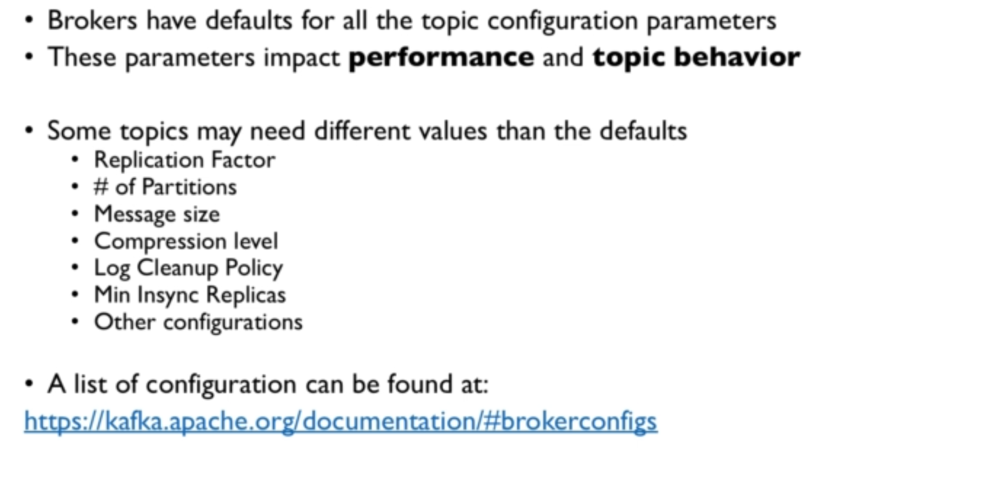

**CLI commands**

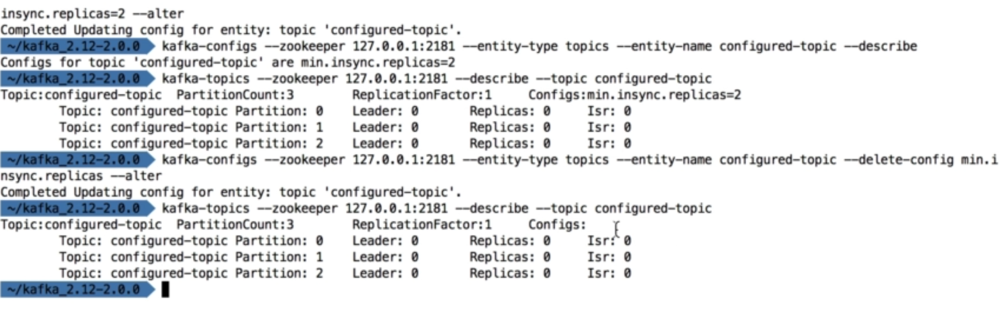

---

# Partitions & Segments

**Segments & Indexes**

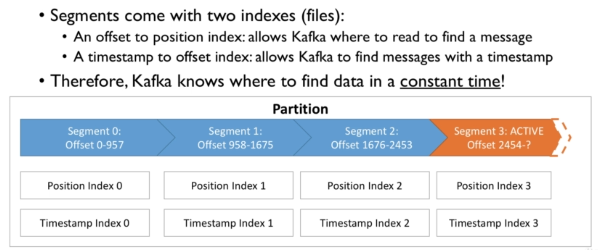

**Segments: Why should I care?**

---

# Log Cleanup Policies

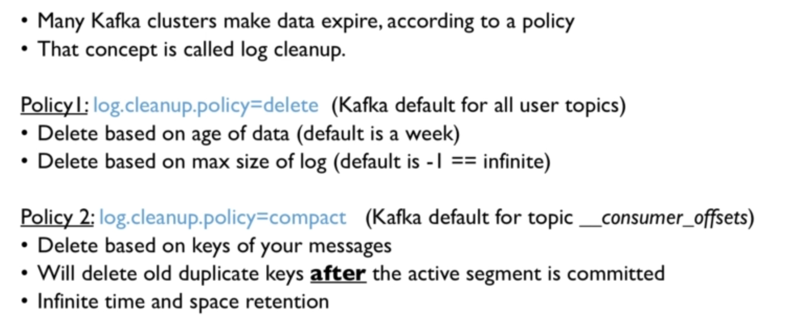

**Why & When?**

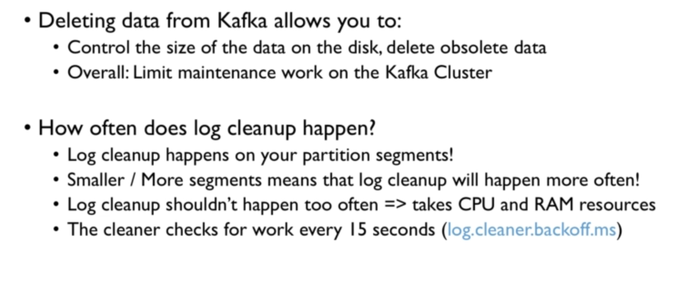

## Log Cleanup Policy: Delete

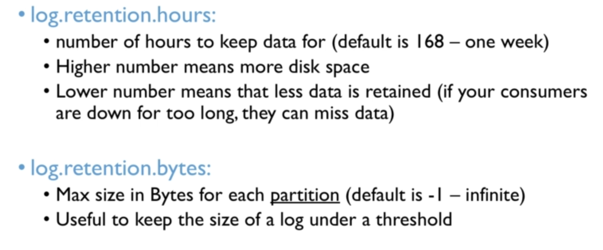

## Log Cleanup Policy: Compact

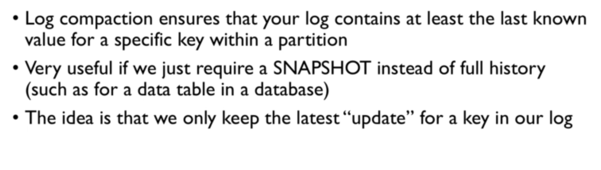

**Example**

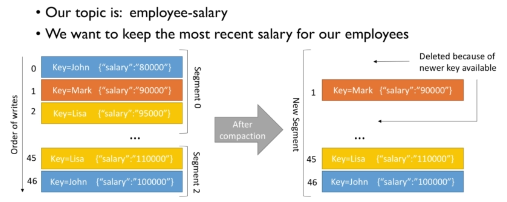

**Log Compaction Guarantees**

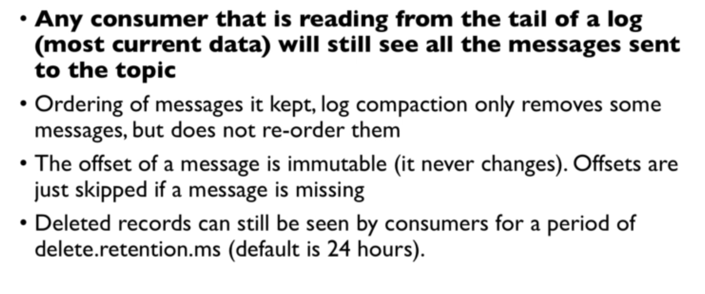

**Log Compaction Myth Busting**

**Log Compaction - working**

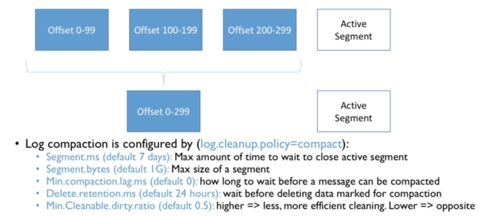

----

## unclean.leader.election

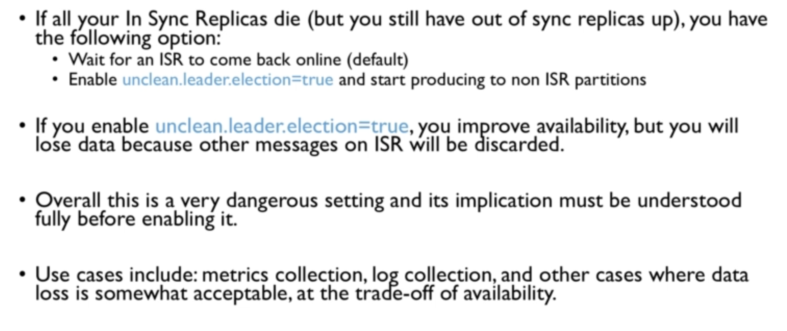

----
