# ElasticSearch Consumer & Consumer configurations

**ElasticSearch on Demand**

https://bonsai.io

---

Twitter data producer:

[Github source code for twitter producer](https://github.com/simplesteph/kafka-beginners-course/blob/master/kafka-producer-twitter/src/main/java/kafka/tutorial2/TwitterProducer.java)

ElasticSearch Consumer:

[ElasticSearch consumer code](https://github.com/simplesteph/kafka-beginners-course/blob/master/kafka-consumer-elasticsearch/src/main/java/com.github.simplesteph.kafka/tutorial3/ElasticSearchConsumer.java)

----

# Delivery Semantics

## At Most Once

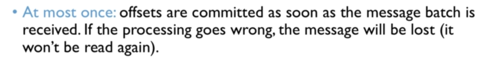

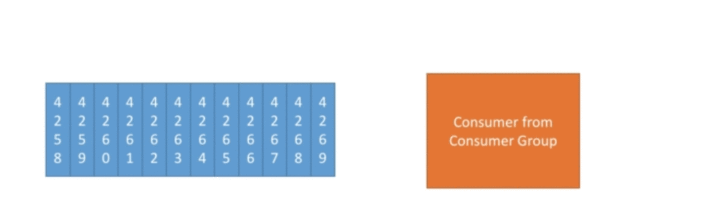

## At Least Once

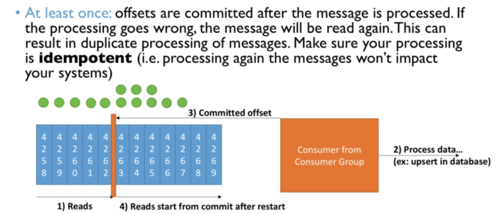

## Summary

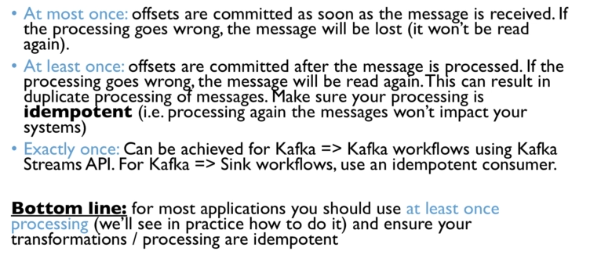

----

# Idempotence

To achieve Idempotence in Kafka, we can use the following to generate the same id for the same message when it is processed again. This is Kafka generic id. Similarly other methods can be used so that even if process the message more than once we don't create duplicates.

```java
// kafka generic ID
String id = record.topic() + "_" + record.partition() + "_" + record.offset();
  ```

---

# Consumer Offset Commits Strategies

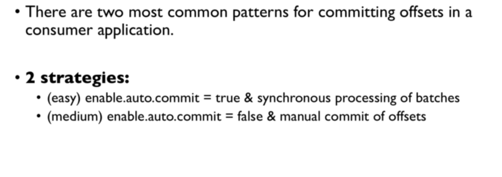

---

## `enable.auto.commit = true`

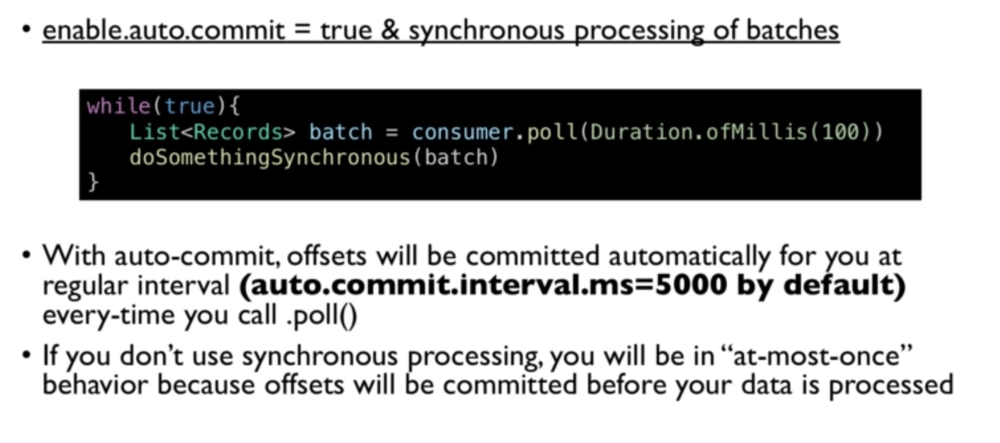

---

## `enable.auto.commit = false`

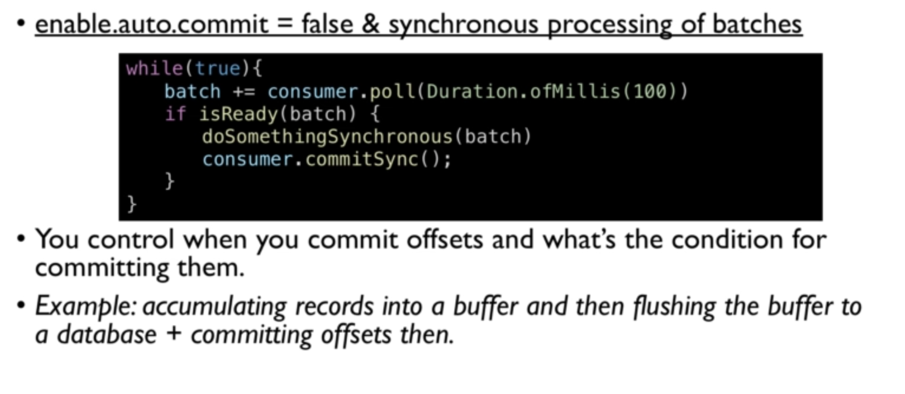


---


# Consumer Offset Reset Behaviour

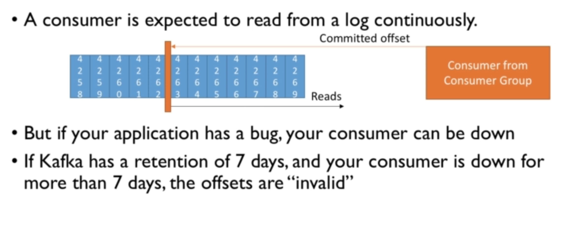

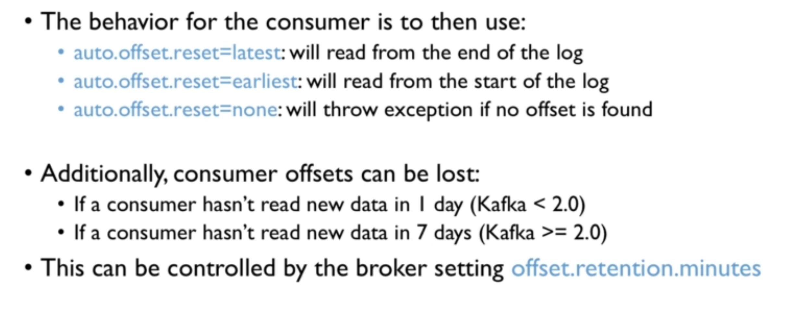

---

# Replaying data for consumers

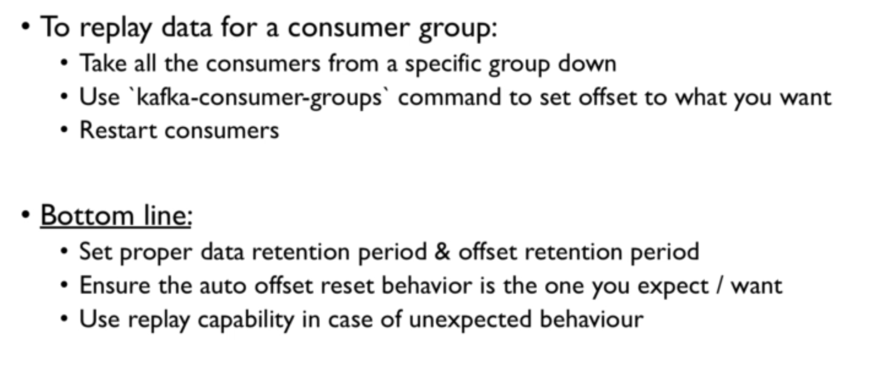

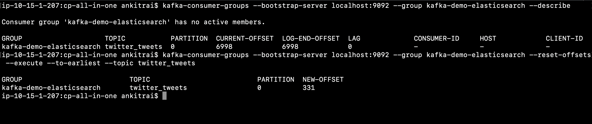

---

# Controlling Consumer Liveliness

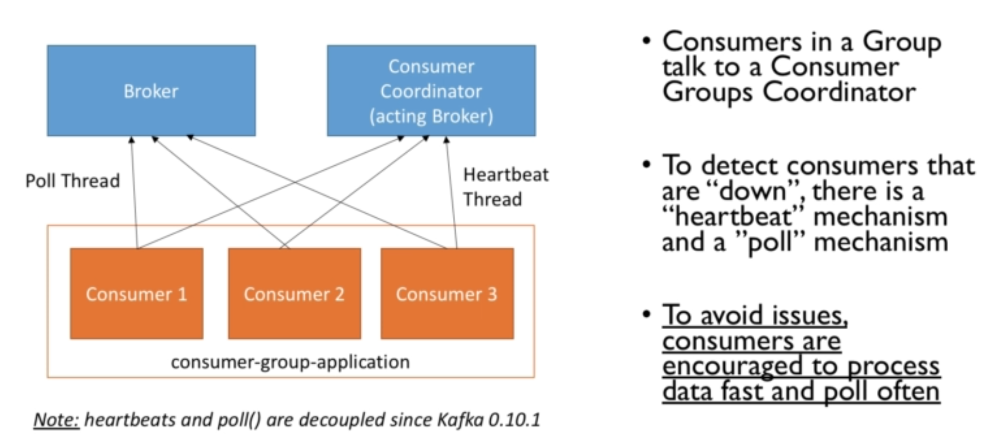

## Consumer Heartbeat Thread

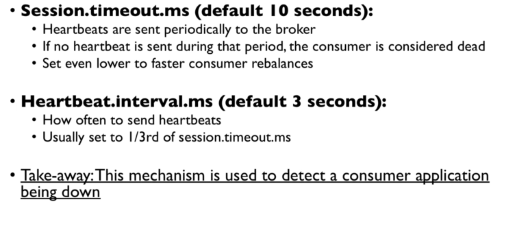
