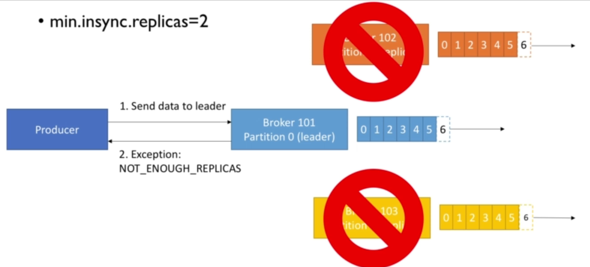

# Java implementations of producer and consumer

- Simple Producer Demo

- Producer with Callback

- Producer with keys

- Simple Consumer Demo

- Consumer Groups

- Consumer Threaded implementation

- Consumer Assign and Seek (consuming specific partition with specific offset)

[Github link for source code](https://github.com/simplesteph/kafka-beginners-course/tree/master/kafka-basics/src/main/java/kafka/tutorial1)

---

# Client Bi-Directional Compatibility

---

# Streaming twitter data via Kafka producer

[Github source code for twitter producer](https://github.com/simplesteph/kafka-beginners-course/tree/master/kafka-producer-twitter/src/main/java/kafka/tutorial2)

---

# Producer configurations

## Producer acks (acknowledgment)

- `acks = 0`(no acks)

- `acks = 1`(leader acks)

- `acks = all`(replicas acks)

**In-Sync replicas configurations**

**Failure scenario**

---
