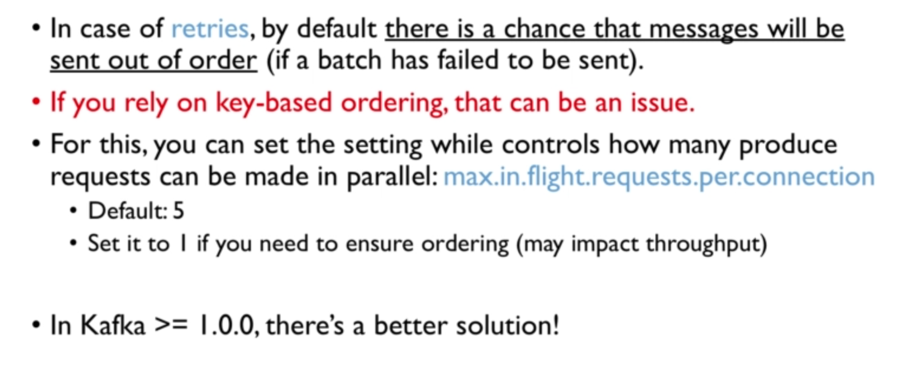

# Java implementations of producer and consumer

- Simple Producer Demo

- Producer with Callback

- Producer with keys

- Simple Consumer Demo

- Consumer Groups

- Consumer Threaded implementation

- Consumer Assign and Seek (consuming specific partition with specific offset)

[Github link for source code](https://github.com/simplesteph/kafka-beginners-course/tree/master/kafka-basics/src/main/java/kafka/tutorial1)

---

# Client Bi-Directional Compatibility


---

# Streaming twitter data via Kafka producer

[Github source code for twitter producer](https://github.com/simplesteph/kafka-beginners-course/blob/master/kafka-producer-twitter/src/main/java/kafka/tutorial2/TwitterProducer.java)

---

# Producer configurations

## Producer acks (acknowledgment)

- `acks = 0`(no acks)


- `acks = 1`(leader acks)


- `acks = all`(replicas acks)


**In-Sync replicas configurations**


**Failure scenario**


---

# Producer Retries




---

# Idempotent Producer


Producer also sends a producer id which is used to identify duplicate messages.


---

# Safe Producer Summary


**In Java**

```java
public KafkaProducer<String, String> createKafkaProducer(){
    String bootstrapServers = "127.0.0.1:9092";

    // create Producer properties
    Properties properties = new Properties();
    properties.setProperty(ProducerConfig.BOOTSTRAP_SERVERS_CONFIG, bootstrapServers);
    properties.setProperty(ProducerConfig.KEY_SERIALIZER_CLASS_CONFIG, StringSerializer.class.getName());
    properties.setProperty(ProducerConfig.VALUE_SERIALIZER_CLASS_CONFIG, StringSerializer.class.getName());

    // create safe Producer
    properties.setProperty(ProducerConfig.ENABLE_IDEMPOTENCE_CONFIG, "true");
    properties.setProperty(ProducerConfig.ACKS_CONFIG, "all");
    properties.setProperty(ProducerConfig.RETRIES_CONFIG, Integer.toString(Integer.MAX_VALUE));
    properties.setProperty(ProducerConfig.MAX_IN_FLIGHT_REQUESTS_PER_CONNECTION, "5"); // kafka 2.0 >= 1.1 so we can keep this as 5. Use 1 otherwise.

    // high throughput producer (at the expense of a bit of latency and CPU usage)
    properties.setProperty(ProducerConfig.COMPRESSION_TYPE_CONFIG, "snappy");
    properties.setProperty(ProducerConfig.LINGER_MS_CONFIG, "20");
    properties.setProperty(ProducerConfig.BATCH_SIZE_CONFIG, Integer.toString(32*1024)); // 32 KB batch size

    // create the producer
    KafkaProducer<String, String> producer = new KafkaProducer<String, String>(properties);
    return producer;
}
```

---

# Message Compression


Benchmarks here: https://blog.cloudflare.com/squeezing-the-firehose/


## Advantages and Disadvantages


## Recommendations


---

# Linger.ms & batch.size


## Controlling the batching mechanism

**Linger.ms**


**Batch size**


---
