# Kafka Administration
---

## Kafka Cluster Setup

**High Level Architecture**

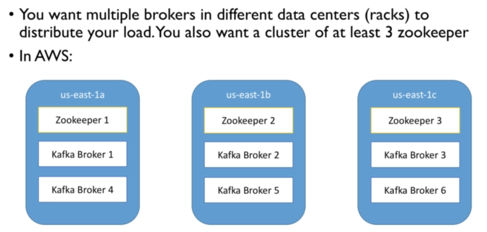

**Kafka Cluster Setup Gotchas**

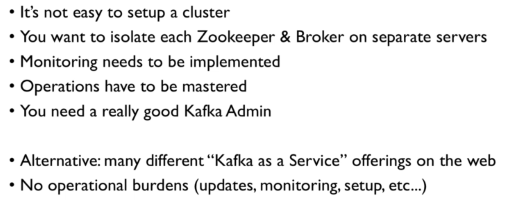

---

## Kafka Monitoring and Operations

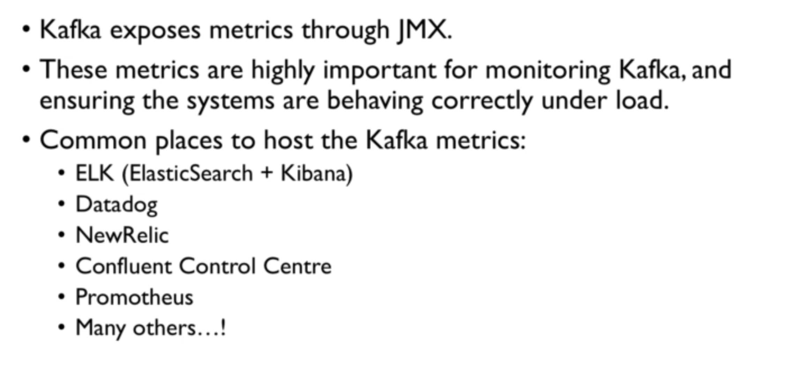

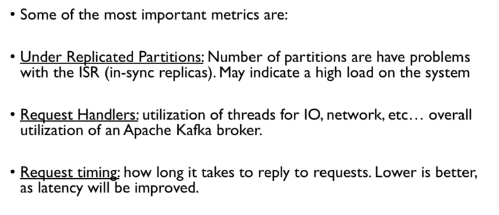

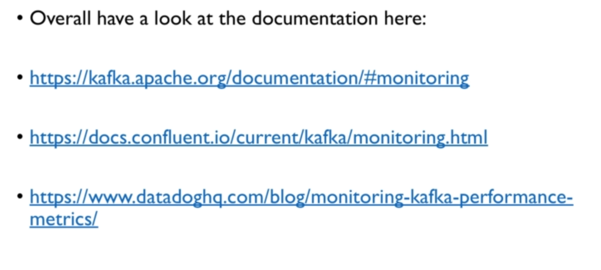

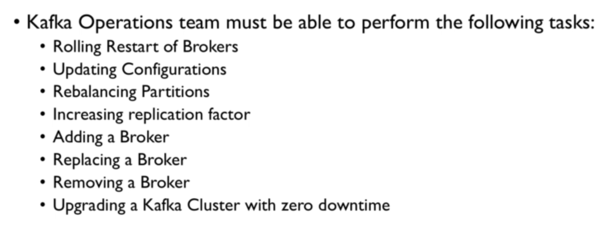

---

## Need for encryption, authentication & authorization in Kafka

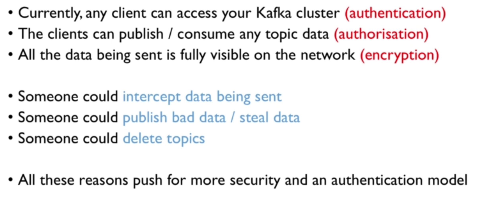

**Encryption in Kafka**

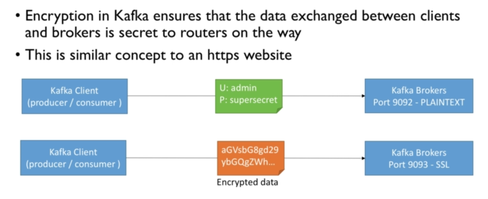

**Authentication in Kafka**

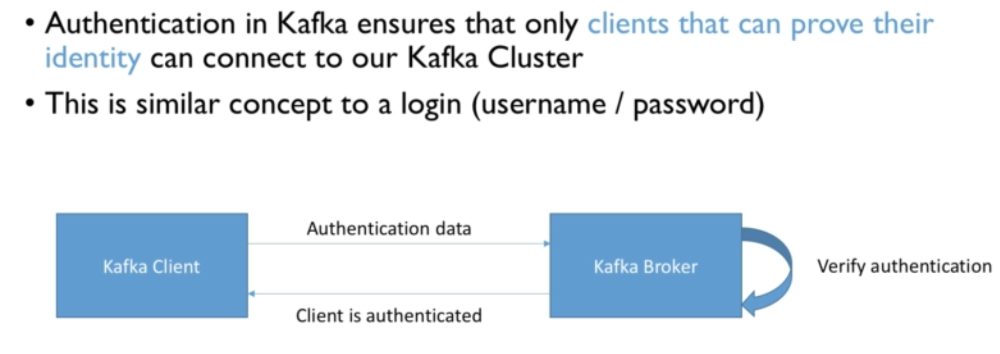

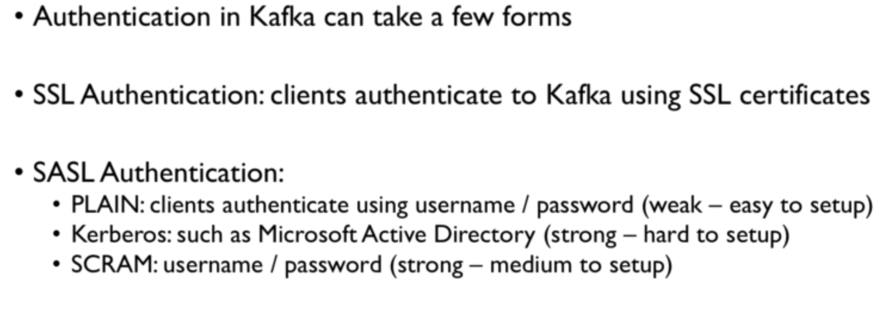

**Authorization in Kafka**

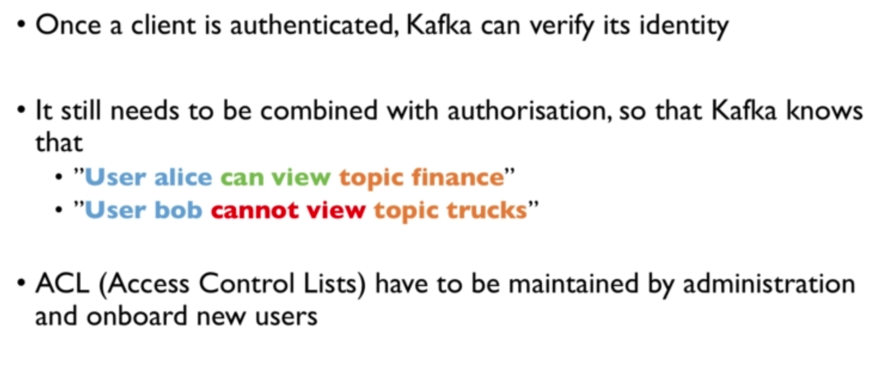

**Putting it all together**

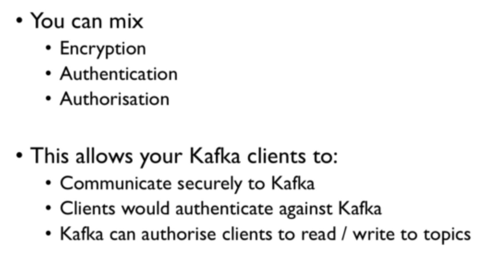

Look for Kafka Security.

---

## Kafka Multi Cluster + Replication

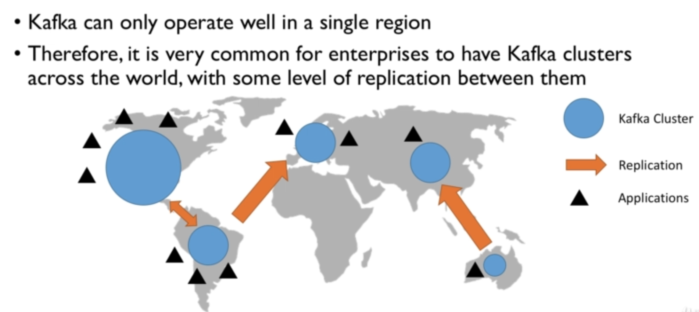

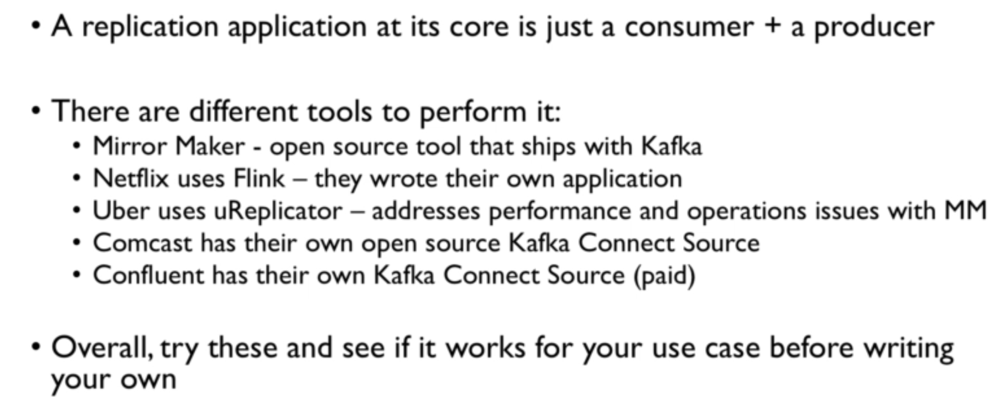

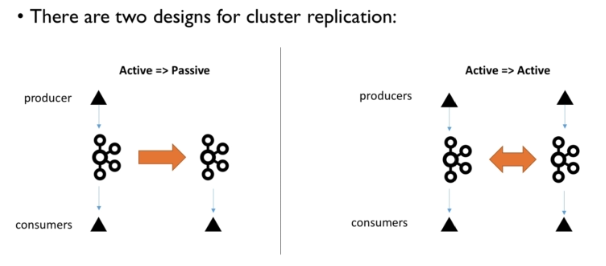

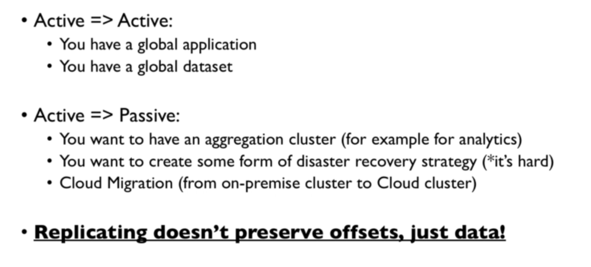

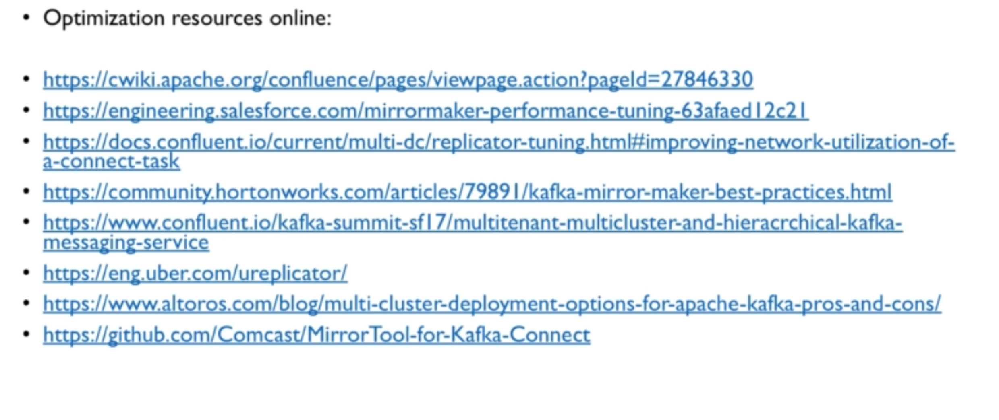

---
