# Kafka Connect API

A brief history

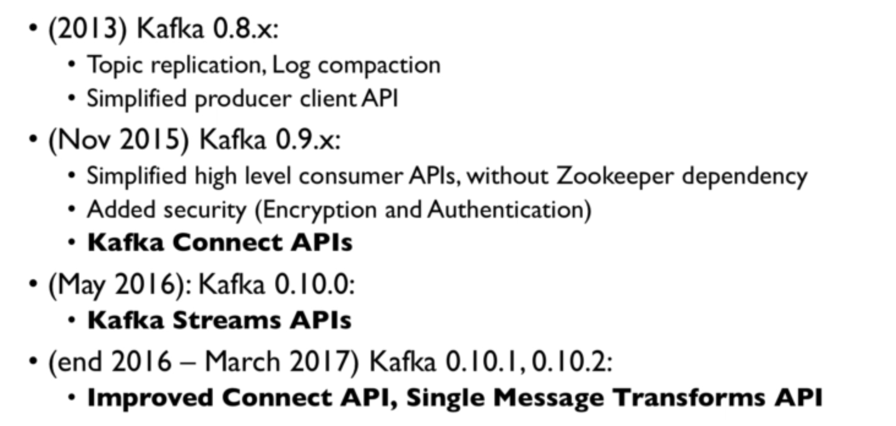

---

# Why Kafka Connect and Streams

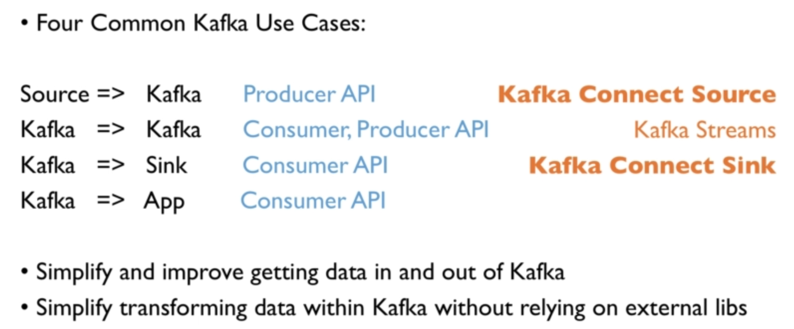

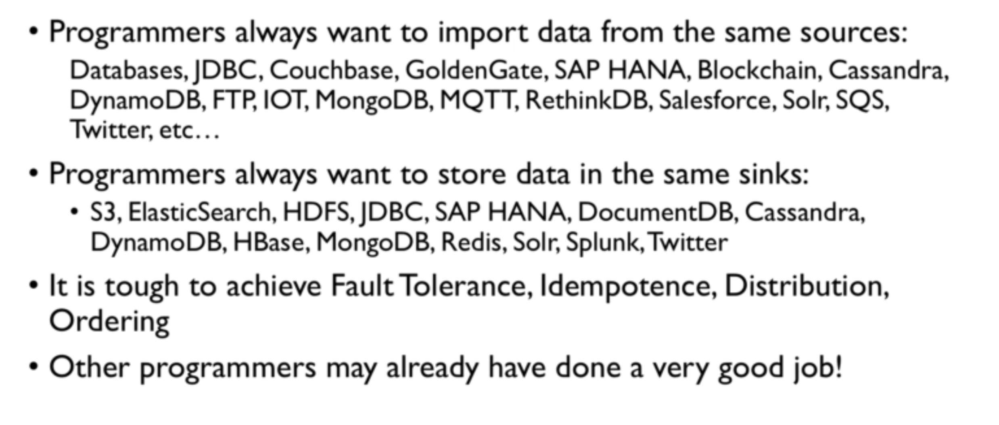

---

# Kafka Connect and Streams Architecture Design

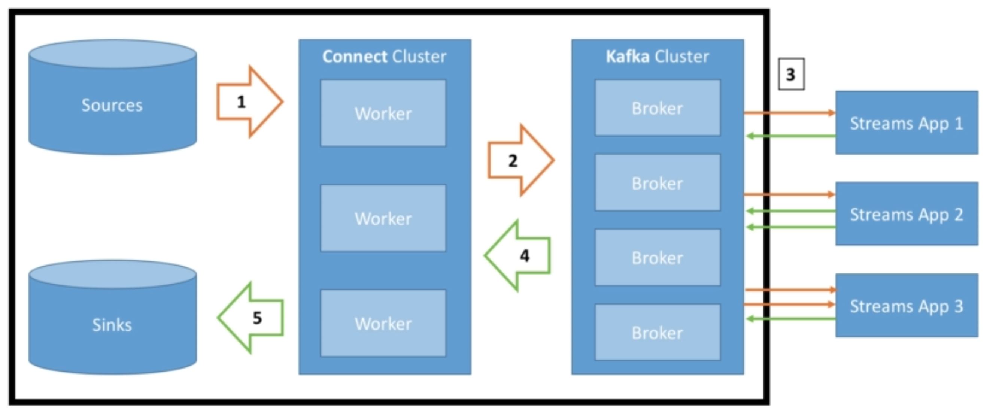

---

# Kafka Connect - High Level

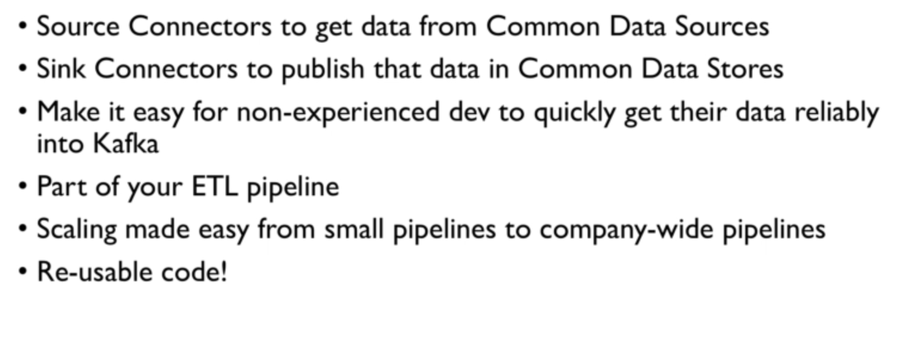

**Kafka Connect sources**

Kafka connect confluent

---

# Kafka Streams

**Use case**

**Purpose**
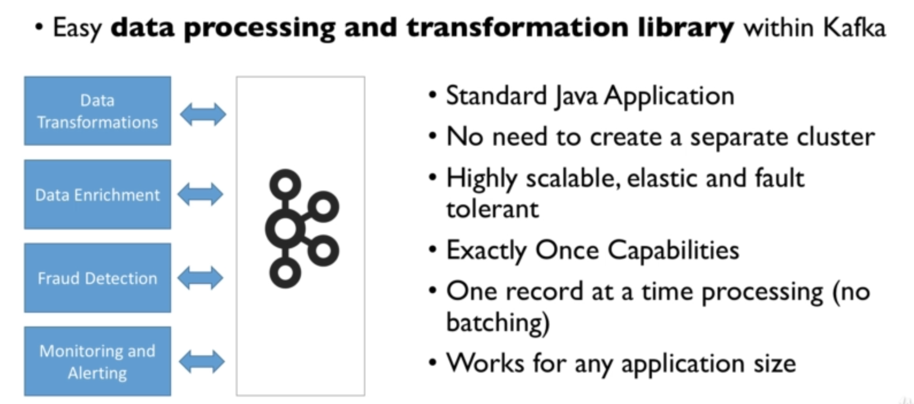

# Kafka Streams Architecture Design

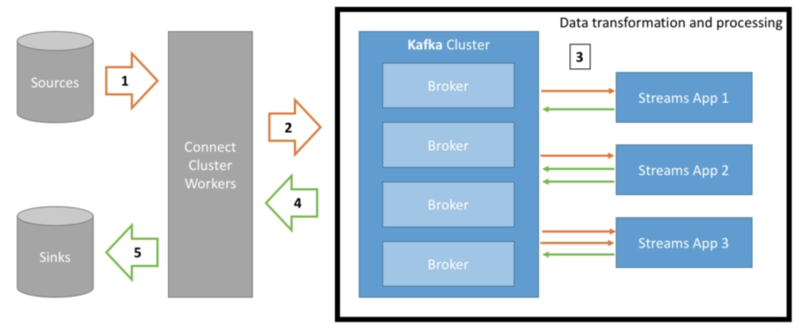

# Kafka Streams History

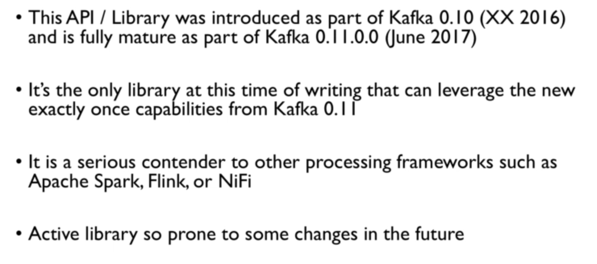

**example: Tweets Filtering**

# Schema Registry

## The need for a schema registry

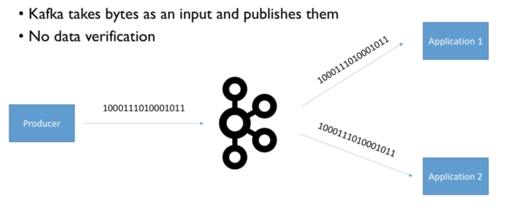

**Scenarios:**

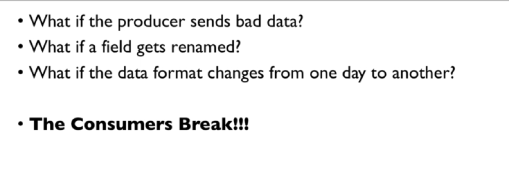

**Requirements**

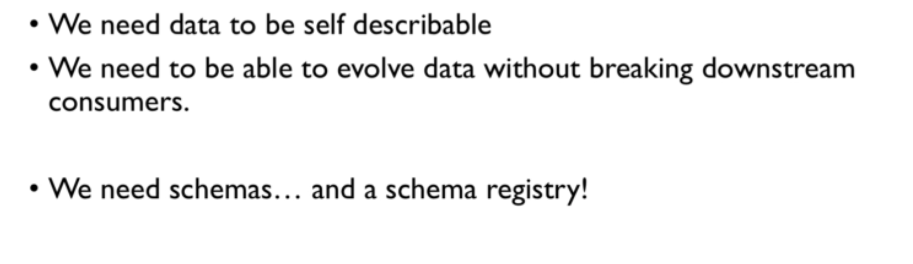

**Enabling data verification in Kafka - not good**

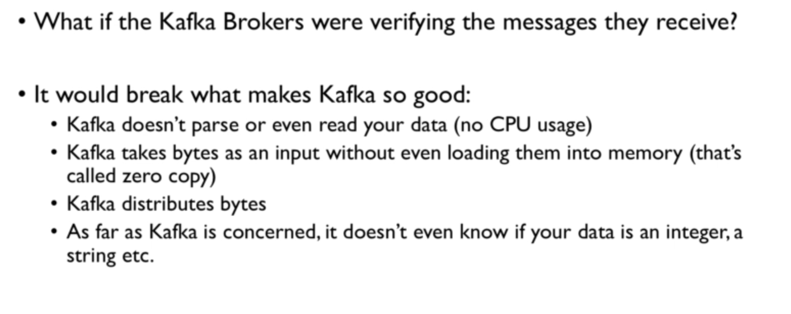

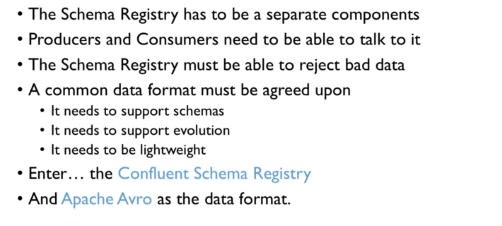

----

## Pipeline without Schema Registry

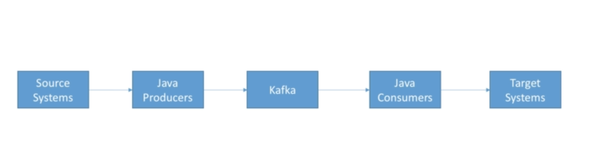

## Confluent Schema Registry Purpose

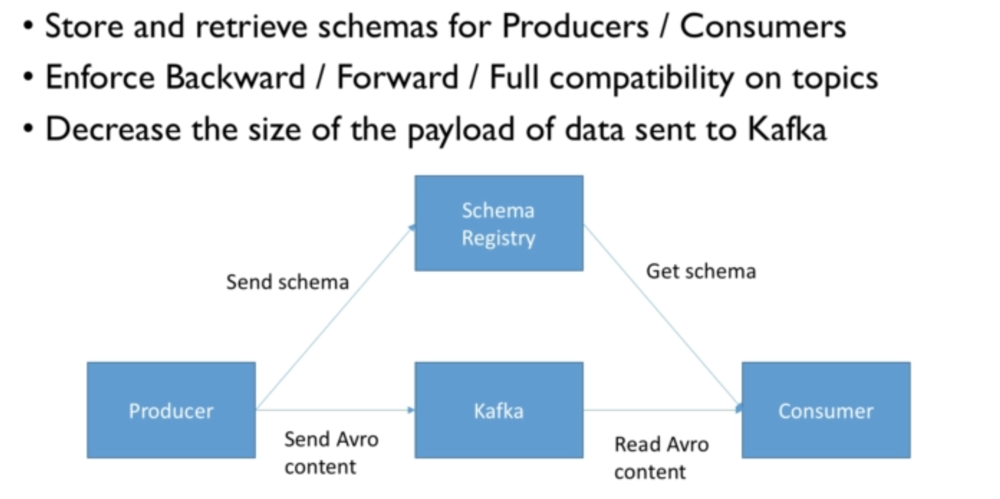
