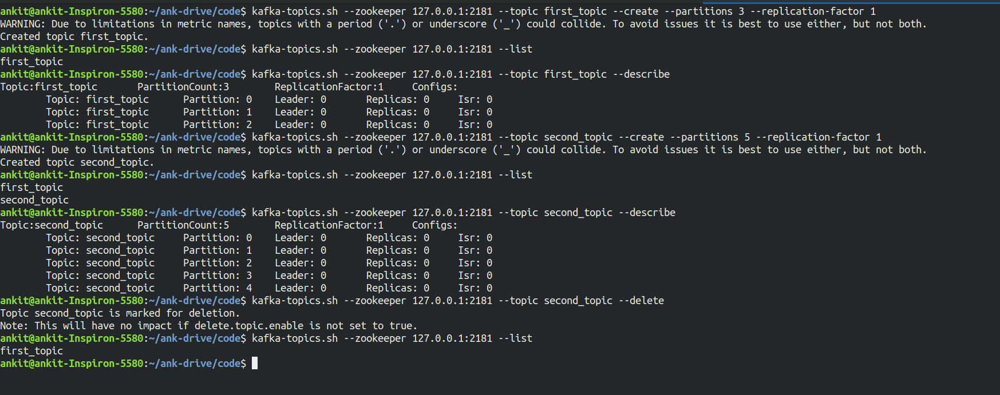
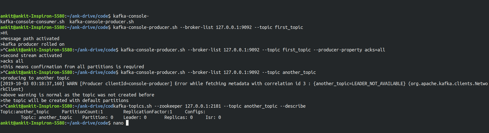
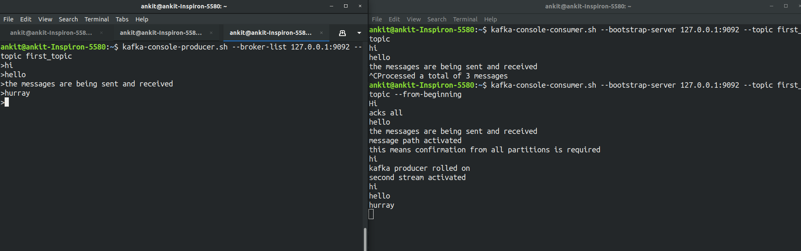
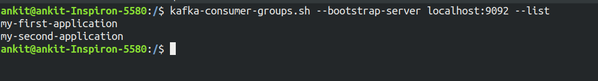
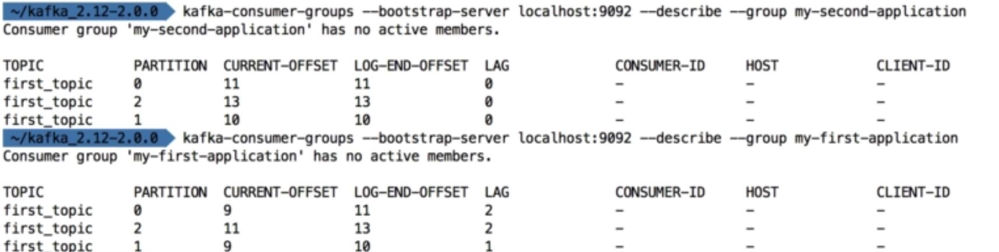
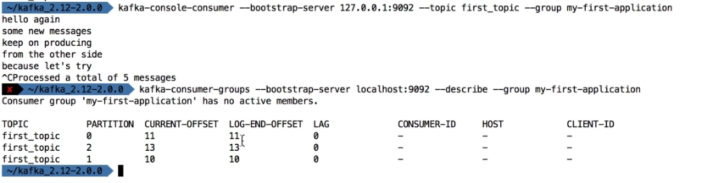
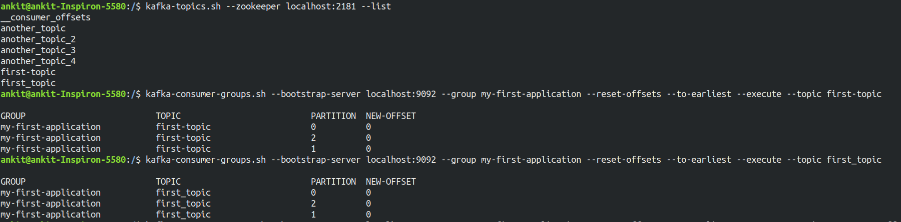
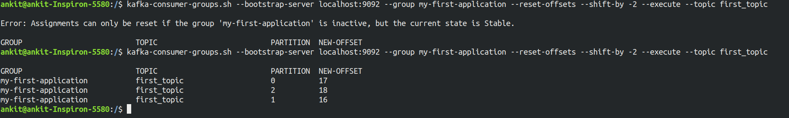

# Kafka Installation on Linux

- Download the kafka binaries from apache site (type kafka download in google)
- extract the binary via `tar -xvf` command.
- create directories for kafka and zookeeper logs
- Update zookeeper and kafka config properties to point to the newly created directories.
- Start first the zookeeper server and then the kafka server. 

```
bin/zookeeper-server-start.sh config/zookeeper.properties
```

```
kafka-server-start.sh config/server.properties
```

--- 

# Kafka CLI

## Kafka topics



## Kafka Producer



The default number of partitions to be created property can be modified in config/server.properties file. Kafka server needs to be restarted to make the changes affected.

## Kafka Consumer

By Default Kafka consumer will receive only the new messages which has been produced after it has been started.



## Kafka Consumer Groups

Consumers can be assigned to a group by specifying `--group` argument.

When multiple consumers are part of the same group, Kafka distrubutes messages accordingly between consumers.


If any of the consumer nodes go down, Kafka distributes the traffic accordingly.

**List all the consumer groups**



When you don't specify the consumer groups while creating a consumer it creates a random consumer group with random number. 

To describe the consumers and offset status use `--describe` arguement.





---

## Resetting Offsets

- To earliest



- Shift By




