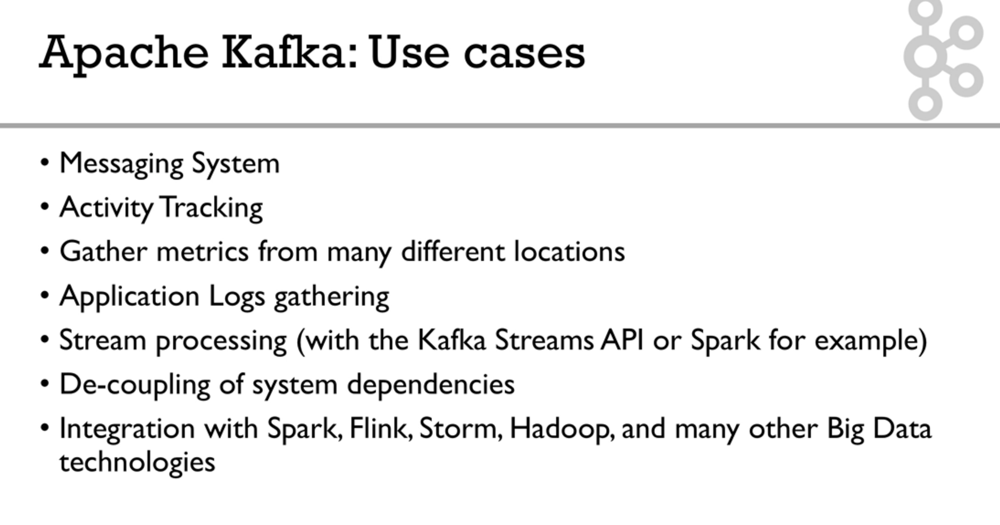
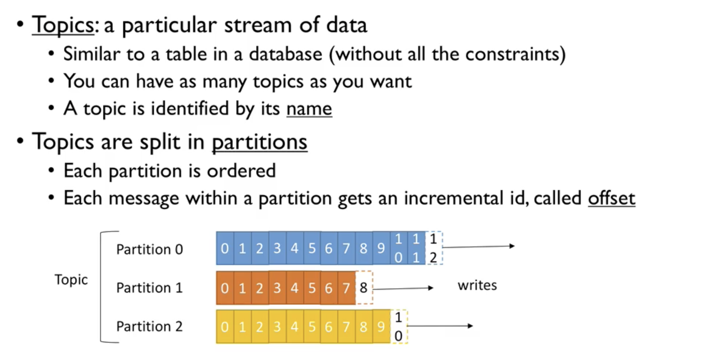
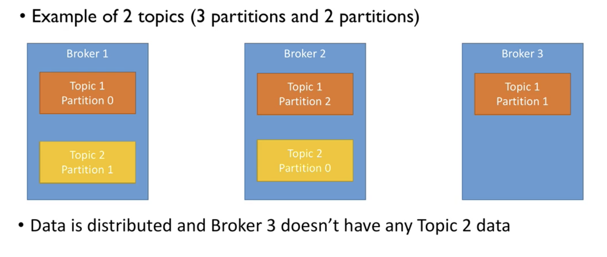
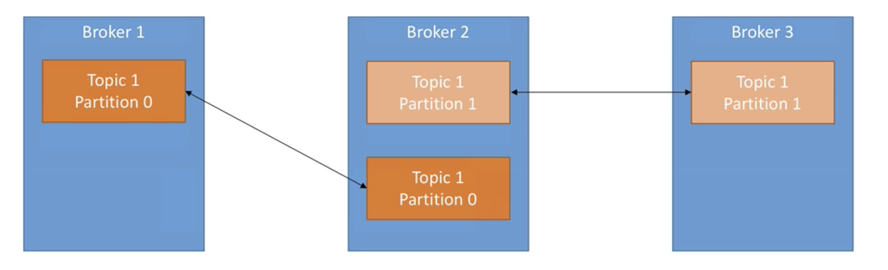
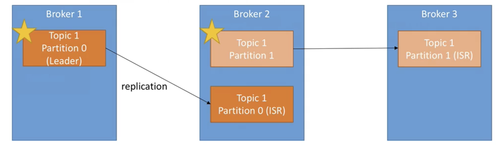
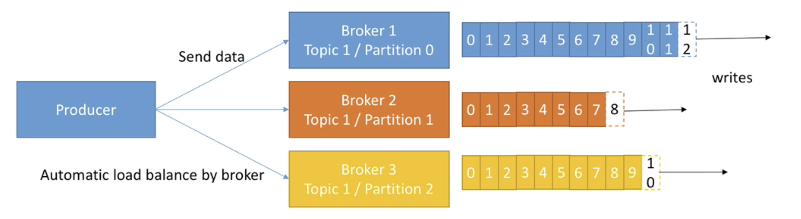
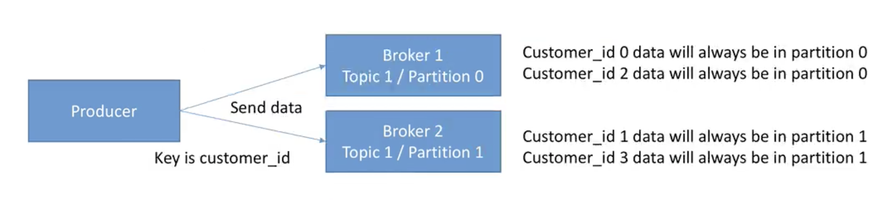
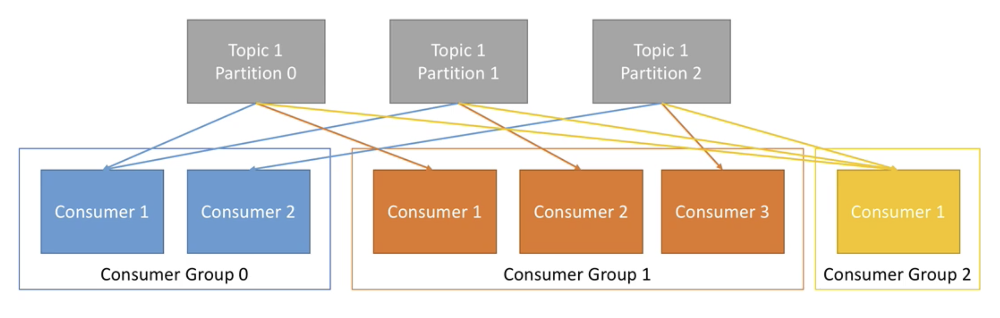

Kafka
---

---

---

---

# Topics & Partitions

- Offset only have a meaning for a specific partition.

	-	E.g. offset 3 in partition 2 doesn't represent the same data as offset 3 in partition 1.

- Order is guaranteed only within a partition (not across partitions)

- Data is kept only for a limited time. (default is two weeks)

- Once the data is written to a partition, **it can't be changed** (immutability)

- Data is assigned randomly to a partition unless a key is provided.

- You can have as many partitions per topic as you want.

---

# Brokers

- A Kafka cluster is composed of multiple brokers (servers)

- Each broker is identified with its ID (integer)

- Each broker contains certain topic partitions.

- After connecting to any broker (called a bootstrap broker), you will be connected to the entire cluster.

- A good number to get started is 3 brokers, but some big clusters have over 100 brokers

## Brokers and topics

## Topic replication factor

- Topics should have a replication factor > 1 (usually between 2 and 3)

- This wasy if a broker is down, another broker can serve the data

- Example: Topic with 2 partitions and replication factor of 2 

- Example: we lost Broker 2

- Result: Broker 1 and 3 can still serve the data

## Concept of Leader for a partition

- **At any time only 1 broker can be a leader for a given partition**

- **Only that leader can receive and serve data for a partition**

- The other brokers will synchronize the data

- There each partition has: one leader, and multiple ISR (in-sync replica)

---

# Producers

- Producers write data to topics.

- **They only have to specify the topic name and one broker to connect to, and Kafka will automatically take care of routing the data to the right brokers**.

- Producers can choose to receive acknowledgement of data writes:

	- Acks = 0 : Producer won't wait for acknowledgement (possible data loss)
	- Acks = 1 : Producer will wait for leader acknowledgement (limited data loss)
	- Acks = all : Leader + replicas acknowledgment (no data loss) 

## Producers: Message keys

- Producers can choose to send a key with the message.

- If a key is sent, then the producer has the guarantee that all messages for that key will always go to the same partition.

- This enables to guarantee ordering of a specific key.

---

# Consumers

- Consumers read data from a topic 

- **They only have to specify the topic name and one broker to connect to, and Kafka will automatically take care of pulling the data from the right brokers**.

- Data is read in order **for each partitions.**
 

## Consumer Groups

- Consumers read data in consumer groups

- Each consumer within a group reads from exclusive partitions

- You cannot have more consumers than partitions (otherwise some will be inactive)

