# Partitions Count, Replication Factor

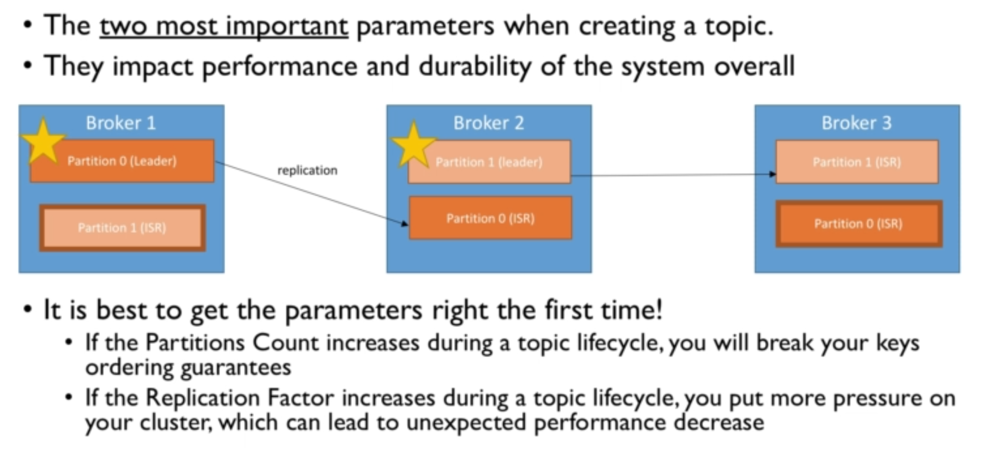

**Partitions Count**

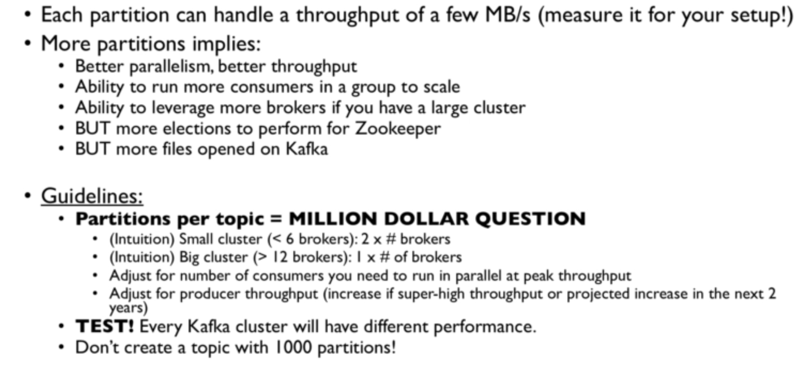

**Replication Factor**

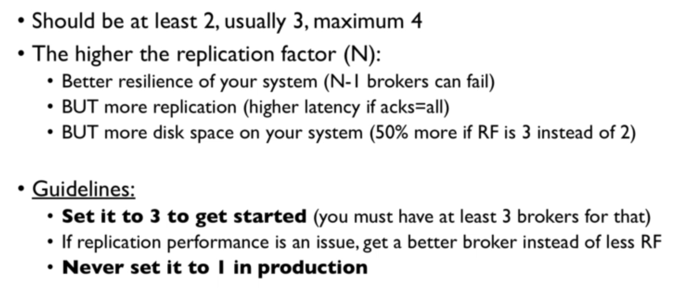

**Cluster Guidelines**

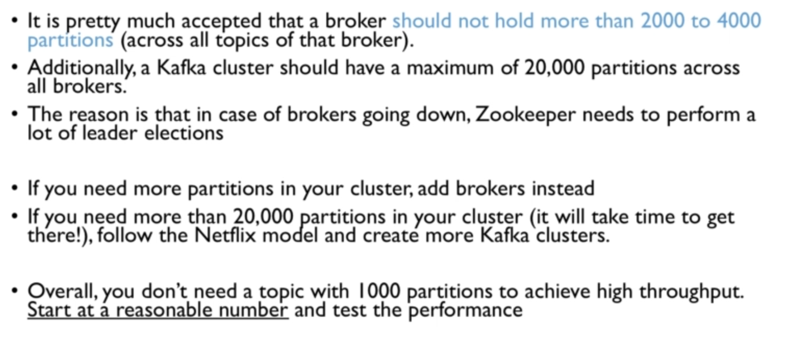

---

# Case Studies and example implementation

## Video analytics - Movieflix

**Requirements**

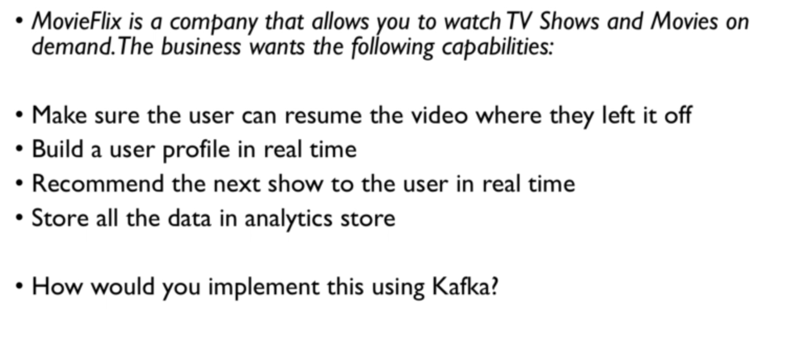

**Architecture**

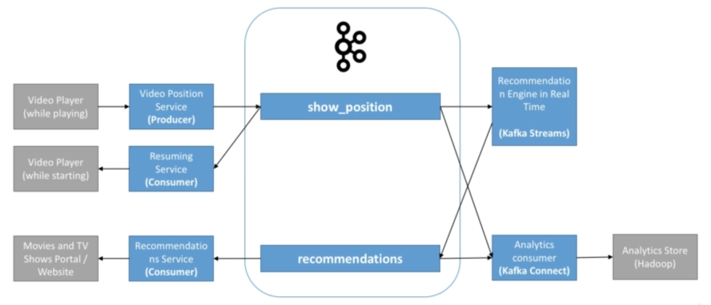

**Topics configurations considerations**

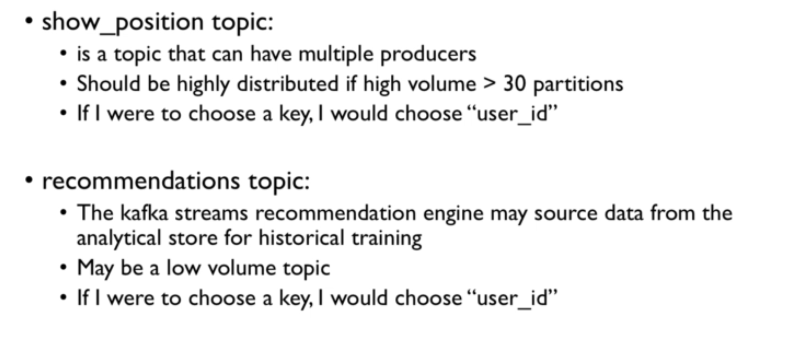

---

## IOT Example - GetTaxi

**Requirements**

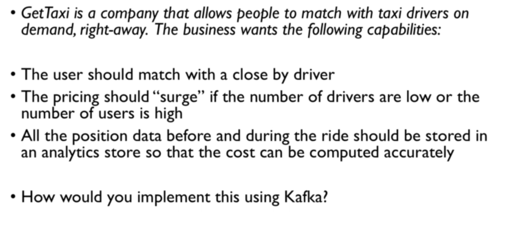

**Architecture**

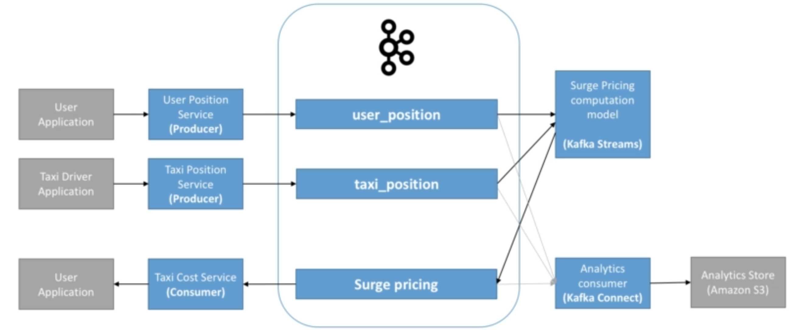

**Topics configurations considerations**

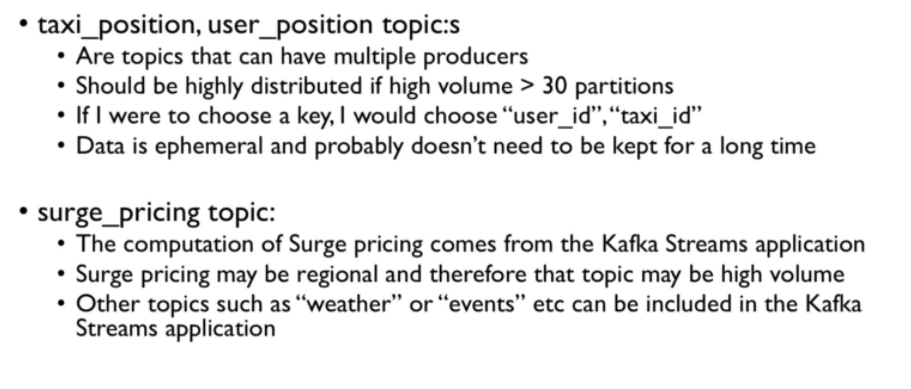

---

## CQRS(Command Query Responsibility Segregation) - MySocialMedia

**Requirements**

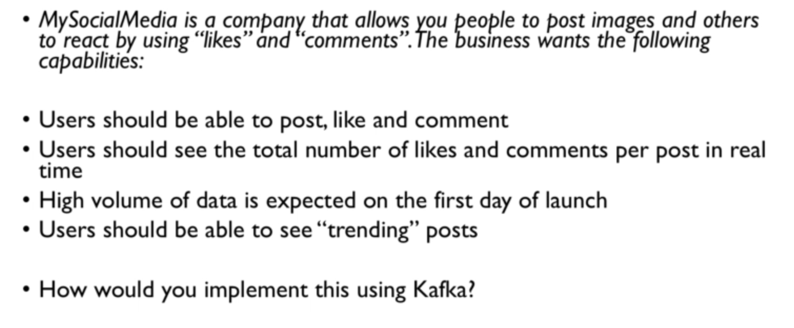

**Architecture**

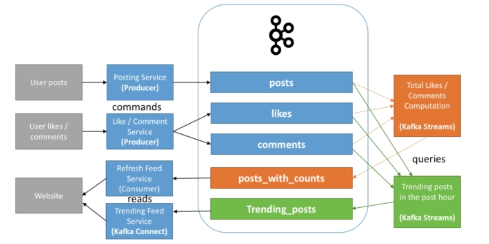

**Topics configurations considerations**

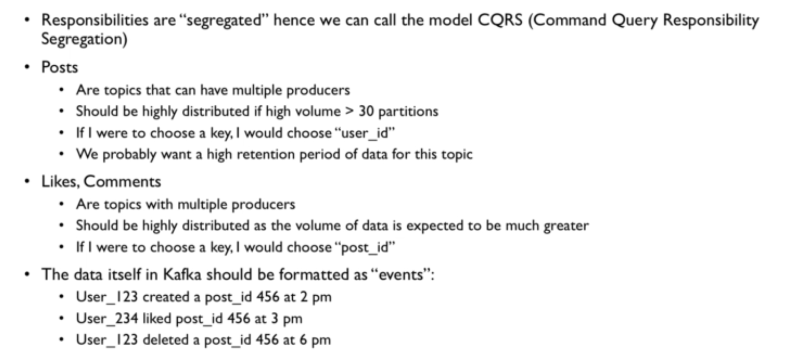

---

## Finance Application - MyBank

**Requirements**

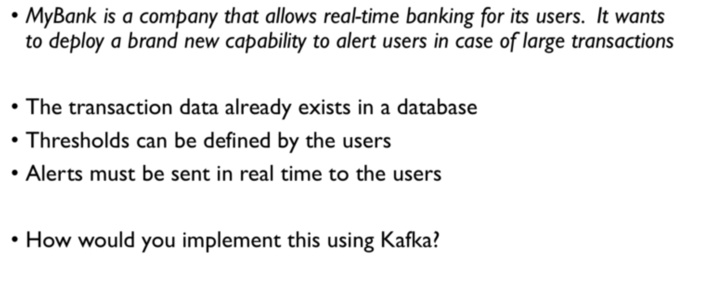

**Architecture**

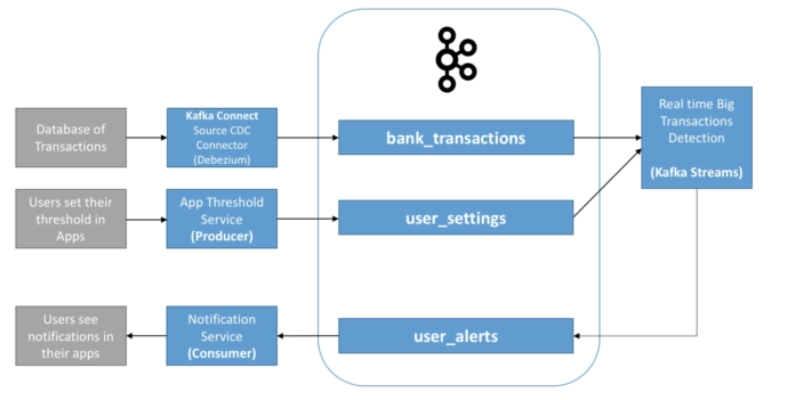

**Topics configurations considerations**

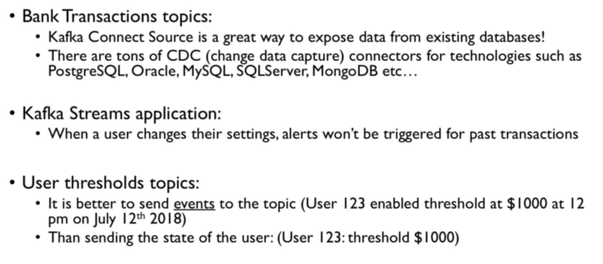

----

## Big Data Ingestion

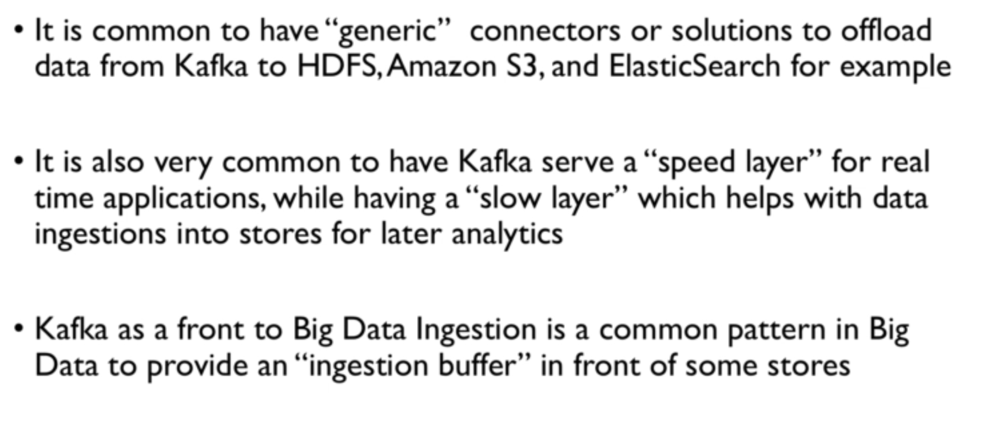

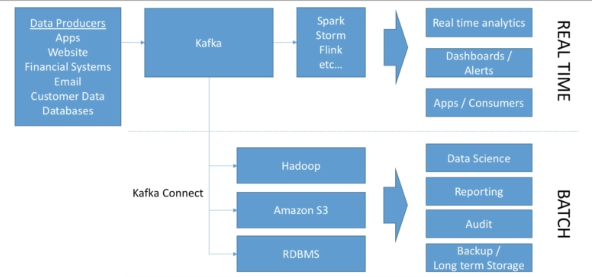

---

## Logging & Metrics Aggregation

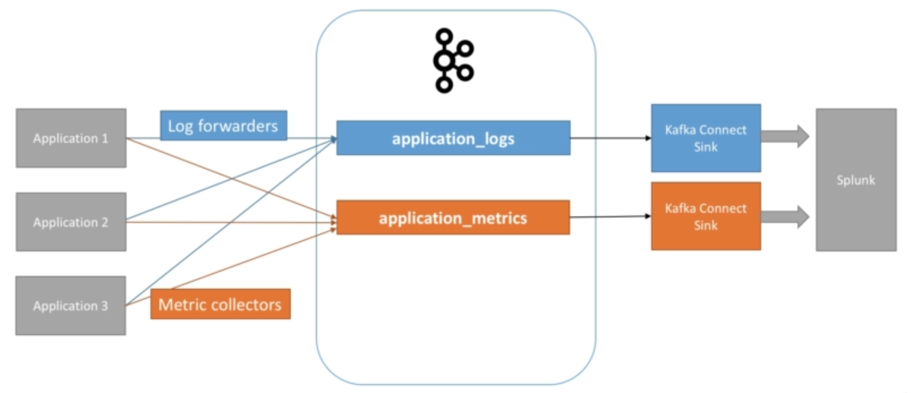

----
