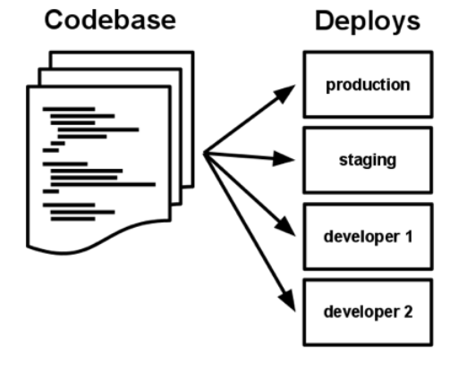
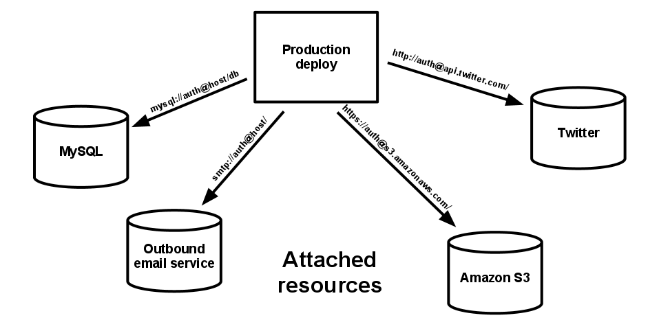
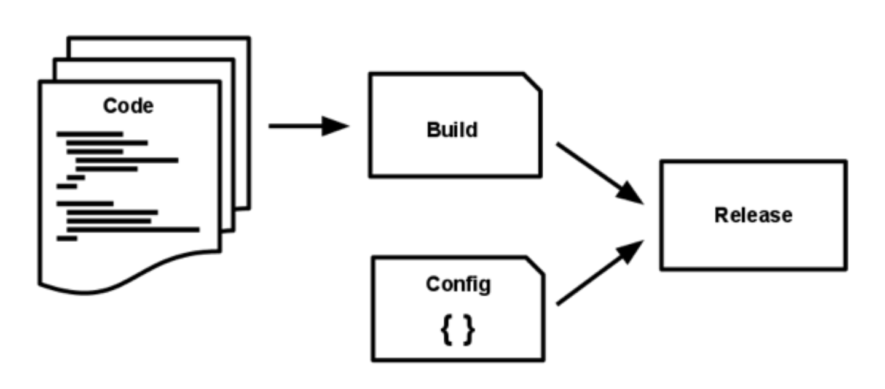
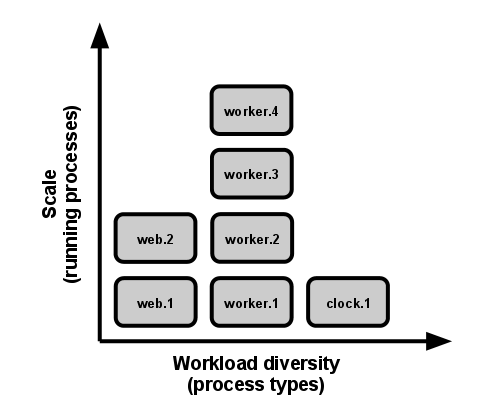

Twelve-Factor app
---

Software is commonly delivered as a service: called *web apps*, or *software-as-a-service*. The **twelve-factor app** is a methodology for building software-as-a-service apps that:

- Use **declarative** formats for setup automation, to minimize time and cost for new developers joining the project;

- Have a **clean contract** with the underlying operating system, offering **maximum portability** between execution environments;

- Are suitable for **deployment** on modern **cloud platforms**, obviating the need for servers and systems administration;

- **Minimize divergence** between development and production, enabling **continuous deployment** for maximum agility;

- And can **scale up** without significant changes to tooling, architecture, or development practices.

---

# 1. Codebase

> One codebase tracked in revision control, many deploys

A twelve-factor app is always tracked in a version control system, such as Git, Mercurial, or Subversion. A copy of the revision tracking database is known as a *code repository*, often shortened to *code repo* or just *repo*.

A *codebase* is any single repo (in a centralized revision control system like Subversion), or any set of repos who share a root commit (in a decentralized revision control system like Git).

There is always a one-to-one correlation between the codebase and the app:

- If there are multiple codebases, it’s not an app – it’s a distributed system. Each component in a distributed system is an app, and each can individually comply with twelve-factor.

- Multiple apps sharing the same code is a violation of twelve-factor. The solution here is to factor shared code into libraries which can be included through the dependency manager.

There is only one codebase per app, but there will be many deploys of the app. A *deploy* is a running instance of the app. This is typically a production site, and one or more staging sites. Additionally, every developer has a copy of the app running in their local development environment, each of which also qualifies as a deploy.

The codebase is the same across all deploys, although different versions may be active in each deploy. For example, a developer has some commits not yet deployed to staging; staging has some commits not yet deployed to production. But they all share the same codebase, thus making them identifiable as different deploys of the same app.

---

# 2. Dependencies

> Explicitly declare and isolate dependencies

Most programming languages offer a packaging system for distributing support libraries. Libraries installed through a packaging system can be installed system-wide (known as “site packages”) or scoped into the directory containing the app (known as “vendoring” or “bundling”).

A twelve-factor app never relies on implicit existence of system-wide packages. It declares all dependencies, completely and exactly, via a *dependency declaration* manifest. Furthermore, it uses a *dependency isolation* tool during execution to ensure that no implicit dependencies “leak in” from the surrounding system. The full and explicit dependency specification is applied uniformly to both production and development.

One benefit of explicit dependency declaration is that it simplifies setup for developers new to the app. The new developer can check out the app’s codebase onto their development machine, requiring only the language runtime and dependency manager installed as prerequisites. They will be able to set up everything needed to run the app’s code with a deterministic *build command*.

Twelve-factor apps also do not rely on the implicit existence of any system tools. Examples include shelling out to ImageMagick or `curl`. While these tools may exist on many or even most systems, there is no guarantee that they will exist on all systems where the app may run in the future, or whether the version found on a future system will be compatible with the app. If the app needs to shell out to a system tool, that tool should be vendored into the app.

---

# 3. Config

> Store config in the environment

An app’s *config* is everything that is likely to vary between deploys (staging, production, developer environments, etc). This includes:

- Resource handles to the database, Memcached, and other backing services

- Credentials to external services such as Amazon S3 or Twitter

- Per-deploy values such as the canonical hostname for the deploy

Apps sometimes store config as constants in the code. This is a violation of twelve-factor, which requires **strict separation of config from code**. Config varies substantially across deploys, code does not.

A litmus test for whether an app has all config correctly factored out of the code is whether the codebase could be made open source at any moment, without compromising any credentials.

Note that this definition of “config” does **not** include internal application config, such as how code modules are connected in Spring. This type of config does not vary between deploys, and so is best done in the code.

Another approach to config is the use of config files which are not checked into revision control. This is a huge improvement over using constants which are checked into the code repo, but still has weaknesses: it’s easy to mistakenly check in a config file to the repo; there is a tendency for config files to be scattered about in different places and different formats, making it hard to see and manage all the config in one place. Further, these formats tend to be language- or framework-specific.

**The twelve-factor app stores config in environment variables** (often shortened to env vars or env). Env vars are easy to change between deploys without changing any code; unlike config files, there is little chance of them being checked into the code repo accidentally; and unlike custom config files, or other config mechanisms such as Java System Properties, they are a language- and OS-agnostic standard.

Another aspect of config management is grouping. Sometimes apps batch config into named groups (often called “environments”) named after specific deploys, such as the `development`, `test`, and `production` environments in Rails. This method does not scale cleanly: as more deploys of the app are created, new environment names are necessary, such as `staging` or `qa`. As the project grows further, developers may add their own special environments like `ankit-staging`, resulting in a combinatorial explosion of config which makes managing deploys of the app very brittle.

In a twelve-factor app, env vars are granular controls, each fully orthogonal to other env vars. They are never grouped together as “environments”, but instead are independently managed for each deploy. This is a model that scales up smoothly as the app naturally expands into more deploys over its lifetime.

---

# 4. Backing services

> Treat backing services as attached resources

A *backing service* is any service the app consumes over the network as part of its normal operation. Examples include datastores (such as MySQL or CouchDB), messaging/queueing systems (such as RabbitMQ or Beanstalkd), SMTP services for outbound email (such as Postfix), and caching systems (such as Memcached).

Backing services like the database are traditionally managed by the same systems administrators as the app’s runtime deploy. In addition to these locally-managed services, the app may also have services provided and managed by third parties. Examples include SMTP services (such as Postmark), metrics-gathering services (such as New Relic or Loggly), binary asset services (such as Amazon S3), and even API-accessible consumer services (such as Twitter, Google Maps, or Last.fm).

The code for a twelve-factor app makes no distinction between local and third party services. To the app, both are attached resources, accessed via a URL or other locator/credentials stored in the config. A deploy of the twelve-factor app should be able to swap out a local MySQL database with one managed by a third party (such as Amazon RDS) without any changes to the app’s code. Likewise, a local SMTP server could be swapped with a third-party SMTP service (such as Postmark) without code changes. In both cases, only the resource handle in the config needs to change.

Each distinct backing service is a resource. For example, a MySQL database is a resource; two MySQL databases (used for sharding at the application layer) qualify as two distinct resources. The twelve-factor app treats these databases as attached resources, which indicates their loose coupling to the deploy they are attached to.

Resources can be attached to and detached from deploys at will. For example, if the app’s database is misbehaving due to a hardware issue, the app’s administrator might spin up a new database server restored from a recent backup. The current production database could be detached, and the new database attached – all without any code changes.

---

# 5. Build, release, run

> Strictly separate build and run stages

A codebase is transformed into a (non-development) deploy through three stages:

- The *build stage* is a transform which converts a code repo into an executable bundle known as a *build*. Using a version of the code at a commit specified by the deployment process, the build stage fetches vendors dependencies and compiles binaries and assets.

- The *release stage* takes the build produced by the build stage and combines it with the deploy’s current config. The resulting *release* contains both the build and the config and is ready for immediate execution in the execution environment.

- The *run stage* (also known as “runtime”) runs the app in the execution environment, by launching some set of the app’s processes against a selected release.

**The twelve-factor app uses strict separation between the build, release, and run stages.**  For example, it is impossible to make changes to the code at runtime, since there is no way to propagate those changes back to the build stage.

Deployment tools typically offer release management tools, most notably the ability to roll back to a previous release. 

Every release should always have a unique release ID, such as a timestamp of the release (such as `2011-04-06-20:32:17`) or an incrementing number (such as `v100`). Releases are an append-only ledger and a release cannot be mutated once it is created. Any change must create a new release.

Builds are initiated by the app’s developers whenever new code is deployed. Runtime execution, by contrast, can happen automatically in cases such as a server reboot, or a crashed process being restarted by the process manager. Therefore, the run stage should be kept to as few moving parts as possible, since problems that prevent an app from running can cause it to break in the middle of the night when no developers are on hand. The build stage can be more complex, since errors are always in the foreground for a developer who is driving the deploy.

---

# 6. Processes

> Execute the app as one or more stateless processes

**Twelve-factor processes are stateless and share-nothing**. Any data that needs to persist must be stored in a stateful backing service, typically a database.

The memory space or filesystem of the process can be used as a brief, single-transaction cache. For example, downloading a large file, operating on it, and storing the results of the operation in the database. The twelve-factor app never assumes that anything cached in memory or on disk will be available on a future request or job – with many processes of each type running, chances are high that a future request will be served by a different process. Even when running only one process, a restart (triggered by code deploy, config change, or the execution environment relocating the process to a different physical location) will usually wipe out all local (e.g., memory and filesystem) state.

Some web systems rely on “sticky sessions” – that is, caching user session data in memory of the app’s process and expecting future requests from the same visitor to be routed to the same process. Sticky sessions are a violation of twelve-factor and should never be used or relied upon. Session state data is a good candidate for a datastore that offers time-expiration, such as Memcached or Redis.

---

# 7. Port binding

> Export services via port binding

**The twelve-factor app is completely self-contained** and does not rely on runtime injection of a webserver into the execution environment to create a web-facing service. The web app **exports HTTP as a service by binding to a port**, and listening to requests coming in on that port.

In a local development environment, the developer visits a service URL like `http://localhost:5000/` to access the service exported by their app. In deployment, a routing layer handles routing requests from a public-facing hostname to the port-bound web processes.

This is typically implemented by using dependency declaration to add a webserver library to the app, such as Tornado for Python, Thin for Ruby, or Jetty for Java and other JVM-based languages. This happens entirely in user space, that is, within the app’s code. The contract with the execution environment is binding to a port to serve requests.

HTTP is not the only service that can be exported by port binding. Nearly any kind of server software can be run via a process binding to a port and awaiting incoming requests. Examples include ejabberd (speaking XMPP), and Redis (speaking the Redis protocol).

Note also that the port-binding approach means that one app can become the backing service for another app, by providing the URL to the backing app as a resource handle in the config for the consuming app.

---

# 8. Concurrency

> Scale out via the process model

In the twelve-factor app, processes are a first class citizen. Processes in the twelve-factor app take strong cues from [the unix process model for running service daemons](https://adam.herokuapp.com/past/2011/5/9/applying_the_unix_process_model_to_web_apps/). Using this model, the developer can architect their app to handle diverse workloads by assigning each type of work to a *process type*. For example, HTTP requests may be handled by a web process, and long-running background tasks handled by a worker process.

This does not exclude individual processes from handling their own internal multiplexing, via threads inside the runtime VM, or the async/evented model found in tools such as EventMachine, Twisted, or Node.js. But an individual VM can only grow so large (vertical scale), so the application must also be able to span multiple processes running on multiple physical machines.

The process model truly shines when it comes time to scale out. The share-nothing, horizontally partitionable nature of twelve-factor app processes means that adding more concurrency is a simple and reliable operation. The array of process types and number of processes of each type is known as the process formation.

Twelve-factor app processes should never daemonize or write PID files. Instead, rely on the operating system’s process manager (such as systemd, a distributed process manager on a cloud platform, or a tool like Foreman in development) to manage output streams, respond to crashed processes, and handle user-initiated restarts and shutdowns.

---

# 9. Disposability

> Maximize robustness with fast startup and graceful shutdown

**The twelve-factor app’s processes are disposable, meaning they can be started or stopped at a moment’s notice**. This facilitates fast elastic scaling, rapid deployment of code or config changes, and robustness of production deploys.

Processes should strive to **minimize startup time**. Ideally, a process takes a few seconds from the time the launch command is executed until the process is up and ready to receive requests or jobs. Short startup time provides more agility for the release process and scaling up; and it aids robustness, because the process manager can more easily move processes to new physical machines when warranted.

**Processes shut down gracefully** when they receive a SIGTERM signal from the process manager. For a web process, graceful shutdown is achieved by ceasing to listen on the service port (thereby refusing any new requests), allowing any current requests to finish, and then exiting. Implicit in this model is that HTTP requests are short (no more than a few seconds), or in the case of long polling, the client should seamlessly attempt to reconnect when the connection is lost.

For a worker process, graceful shutdown is achieved by returning the current job to the work queue. For example, on RabbitMQ the worker can send a `NACK`; on Beanstalkd, the job is returned to the queue automatically whenever a worker disconnects. Lock-based systems such as Delayed Job need to be sure to release their lock on the job record.
 
Processes should also be robust against sudden death, in the case of a failure in the underlying hardware. While this is a much less common occurrence than a graceful shutdown with SIGTERM, it can still happen. A recommended approach is use of a robust queueing backend, such as Beanstalkd, that returns jobs to the queue when clients disconnect or time out. Either way, a twelve-factor app is architected to handle unexpected, non-graceful terminations.

---

# 10. Dev/prod parity

> Keep development, staging, and production as similar as possible

Historically, there have been substantial gaps between development and production.

- **The time gap:** A developer may work on code that takes days, weeks, or even months to go into production.

- **The personnel gap:** Developers write code, ops engineers deploy it.

- **The tools gap:** Developers may be using a stack like Nginx, SQLite, and OS X, while the production deploy uses Apache, MySQL, and Linux.

**The twelve-factor app is designed for continuous deployment by keeping the gap between development and production small.**

- Make the time gap small: a developer may write code and have it deployed hours or even just minutes later.

- Make the personnel gap small: developers who wrote code are closely involved in deploying it and watching its behavior in production.

- Make the tools gap small: keep development and production as similar as possible.

Summarizing the above into a table:

| 								   |Traditional app		|Twelve-factor app.      |
| -------------------------------- |:-------------------|:-----------------------|
| Time between deploys			   | Weeks				| Hours 				 | 
| Code authors vs code deployers.  | Different people	| Same people			 | 
| Dev vs production environments   | Divergent			| As similar as possible | 

Backing services, such as the app’s database, queueing system, or cache, is one area where dev/prod parity is important.

**The twelve-factor developer resists the urge to use different backing services between development and production**, even when adapters theoretically abstract away any differences in backing services. Differences between backing services mean that tiny incompatibilities crop up, causing code that worked and passed tests in development or staging to fail in production. These types of errors create friction that disincentivizes continuous deployment. The cost of this friction and the subsequent dampening of continuous deployment is extremely high when considered in aggregate over the lifetime of an application.

Declarative provisioning tools such as Chef and Puppet combined with light-weight virtual environments such as Docker and Vagrant allow developers to run local environments which closely approximate production environments. The cost of installing and using these systems is low compared to the benefit of dev/prod parity and continuous deployment.

Adapters to different backing services are still useful, because they make porting to new backing services relatively painless. But all deploys of the app (developer environments, staging, production) should be using the same type and version of each of the backing services.

---

# 11. Logs

> Treat logs as event streams

Logs are the stream of aggregated, time-ordered events collected from the output streams of all running processes and backing services. Logs in their raw form are typically a text format with one event per line (though backtraces from exceptions may span multiple lines). Logs have no fixed beginning or end, but flow continuously as long as the app is operating.

**A twelve-factor app never concerns itself with routing or storage of its output stream**. It should not attempt to write to or manage logfiles. Instead, each running process writes its event stream, unbuffered, to `stdout`. During local development, the developer will view this stream in the foreground of their terminal to observe the app’s behavior.

In staging or production deploys, each process’ stream will be captured by the execution environment, collated together with all other streams from the app, and routed to one or more final destinations for viewing and long-term archival. These archival destinations are not visible to or configurable by the app, and instead are completely managed by the execution environment. Open-source log routers (such as Logplex and Fluentd) are available for this purpose.

The event stream for an app can be routed to a file, or watched via realtime tail in a terminal. Most significantly, the stream can be sent to a log indexing and analysis system such as Splunk, or a general-purpose data warehousing system such as Hadoop/Hive. These systems allow for great power and flexibility for introspecting an app’s behavior over time, including:

- Finding specific events in the past.
- Large-scale graphing of trends (such as requests per minute).
- Active alerting according to user-defined heuristics (such as an alert when the quantity of errors per minute exceeds a certain threshold).

---

# 12. Admin processes

> Run admin/management tasks as one-off processes

The process formation is the array of processes that are used to do the app’s regular business (such as handling web requests) as it runs. Separately, developers will often wish to do one-off administrative or maintenance tasks for the app, such as:

- Running database migrations

- Running a console (also known as a [REPL](https://en.wikipedia.org/wiki/Read–eval–print_loop) shell) to run arbitrary code or inspect the app’s models against the live database. 

- Running one-time scripts committed into the app’s repo (e.g. `php scripts/fix_bad_records.php`).

One-off admin processes should be run in an identical environment as the regular long-running processes of the app. They run against a release, using the same codebase and config as any process run against that release. Admin code must ship with application code to avoid synchronization issues.

Twelve-factor strongly favors languages which provide a REPL shell out of the box, and which make it easy to run one-off scripts. In a local deploy, developers invoke one-off admin processes by a direct shell command inside the app’s checkout directory. In a production deploy, developers can use ssh or other remote command execution mechanism provided by that deploy’s execution environment to run such a process.

---
---
 