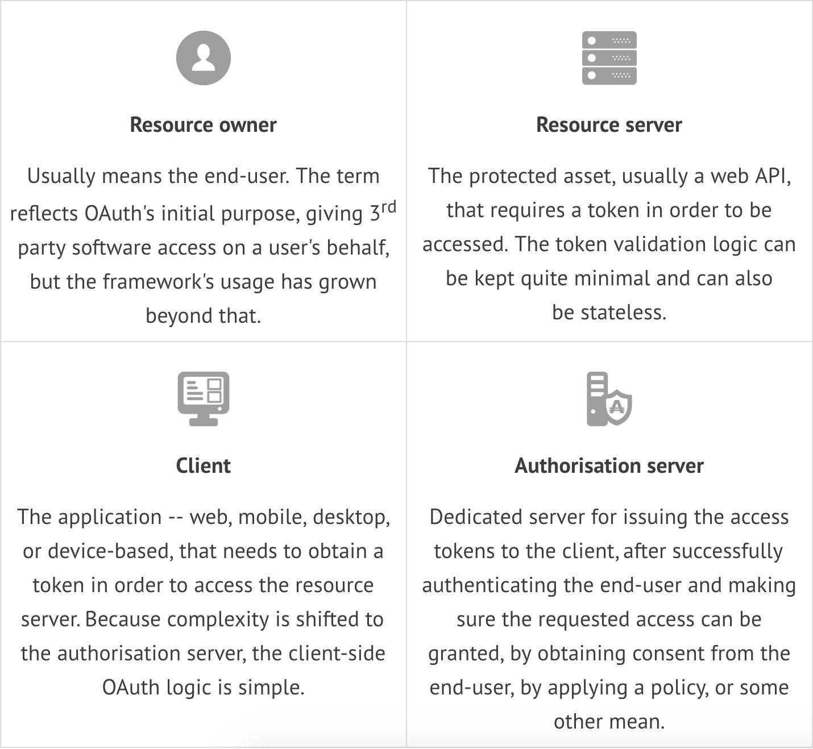

# OAuth 2.0
---

https://connect2id.com/learn/oauth-2

The OAuth 2.0 security framework has flows for web, mobile and IoT clients, plus useful APIs for managing the token lifecycle to protect an application with tokens. What started as a simple and effective solution for granting 3rd party access to social profiles, has evolved to support applications in a range of domains, with even the most stringent security requirements.

## The four roles in OAuth

OAuth defines four roles, with clean separation of their concerns.

