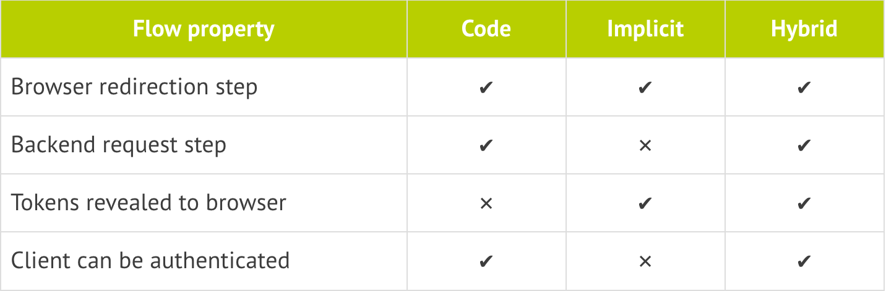
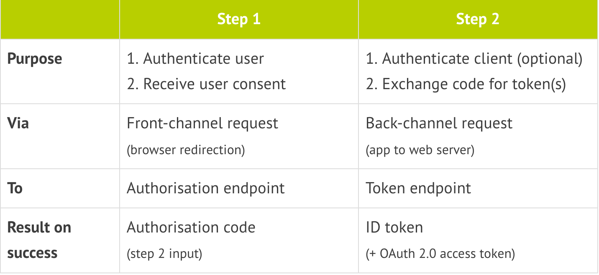

OpenID Connect explained
---

Reference: https://connect2id.com/learn/openid-connect

## Identity Provider (IdP):

Delegating user authentication and provisioning to a dedicated, purpose-built service,

Google, Facebook and Twitter, where many people on the internet are registered, offer such IdP services for their users. A consumer web site can greatly streamline user on boarding by integrating login with these IdPs.

In a enterprise, this would ideally be one internal IdP service, for employees and contractors to log into the internal applications

Centralization has considerable benefits, such as easier administration and potentially faster development cycles for new apps. You may ask: Isn't that going to create a single point of failure? No, not when the IdP service is built for redundancy.


## OpenID Connect

OpenID Connect, published in 2014, is not the first standard for IdP, but definitely the best in terms of usability and simplicity, having learned the lessons from past efforts such as SAML and OpenID 1.0 and 2.0.

success formula of OpenID Connect:

- **Easy to consume identity tokens**: Clients receive the user's identity encoded in a secure JSON Web Token (JWT), called an ID token. JWTs are appreciated for their elegance and portability, and for their ready support for a wide range of signature and encryption algorithms. All that makes JWT outstanding for the ID token job.

- **Based on the OAuth 2.0 protocol**: The ID token is obtained via a standard OAuth 2.0 flow, with support for web applications as well as native / mobile apps. OAuth 2.0 also means having one protocol for authentication and authorization (obtaining access tokens).

- **Simplicity**: OpenID Connect is simple enough to integrate with basic apps, but it also has the features and security options to match demanding enterprise requirements.

---

## The identity token

The ID token resembles the concept of an identity card, in a standard JWT format, signed by the OpenID Provider (OP). To obtain one the client needs to send the user to their OP with an authentication request.

Features of the ID token:

- Asserts the identity of the user, called subject in OpenID (`sub`).
- Specifies the issuing authority (`iss`).
- Is generated for a particular audience, i.e. client (`aud`).
- May contain a nonce (`nonce`).
- May specify when (`auth_time`) and how, in terms of strength (`acr`), the user was authenticated.
- Has an issue (`iat`) and expiration time (`exp`).
- May include additional requested details about the subject, such as name and email address.
- Is digitally signed, so it can be verified by the intended recipients.
- May optionally be encrypted for confidentiality.

```
{
  "sub"       : "alice",
  "iss"       : "https://openid.c2id.com",
  "aud"       : "client-12345",
  "nonce"     : "n-0S6_WzA2Mj",
  "auth_time" : 1311280969,
  "acr"       : "c2id.loa.hisec",
  "iat"       : 1311280970,
  "exp"       : 1311281970
}
```

The ID token header, claims JSON and signature are encoded into a base 64 URL-safe string, for easy passing around, for example as URL parameter.


## How to request an ID token

Authentication must take place at the identity provider, where the user's session or credentials will be checked. For that a trusted agent is required, and this role is usually performed by the web browser.

A browser popup is the preferred way for a web application to redirect the user to the IdP. Mobile apps on platforms such as Android or iOS should launch the system browser for that purpose. Embedded web views are not be trusted, as there's nothing to prevent the app from snooping on the user password. User authentication must always occur in a trusted context that is separate from the app (e.g. the browser).

ID tokens are requested via the OAuth 2.0 protocol.

OAuth has flows designed for all application type: traditional server-based web applications, browser (JavaScript) only apps, and native / mobile apps.

- **Authorisation code flow** - the most commonly used flow, intended for traditional web apps as well as native / mobile apps. Involves an initial browser redirection to / from the OP for user authentication and consent, then a second back-channel request to retrieve the ID token. This flow offers optimal security, as tokens are not revealed to the browser and the client can also be authenticated.

- **Implicit flow** -- for browser (JavaScript) based apps that don't have a backend. The ID token is received directly with the redirection response from the OP. No back-channel request is required here.

- **Hybrid flow** -- rarely used, allows the application front-end and back-end to receive tokens separately from one another. Essentially a combination of the code and implicit flows.





## ID token uses

An ID token can be put to uses beyond basic sign-in:

- **Stateless sessions** -- Put into a browser cookie the ID token can implement a lightweight stateless session. This does away with the need to store sessions on the server side (in memory or on disk), which can be a burden to manage and scale. The session is checked by validating the ID token. When the token reaches some predefined age past its issue timestamp (iat) the application can simply ask the OP for a new one via a silent prompt=none request.

- **Passing identity to 3rd parties** -- The ID token may be passed to other application components or to backend services when knowledge of the user's identity is required, for example to log audit trails.

- **Token exchange** -- The ID token may be exchanged for an access token at the token endpoint of an OAuth 2.0 authorisation server. There are real world scenarios when an identity document is required to obtain access, for example when you check in at a hotel to get your room key. Token exchange has uses in distributed and enterprise applications.

---

## Example OpenID authentication




To be continued..


---
