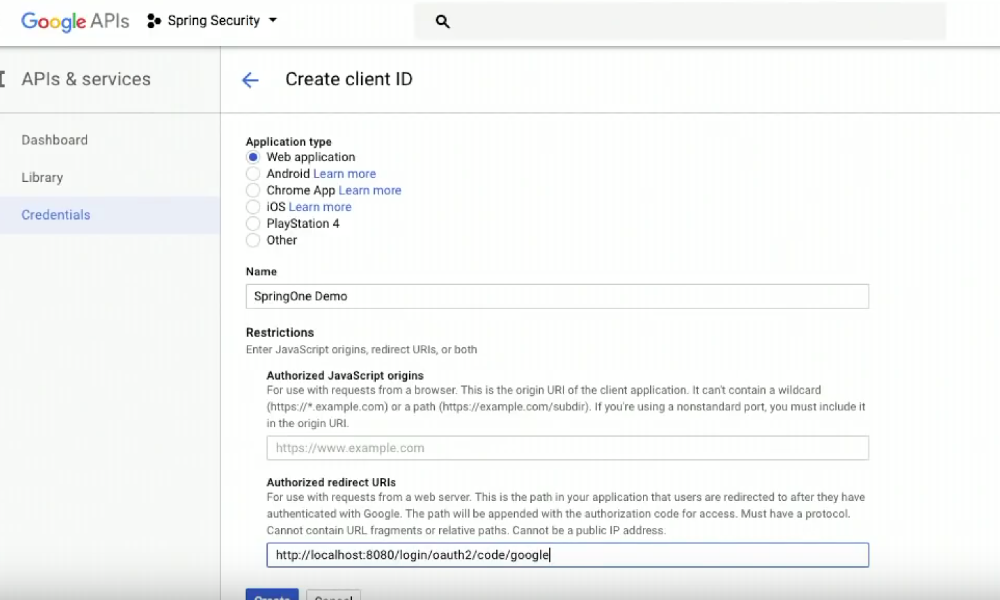

# Stateless (Session-less) Authentication

https://dzone.com/articles/spring-security-5-oauth-20-login-and-signup-in-sta

https://hk.saowen.com/a/d6d4454ffa3c0ef1b7b74ad2961b92a298bd0a5f1aba66d50ab892917883636a
https://hk.saowen.com/a/0e5f4e1ffc5cb8198c0d56e262a0e14491f7f7853f517cb8b22bed32156f4032

- Post for integrating angular application with Rest backend

https://medium.com/@nydiarra/secure-a-spring-boot-rest-api-with-json-web-token-reference-to-angular-integration-e57a25806c50

---

when the user clicks on “Sign on using Google,” you’ll open https://api.example.com/oauth2/authorization/google in the browser.

what happens when the browser opens https://api.example.com/oauth2/authorization/google?

Spring Security has a `OAuth2AuthorizationRequestRedirectFilter`, which intercepts requests of the pattern `/oauth2/authorization/*`, and does the following:

- Creates an `OAuth2AuthorizationRequest` object. (A representation of an OAuth 2.0 Authorization Request for the authorization code grant type or implicit grant type.)

- Stores that using a configured `AuthorizationRequestRepository`.

- Redirects the browser to the provider’s authorization-uri page (e.g. https://accounts.google.com/o/oauth2/v2/auth), with a few parameters. Among the parameters would be a callback URL (e.g. https://api.example.com/login/oauth2/code/google).

`OAuth2AuthorizationRequestRedirectFilter` description in spring source code:

This `Filter` initiates the authorization code grant or implicit grant flow by redirecting the End-User's user-agent to the Authorization Server's Authorization Endpoint.

It builds the OAuth 2.0 Authorization Request, which is used as the redirect `URI` to the Authorization Endpoint.
The redirect `URI` will include the client identifier, requested scope(s), state, response type, and a redirection URI which the authorization server will send the user-agent back to once access is granted (or denied) by the End-User (Resource Owner).

----

in google console in application

redirect uri: http://localhost:8080/login/oauth2/code/google

Failed to load https://accounts.google.com/o/oauth2/v2/auth?response_type=code&client_id=44684615755-t3v4e43nacg77ac7ctpa5ki9vkrab2b5.apps.googleusercontent.com&scope=openid%20profile%20email&state=FnDGX5E0S_A3BtSPVhmH_20tSkoZeq-hSn26EVqyhYg%3D&redirect_uri=http://localhost:8080/login/oauth2/code/google: Response to preflight request doesn't pass access control check: No 'Access-Control-Allow-Origin' header is present on the requested resource. Origin 'null' is therefore not allowed access.

http://localhost:8080/login/oauth2/code/google?state=FnDGX5E0S_A3BtSPVhmH_20tSkoZeq-hSn26EVqyhYg%3D&code=4%2FgACS-RGV0i_kJB33quStZ1roCOQe7CP8a4pC2pDKx7sNH8bFKKBQVRn_dqNTcQftmkTsO91NLqA61hoVHgiWh7g&scope=openid+email+profile+https%3A%2F%2Fwww.googleapis.com%2Fauth%2Fplus.me+https%3A%2F%2Fwww.googleapis.com%2Fauth%2Fuserinfo.profile+https%3A%2F%2Fwww.googleapis.com%2Fauth%2Fuserinfo.email&authuser=0&session_state=72f9976086ca332dffb26d8df41670cd8e4c993b..caf1&prompt=consent#

http://localhost:9000/social-login-success?token=eyJlbmMiOiJBMTI4Q0JDLUhTMjU2IiwiYWxnIjoiZGlyIn0..QX_MScAcPbQxNw24IxW_lA.uh1K_jtruwovP0wyDunDl1sFDwe17RXLJtGhVxxI0vR-ajA58a-kmWX9k3MM7Mqs6gDLmponSKg2uIUDyNgTzCy1bIB8yFhCelV_xngRxb6yJV-5E0nsN_GOwgIzfJOv.NsXrcxQR08Gj9Tv2o810ow
---

For Github

authorization callback URL

http://localhost:8080/login/oauth2/code/github

/Users/ankirai/Documents/Personal_Docs/code/resource/maven_repo/org/springframework/security/spring-security-oauth2-client/5.0.9.RELEASE/spring-security-oauth2-client-5.0.9.RELEASE.jar

/Users/ankirai/Documents/Personal_Docs/code/resource/maven_repo/org/apache/commons/commons-lang3/3.7/commons-lang3-3.7.jar

----
