# Advanced Smart Contracts
---

## The Lottery Contract

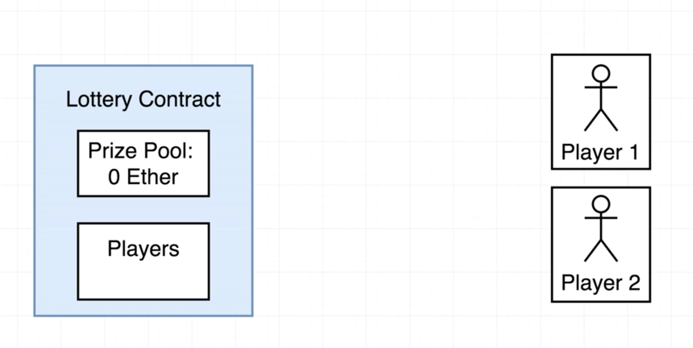

It will have a prize pool and a list of people who have entered for the prize pool.

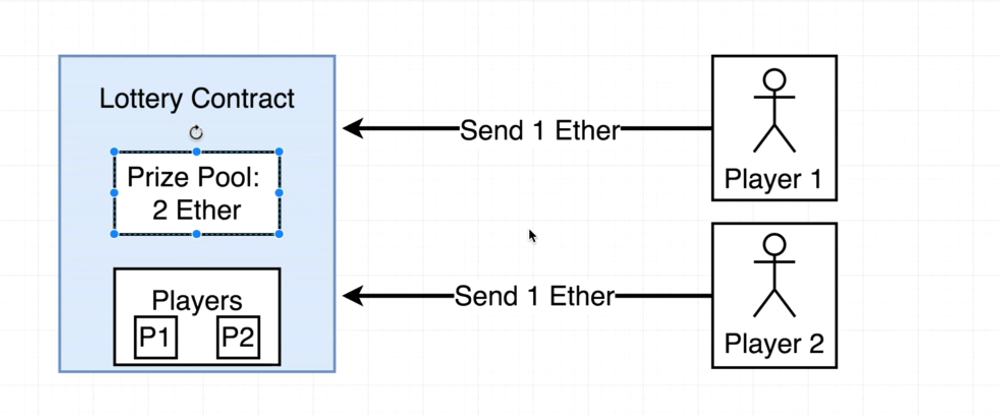

The Players will pay some ether to participate in the Lottery.

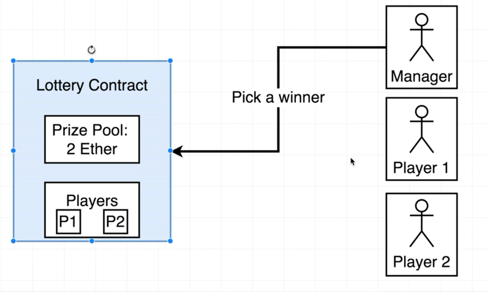

Another User (Manager) will initiate the Lottery contract to pick a winner

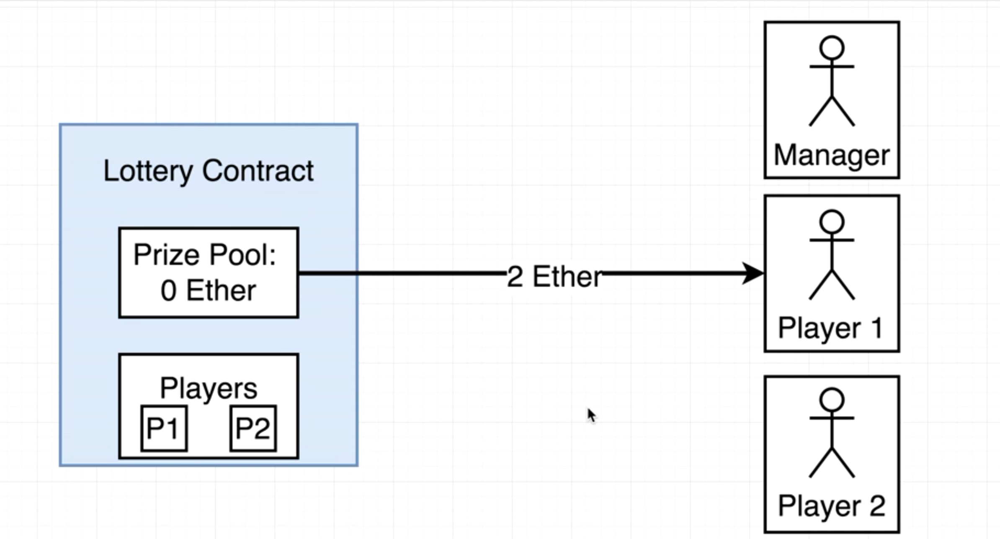

The contracts will look at its list of participants it will pick one of the players and it will send all of the money out of the prize pool to that particular winner. At that point the lottery contract then resets and then becomes ready to accept a new list of players and repeat itself all over again.

So essentially it's a self repeating contract that can be used for playing a tiny little lottery.

---

## Lottery Design

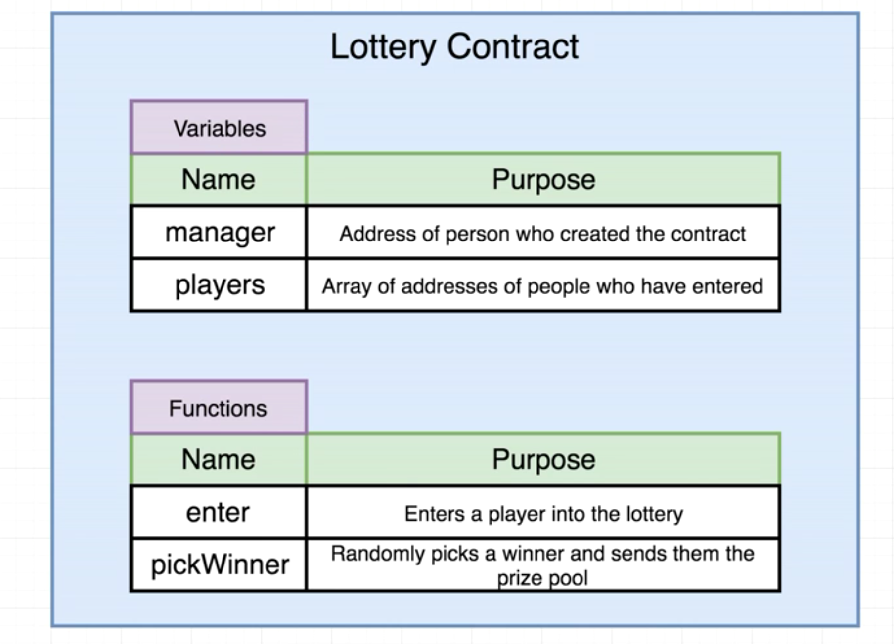

---

## Basic Solidity Types

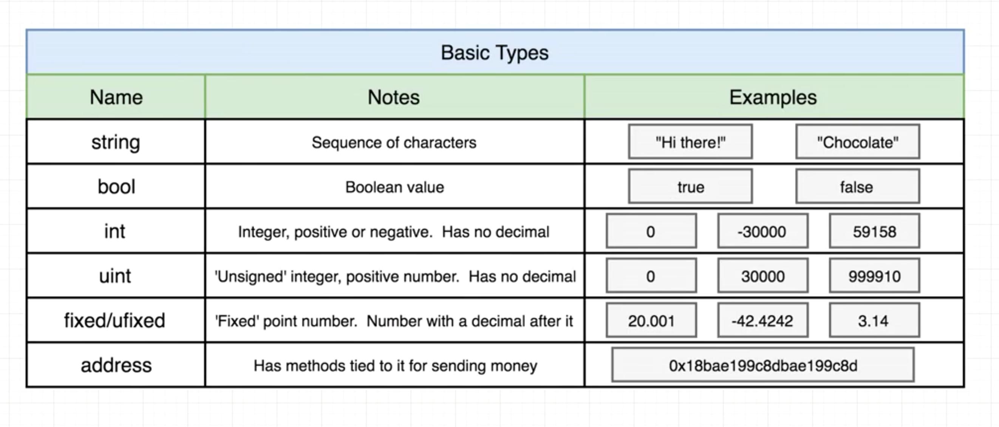

address type or a variable of type address is specifically meant for storing addresses.

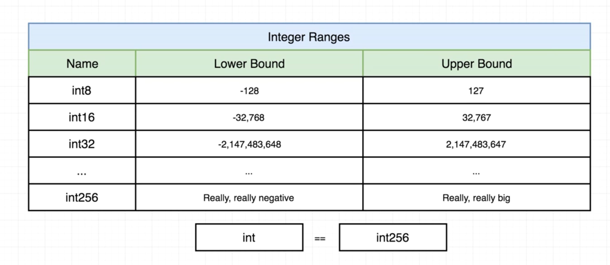

The number after the word int specifies the number of bits that are used to store this particular number the number of bits that are used to store a number will specify exactly how large a number this variable can contain. Same for `uint`.

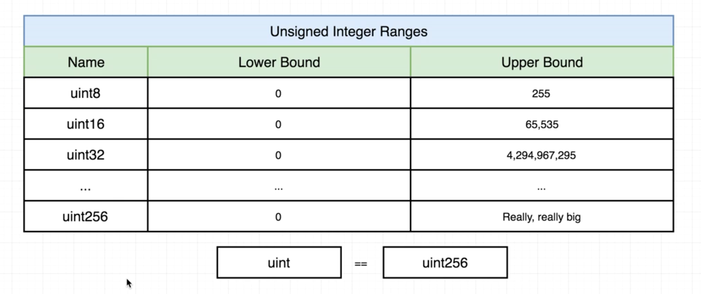

We usually do not end up doing a lot of math inside of our contracts. Remember these contracts are way more about storing raw data and implementing some simple very simple business logic.

As soon as we start doing complex math remember we pay for every operation that occurs inside of our contract. So it just ever happens that as we're writing these contracts, we very rarely end up putting some really critical business logic or some really complex math because we don't have to pay for doing that math.

---

## Starting the Lottery Contract

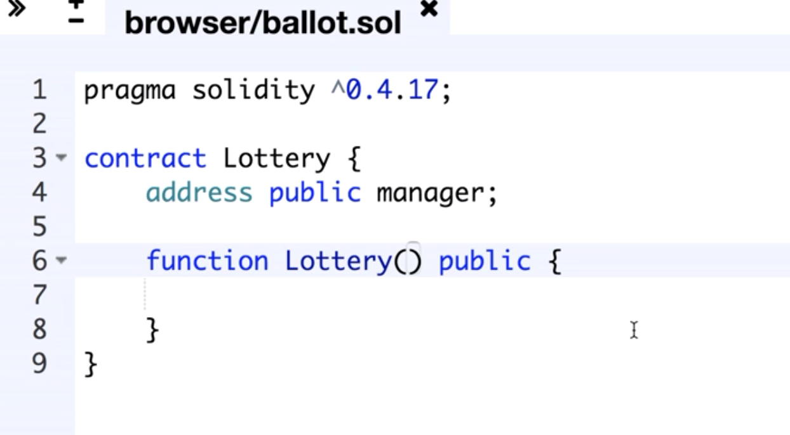

Remember the order of declarations that we use to make a new variable we specify: the type, it's visibility and then the variable name.

The visibility can be either public or private. Using public or private enforces no security whatsoever over the data inside of your contract. Using public or private is much more about making it clear to other developers whether or not they should be able to easily access this variable.

**The Message Global Variable**

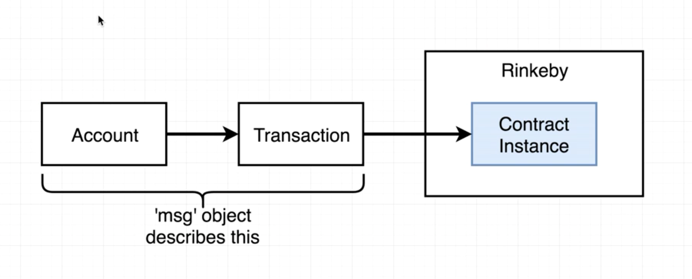

The `msg` (Message) global variable is the object has some properties on it that describe both who just sent in a transaction to the network and it also describes some details about the transaction itself.

This `msg` object is available not only when we create a new contract it's also available with any function invocation.

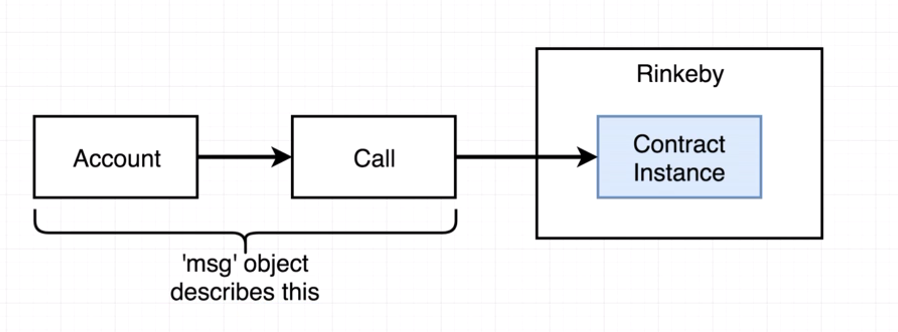

properties of the `msg` object

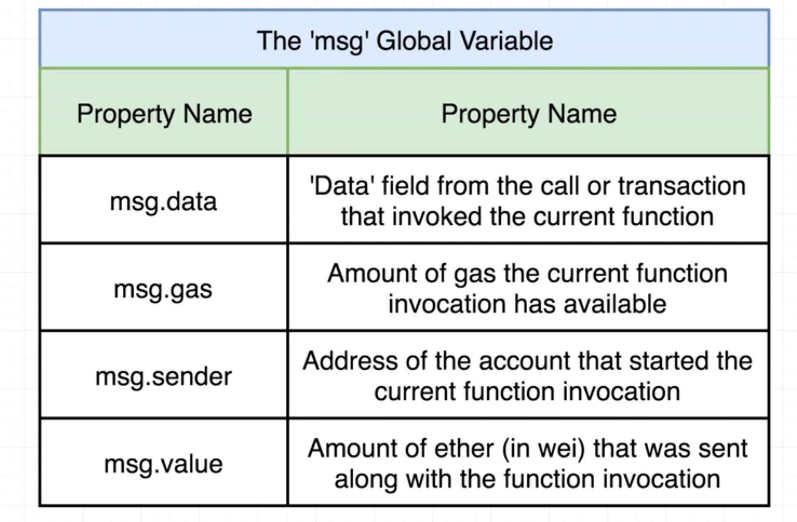

- data property : This is present on any transaction. The data property includes in the case of contract creation the contract source code and if we're trying to just invoke a function or send the transaction to a function then this will contain some of the arguments that we're trying to send to that function.

- gas property: the amount of gas that we have available to us to run some bit of code. In reality we very rarely actually make use of this property. Usually we assume that with any function invocation an appropriate amount of gas has been sent along with the transaction.

- sender property: This is the address of the person or the account who just sent in a transaction or a call to the network.

- value property: If a transaction is being sent in with some amount of ether tied to it then the value property contains the amount of ether that has been sent in.

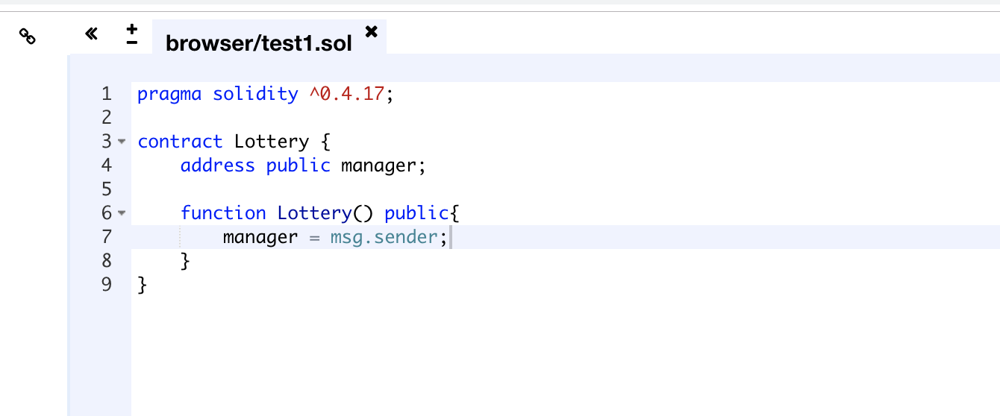

---

## Overview of Arrays, Mappings and Structs

An array in solidity is a example of a reference type.

Reference types available in solidity.

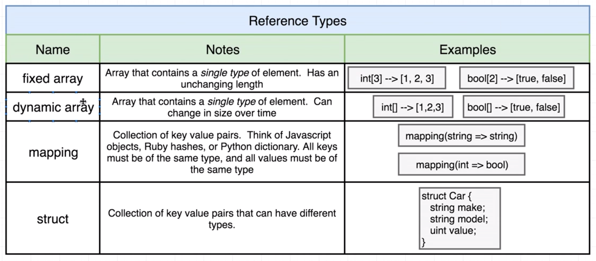

Arrays example

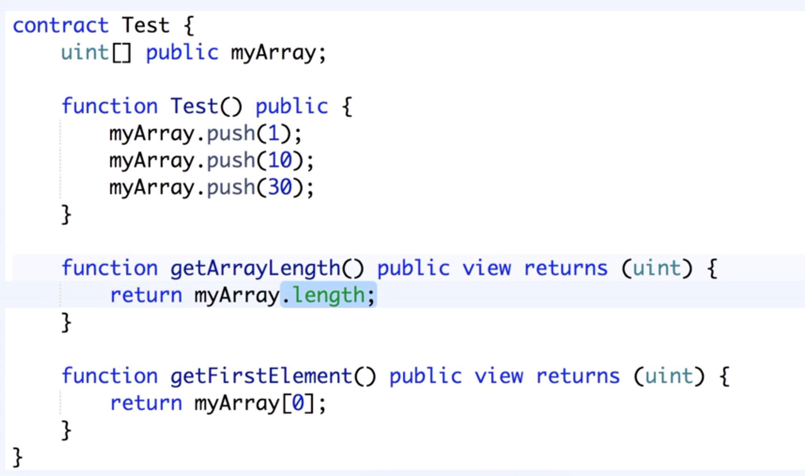

whenever we have an array in solidity the function that gets generated does not return the entire array.

A mapping is a collection of key value pairs.

A struct is a collection of key value pairs very similar to a mapping but the values of a struct can have different types. It is similar to a class in java.

---

## Big Solidity Gotcha

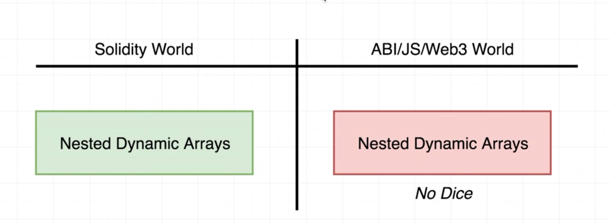

We do not yet have the ability to pull a nested dynamic rate from the solidity world over to the javascript world.

This is not a limitation of javascript and it's not a limitation of solidity. It's a limitation of the bridge between the two languages. That's the limitation of the communication layer, of the translation layer between the two.

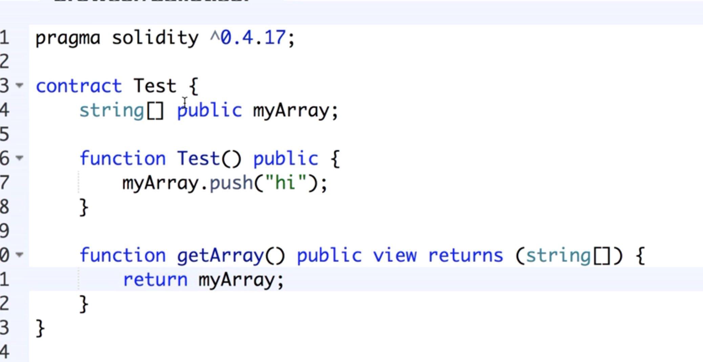
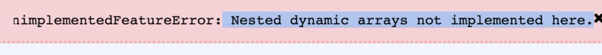

This may not seem like a big problem but there is one issue. Unfortunately strings inside of solidity are represented as dynamic arrays. It means that we cannot transfer arrays of strings over to javascript.

---

## Entering the Lottery

Function for entering into the lottery. For players to enter into the lottery, they have to send some ether while calling the function. Hence the `enter()` function is marked as `payable`. we use that `payable` keyword whenever someone has to call that function and send along some amount of ether.

To get the address of the player we can use `msg.sender` which has the property of the sender.

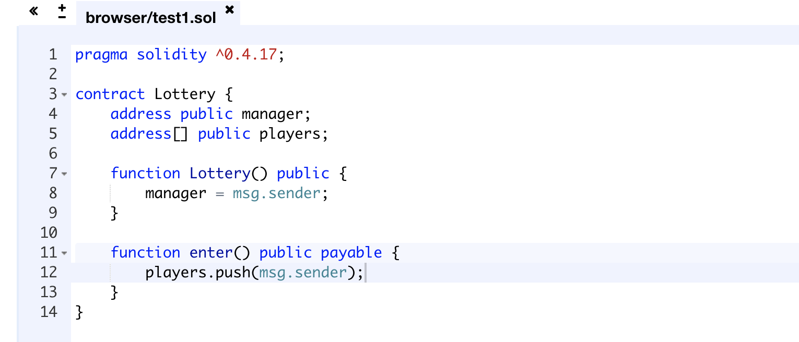

**Validation with Require Statements**

We will validate if the person who wants to enter into lottery has send the required amount of ether to the transaction.

The function that we're going to call is `require`. `require` is used for validation. We can pass in some type of boolean expression to this `require` function.

If that billing expression returns to false then the entire function is immediately exited and no changes are made to the contract. If the expression evaluates to true then code inside the function continues to run as usual.

So the `require` function is a great thing to use to make sure that some requirement has been satisfied before allowing the rest of the function to be executed.

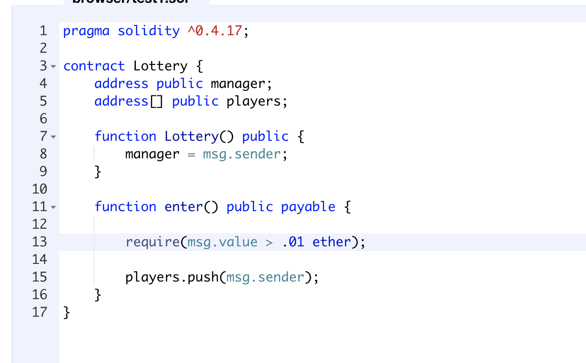

We check the value send through `msg.value` property. This is the amount of ether (in wei) specifically that was sent along with the function invocation.

---

## Pseudo Random Number Generator

The goal of the pickWinner function is to randomly pick a winner out of a list of players. And the key word in here is randomly. However with solidity we do not get access to a random number generator. There's no such thing as a random number generator with solidity.

we're going to have a pseudo random generator.

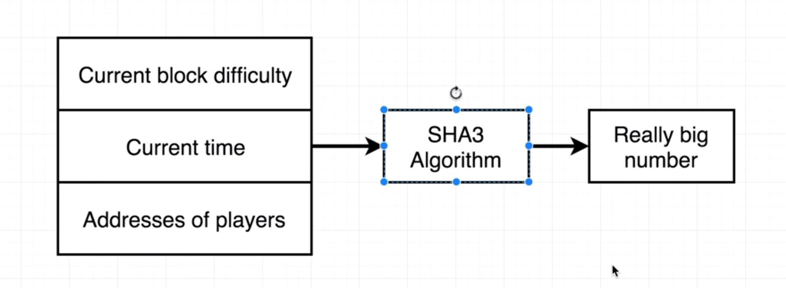

So although it looks like that it is a random number ahead of time, people can kind of figure out these variables.

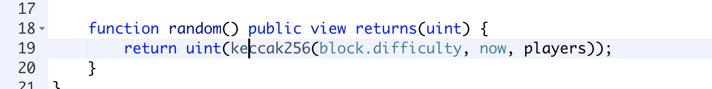

---

## Selecting a Winner

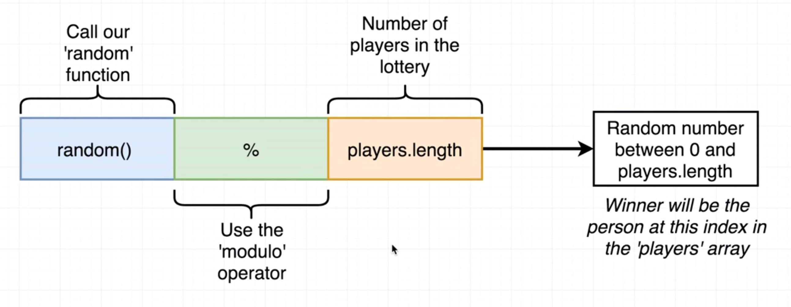

 

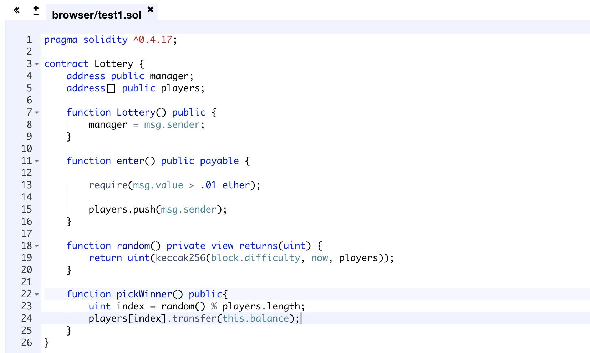

---

## Resetting Contract State

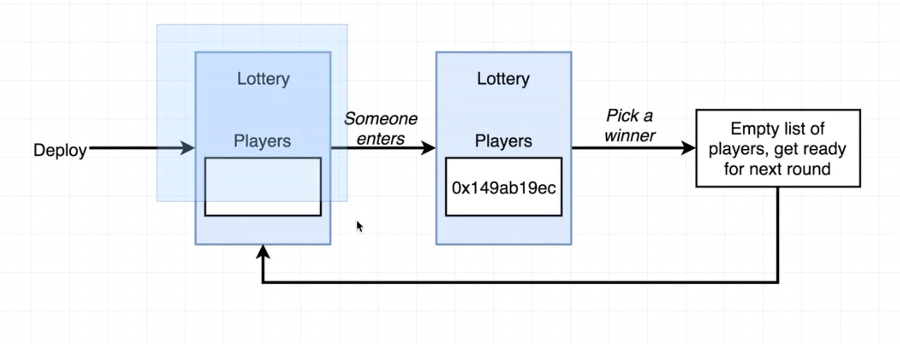

Code for Resetting

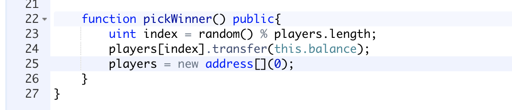

----
