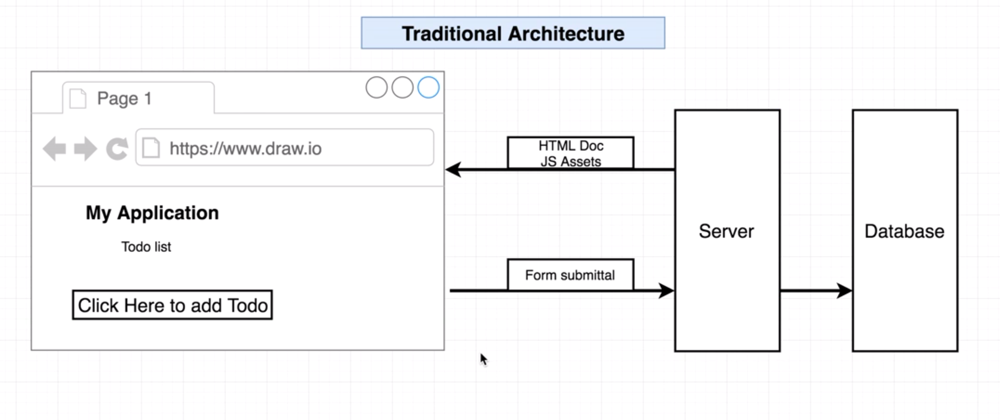
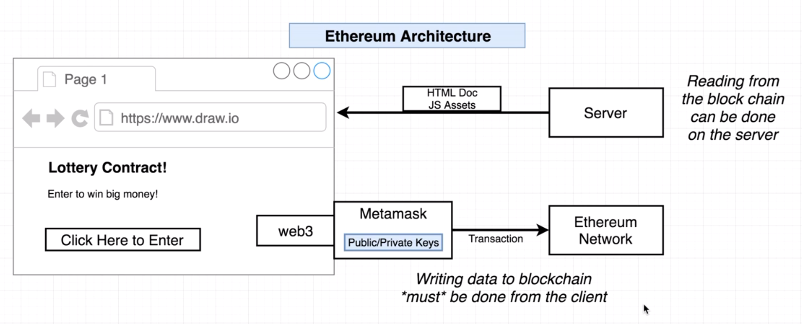
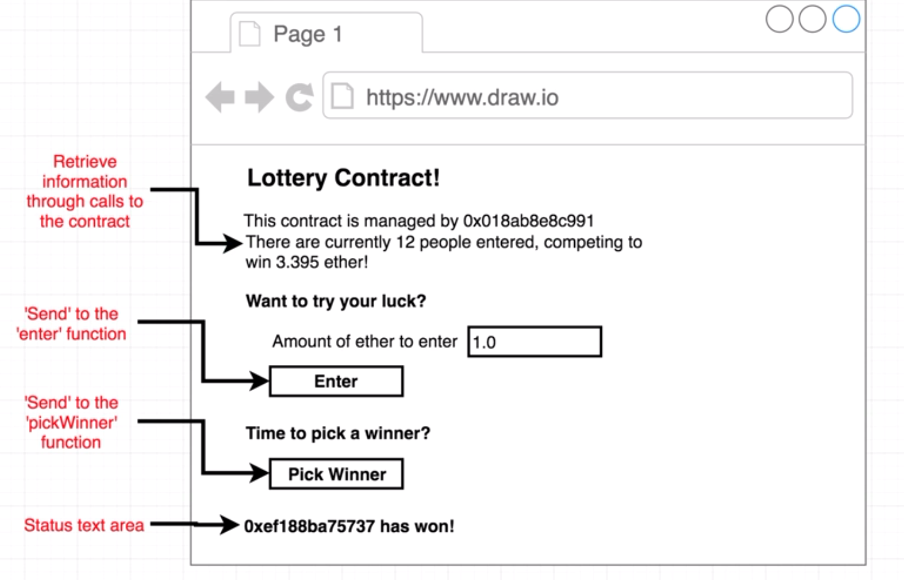
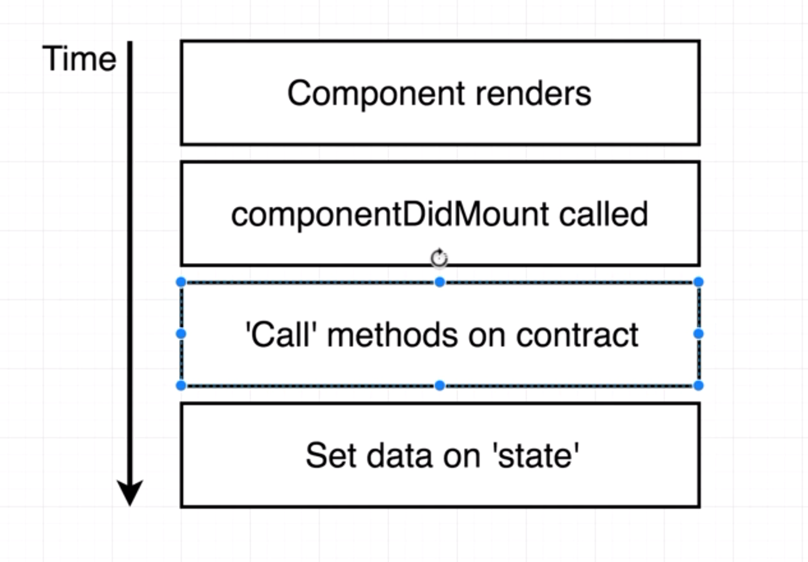

## Ethereum App Architecture

Difference between traditional web applications and ethereum web applications.

**traditional web applications**

**ethereum web applications**

---

**Application Structure**

---

**Install npm tools**

- `create-react-app`

- `web3@1.0.0-beta.35`

---

## Confusion regarding multiple web3 instances

Our Application by default tries to use the instance of Web3 provider from the metamask plugin installed in the browser. Unfortunately, the web3 version in the metamask is the old one and uses callbacks. The one we installed above from npm is the latest one which uses async.

Also our ether for the rinkeby network is stored in the metamask plugin only and that will be used for deploying or running the application on the rinkeby ethereum network. The provider present in the web3 of metamask is used to connect to the ethereum network. So, we are gonna hijack the provider present in the metamask and use it in our application.

---

## React State Flow

---

----
