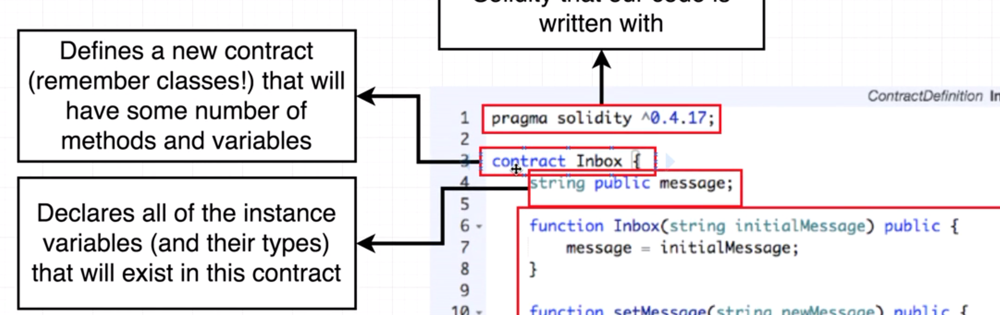

# Blockchain history

## Bitcoin whitepaper


[Link](https://bitcoin.org/bitcoin.pdf)

## Ethereum whitepaper


[Link](http://web.archive.org/web/20131228111141/http://vbuterin.com/ethereum.html)

---

## What is Ethereum


## Interfacing with Ethereum Networks


## metamask

Chrome extension to access ethereum network and perform operations.

## Ethereum accounts

Below is the anatomy of an ethereum account.


**Getting ether on rinkeby test network**

go to www.rinkeby-faucet.com and enter your account number. You will receive the same after some time.


Another network: faucet.rinkeby.io


---

## Transaction


**Transaction Flow**


**Why we have to wait for the Transaction**

Our Transaction goes to one of the nodes in the network and not to the network as a whole.


Our Transaction assembled with other transactions requested at the same time are grouped into a **block**. Node performs some calculation (or validation) on the block (also known as mining).


---

## Basic BlockChains

**SHA256**

SHA256 is a fingerprint of some digital data. If data is changed even a bit, the fingerprint will get changed.

**Block**

Mining is calculating the next hash value which will satisfy the given condition and it is done by increasing the nonce value step by step and performing the calculation.

## Block time


## Smart Contracts

Smart contracts are used to build interesting applications on ethereum blockchain.


In layman terms: a smart contract is an account that is being controlled by some amount of code. The developer is going to author this code. This code instructs the smart contract how to behave.

**Contract Account**


**Difference between account created on metamask (user account) and contract account**


- external accounts live in their own type of universe and they're completely decoupled from any individual network. We can use the same exact account to connect to the main network, Robeston, Kovan or Rinkeby.

- contract accounts are only specific to one individual network. So when we create a contract account that contains our smart contract we create it on one specific network and they cannot be accessed across networks.


**Contract Source**

contracts source is the actual code that instructs the contract how it should behave and how it should handle money.

We can then take that contract code that source code and deploy it to a network like say Rinkeby.

When we deploy this contract code it creates an instance of the contract or what are what we refer to as the contract account.

We can take one contract source code and deploy multiple times to one network or multiple networks in that sense you can really imagine the relationship between the source code files right here and these deployed instances as being very very similar to the relationship between a class and an instance in the programming world.


---

## The Solidity programming language


**How Solidity is used**


A contract definition is fed  into a solidity compiler. This compiler is going to spit out two separate files.

The first one is going to contain some byte code and this is the actual byte code that will be deployed to the ethereum network. So this is the actual stuff that gets stuffed into our contract account.

Another thing the solidity compiler is also going to spit out something called the **application binary interface** which we are going to refer to as the ABI.


**How ABI is used**


---

## Contract Structure

```
pragma solidity ^0.4.17;

contract Inbox {
    string public message;

    function Inbox(string initialMessage) public{
        message = initialMessage;
    }

    function setMessage(string newMessage) public{
        message = newMessage;
    }

    function getMessage() public view returns (string) {
        return message;
    }
}
```





`message` in the above is a storage variable. A storage variable is one that will be automatically stored with the contract on the block chain. So that means whenever we change the value of message right here the value that we assign to message will be automatically stored for all eternity on the block chain.

And we can always pull our contract back up from the block chain and look at the value of this variable right here.

This is in contrast to local variables local variables are kind of one time created when a contract is executed and then thrown away at the very end. And they are never actually persisted on the block chain.

**Function Declarations**


---

## Testing with remix


For Testing use the Environment value as `Javascript VM` in the remix editor.

---

## Behind the scenes of deployment


Creating a contract is very similar to the transfer of money between two different parties. There are just some very small differences.

Before whenever we want to send money from one person to another we are going to take our account to author a new transaction.

This transaction right here will have a purpose of trying to create a new contract and we're going to send that from our account over to some specific network. So this is an external account to create a contract transaction.

The big difference between a money sending transaction and a contract creation transaction is that *to* field right here is left as blank. So if we send a transaction into the network and leave to blank. That means that we are going to attempt to create a new contract.

**the data property** - This is the actual compiled byte-code of the contract. This is where the code that comes out of the solidity compiler is sent in and stored on the network. Specifically the code gets stored in the account that is created that represents our actual contract. Whenever you write one of these contracts and deploy it to a network all the code or at least the raw byte code is available for everyone else in the world to read. So there's really no concept of inherent security of the code we write.

this contract will still be signed with these `v`, `r` and `s` properties which are derived from the sender's private key and can be used to derive their public key. So this is where it says essentially this is the person who is trying to create this contract.

----

## Running Functions on contracts

Anytime we want to change any data that gets stored on the block chain we are going to have to submit a transaction. Not only do we have to submit that transaction but we also have to wait for it to be mined or to go through that proof of work algorithm and that can take anywhere from 10 to 30 seconds to execute.


So any time we are trying to update a value any time on any contract it's going to take somewhere from 15 to 30 seconds to actually execute and give us a notification back that says hey everything looks good. Secondly whenever we send a transaction to a function that returns the transaction hash id.


Sending a transaction to a function costs money.


----

## Wei vs Ether

There are different units of measurement in ether.


There are many tools available to convert between these units.


---

## Gas and Transactions

In order to get someone else to run our contracts we have to pay them money. This money is reflected in terms of gas. Any time we send the transaction to the ethereum network there is some amount of gas price attached to it.

Let's say we have a function in our contract that performs some mathematical operations as below:

```
function doMath(int a, int b){
  a + b;
  b - a;
  a * b;
  a == 0;
}
```

We can break down the price of each of these operations with a little spreadsheet and we can see exactly how much gas it would cost us to execute on the Ethereum network.


It might seem like we're always going to know the amount of money or the amount of gas that we're going to need to spend ahead of time like we can very easily look at this series of above operations  and we can go back over to that spreadsheet and calculate the same.

However there are many types of code that we can write where we cannot easily compute the amount of gas it's going to take ahead of time. (e.g. for loop where the collection of records to be process is unknown beforehand)

**Gas Price**


If we issue a transaction and we provide a gas price of 300. That means we are willing to spend 300 *wei* for every unit of gas and we are willing to spend at most 10 units of gas. So at most don't spend more than 10. This is the absolute limit of what we're willing to do.


So what happens and which in the case in which we say that we need some amount of gas but we only allowed this amount right here. Well for every operation that is executed inside of our contract we execute a line of code or an operation and then the person who is executing that code checks to see the current amount of gas that has been spent and how much is available. As soon as we execute more steps of gas than we have available, the execution of our function immediately halts.

If now we increase the units of gas that can be consumed for transaction. The gas remaining after the actual execution that does not get consumed, gets sent back to us (the person who created the transaction object).

**Total Cost Calculation**


We also have to spend some amount of gas to store data within our contract as well. All these operations that modify or store data on the block chain are going to cost some amount of money.

So this imposes a very strict limit on the types of applications that you can expect to build with ethereum.

---

## Mnemonic Phrases

It is possible to have multiple ethereum accounts.


With each accounts there is associated an address, public key and private key.


Mnemonic Phrases are 12 words combination that can be used to determine the next available account's address, public key and private key.


Mnemonic Code Converter - https://iancoleman.io/bip39/


---
