# Smart Contracts with Solidity
---

## Contract Deployment

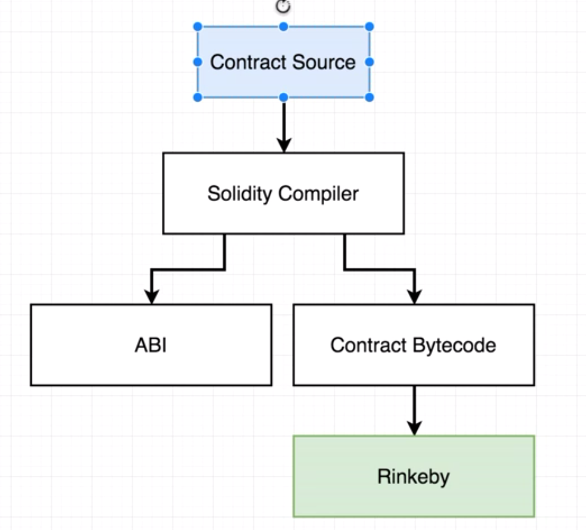

Common Tool used for contract deployment: Truffle

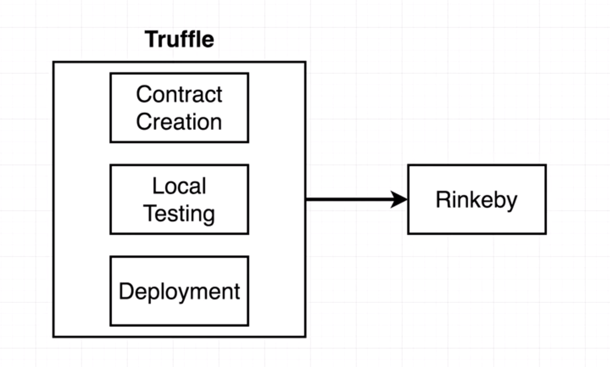

Problems with Truffle:

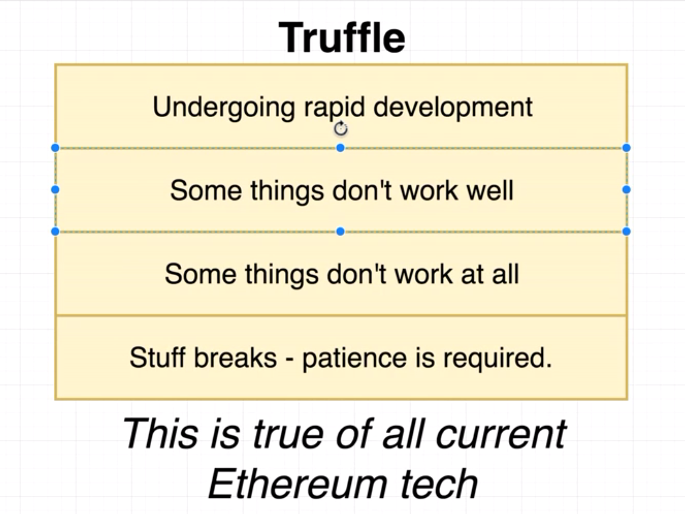


## Creating a Custom Project for developing, testing and deploying contracts

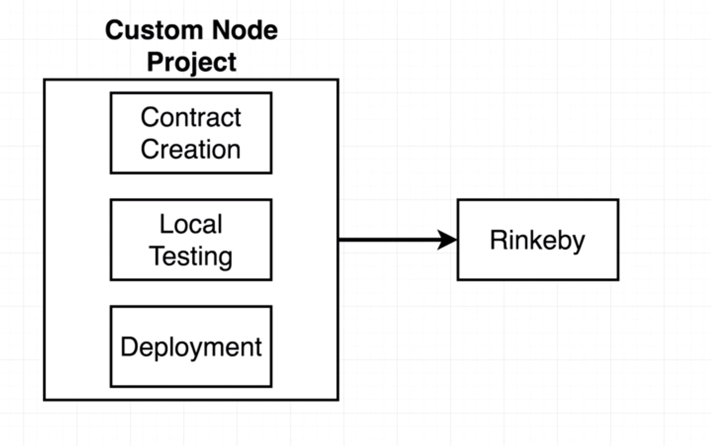

**Development Challenges and solutions**

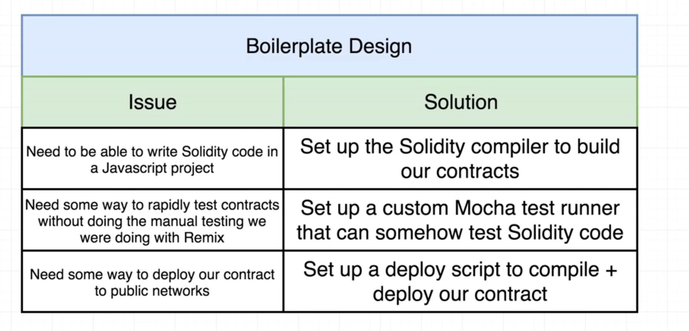

install a couple of dependencies and set up some pipeline to automatically compile code.

**Create a new node project**

- Initialize project

```
npm init
```

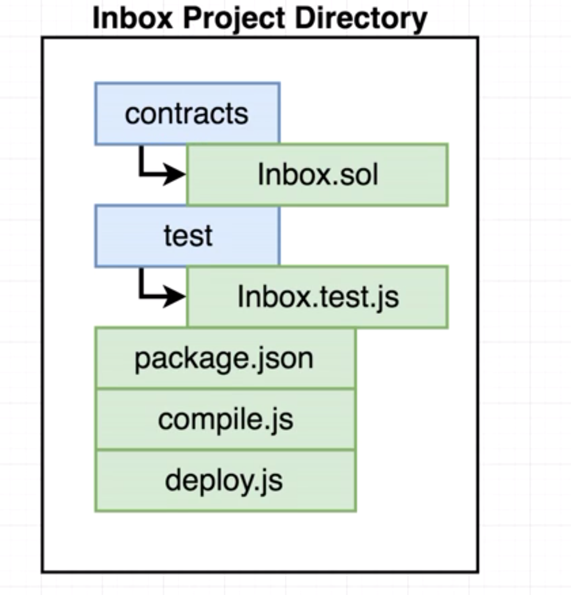

**compile.js** - this will be a small script file whose sole purpose will be to look inside that contracts directory and compile each of the contracts that exist inside of it.


**deploy.js** - this is also going to be a little script file whose sole purpose will be to take some compiled code and deploy it to a ethereum network that might be the main network or Ropeston or Rinkeby or even a private local network as well.

[Path to the Project]

[Possible Breaking changes and fixes](./breaking-changes-1.md)

## Compiling Solidity

Install the solidity compiler for node

```
npm install --save solc
```

Refer to the compile.js file

output of file:  
- interface object is the ABI.
- bytecode is the compiled code.

---

## Testing Architecture

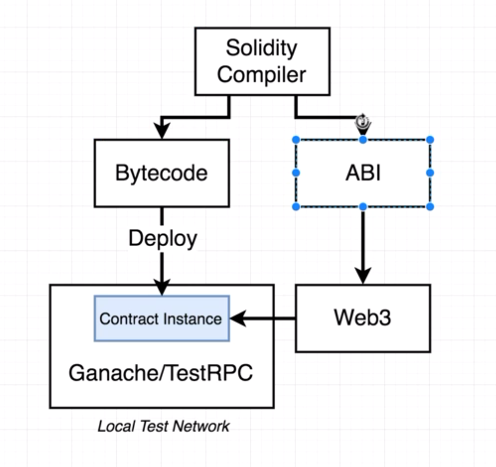

Ganache is used to create a local ethereum network to deploy the contracts. TestRPC is the old name of Ganache.

Web3 is a library that is used to get programmatic access to a deployed contract on the block chain. So Web 3 right here is kind of our portal into what is going on on the local test network.


---

## Installing Modules

Install node modules `mocha`, `ganache-cli`, `web3@1.0.0-beta.35`

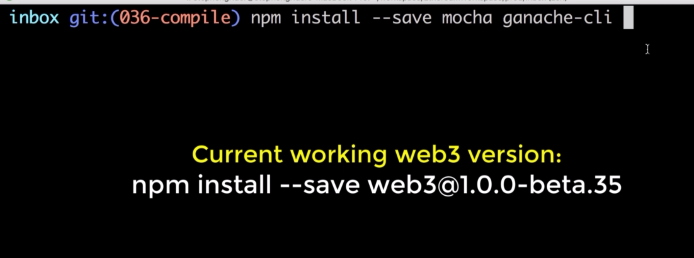

```
npm install --save mocha ganache-cli web3@1.0.0-beta.35
```

Refer to [Inbox.test.js] for require modules.

**Capital W in Web3 require** - This is a constructor. It is used to create instances of the web 3 library by tradition or by convention whenever we are working with a constructor function we always capitalize it.

Whenever we make use of Web 3 we have the constructor function and we use this to make instances of the web3 library. We can make multiple instances inside of one project. The purpose of each instance is to connect to a different theory of network.

**Web3 Versioning**

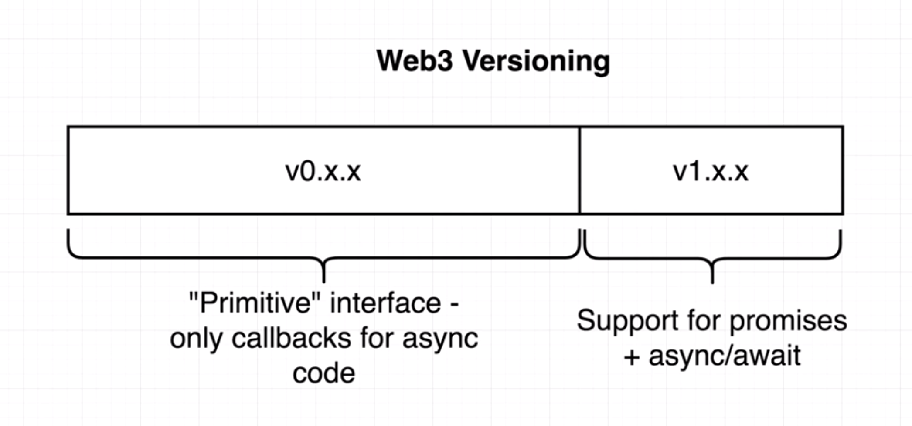


**Web3 Providers**

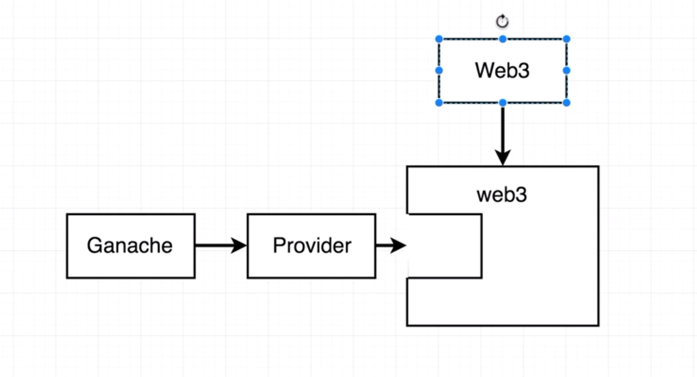

A provider can be thought of as like a communication layer between the web3 library and some specific ethereum network.

---

## Testing with Mocha

Mocha is a test running framework.

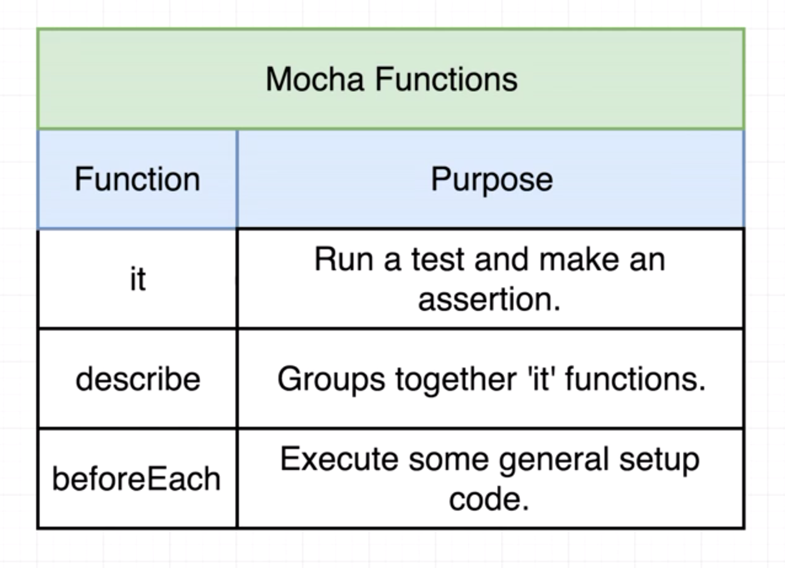

Sample Tests

```js
const assert = require('assert');

class Car {
  constructor() {

  }

  park() {
    return 'stopped';
  }

  drive() {
    return 'vroom';
  }
}

let car ;

beforeEach(() => {
  car = new Car();
});

describe('Car Tests', () => {

  it('can park', () => {
    assert.equal(car.park(),'stopped');
  });

  it('can drive', () => {
    assert.equal(car.drive(),'vroom');
  });

});

````

To run the tests update the `test` value under `scripts` in package.json to `mocha`.

**Mocha Structure**

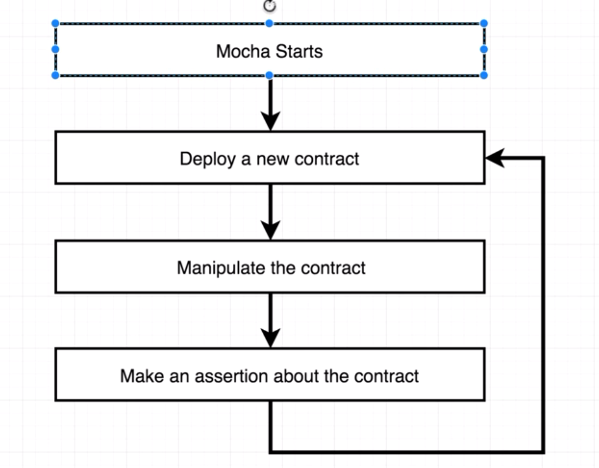

---

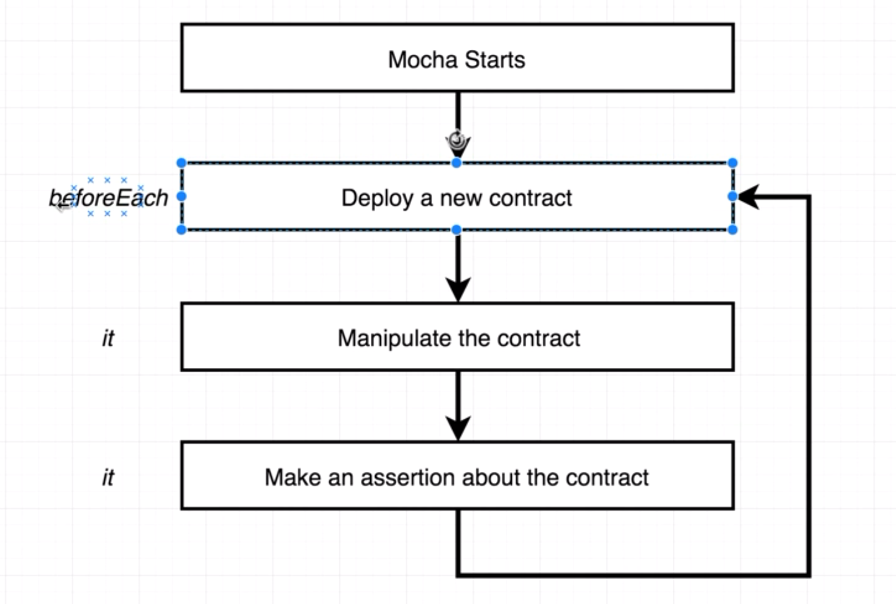


---

## Fetching accounts from Ganache

Mocha test for fetching accounts from Ganache.

```js

const assert = require('assert');
const ganache = require('ganache-cli');
const Web3 = require('web3');

const web3 = new Web3(ganache.provider());

beforeEach(() => {

  // Get a list of all accounts
  web3.eth.getAccounts().then(fetchedAccounts => {
    console.log(fetchedAccounts);
  });

  // Use one of the contracts to deploy the contract


});

describe('Inbox tests',() => {

  it('deploys a contract', () => {});
});

```

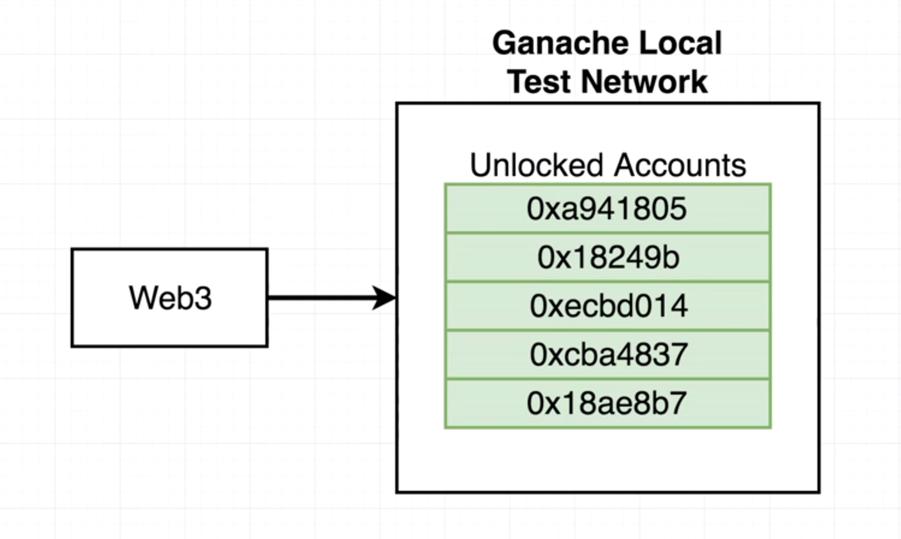


**Refactoring to Async/Await**

The Promise syntax used above can be refactored to Async/Await as follows:

```js
let accounts;
let inbox;

beforeEach(async () => {

  // Get a list of all accounts
  accounts = await web3.eth.getAccounts();

  // Use one of the contracts to deploy the contract

});

describe('Inbox tests',() => {

  it('deploys a contract', () => {
    console.log(accounts);
  });
});
```

---

## Deployment with Web3

The contract exported from solidity compiler has two properties assigned to it. In particular one is called interface and the other is bytecode. The property interface is the javascript API and bytecode is the actual raw compiled contract.

```js
inbox = await new web3.eth.Contract(JSON.parse(interface))
                      .deploy({data: bytecode, arguments: ['Hi there!']})
                      .send({from: accounts[0], gas: '1000000'});
```


[Refer to Inbox.test.js](.)


## Deployed Contract Overview

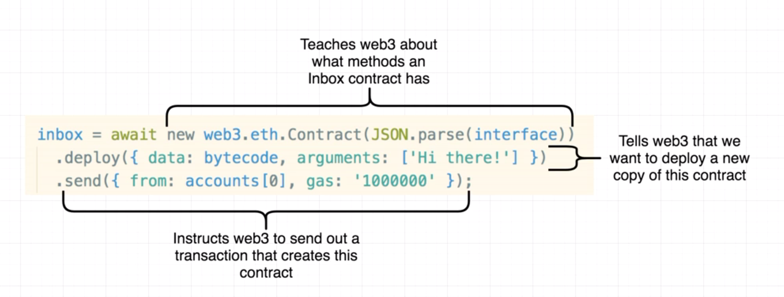


**Web3 with contracts**

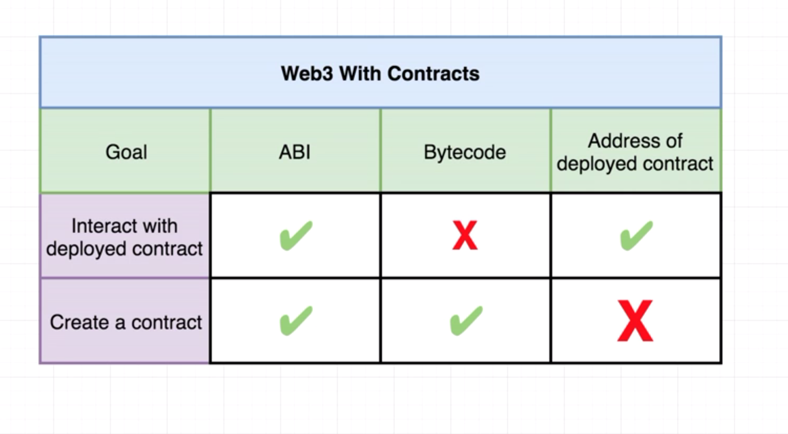

The Web 3 library is not only used in deploying contracts we can also use web3 to get access to contracts that have already been deployed to the network.

We can use web3 to create and deploy a new contract or we can use it to communicate to a contract that has already been deployed depending on what we're trying to do.

**Properties of inbox(deployed contract) object**

Provider - provider is the communication layer with the actual block chain. So whenever we provide a provider to web3 there are three types of providers so we can designate

- it can be a provider that communicates over web sockets and

- it can be one that communicates over HTTP connection and

- it can be the one that communicates over IPC or interprocess communication. IPC is used whenever you are running a block chain or a network on the same machine as your test or whatever you're using for your test set up as well.

Methods - Methods are the actual functions that we can interact with that are tied to our contract on the methods object

options - options contain some information about the actual contract that was just deployed.


[Web3 1.0.0-beta.26 version fix](./web3-version-fix.md)

---

## Deployment with Infura

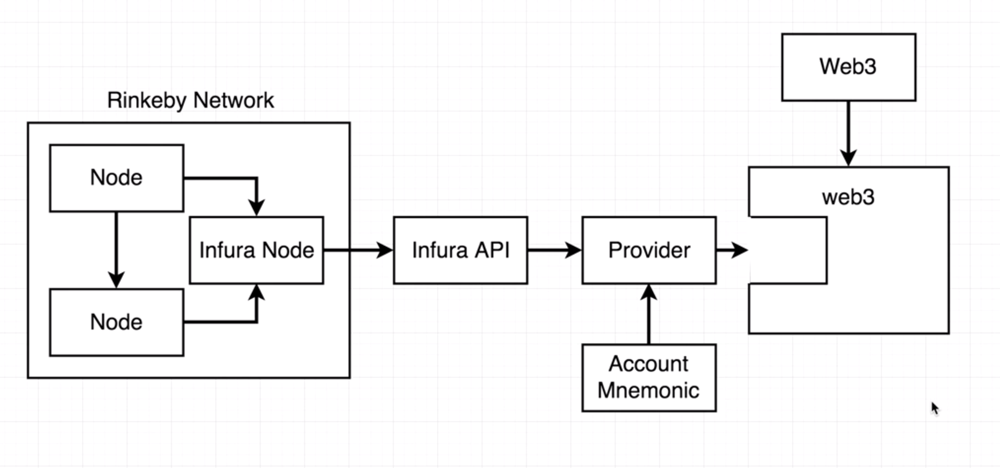

## Waller Provider Setup

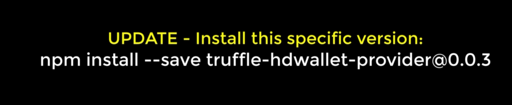

the provider is how our web3 instance talks to some particular network.

---

## Observing deployment on Etherscan

the deployed contract can be viewed on below link:

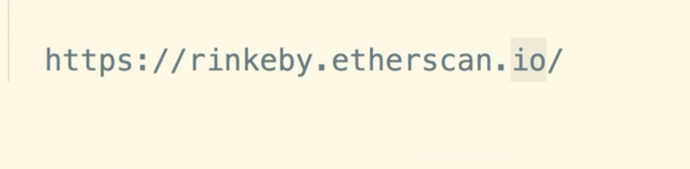

https://rinkeby.etherscan.io/

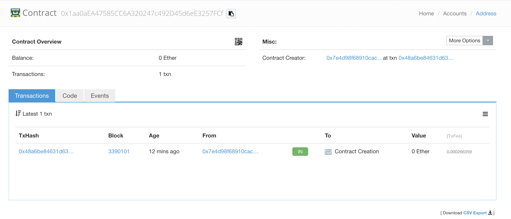

Transaction information

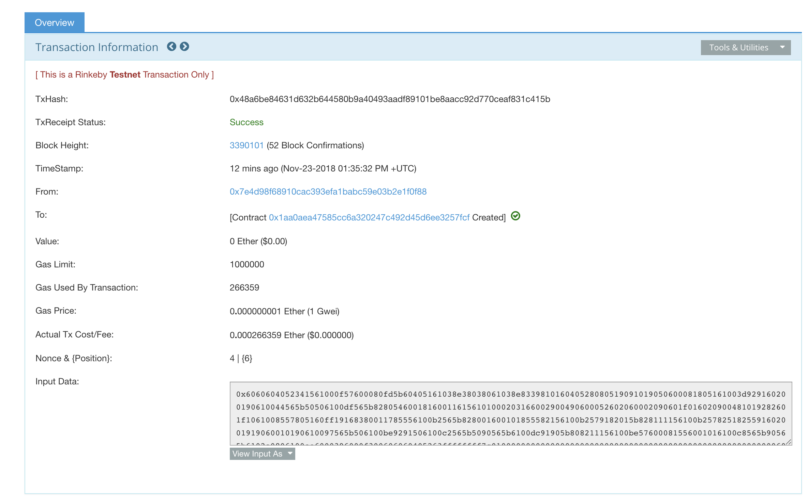


----
