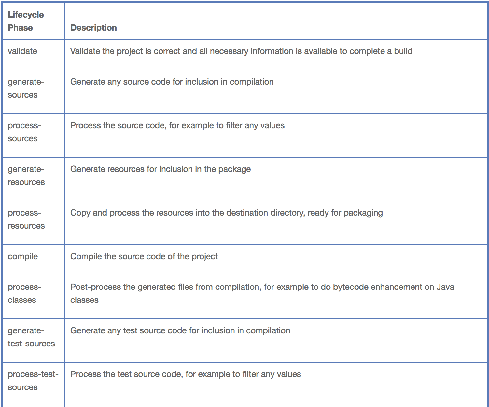
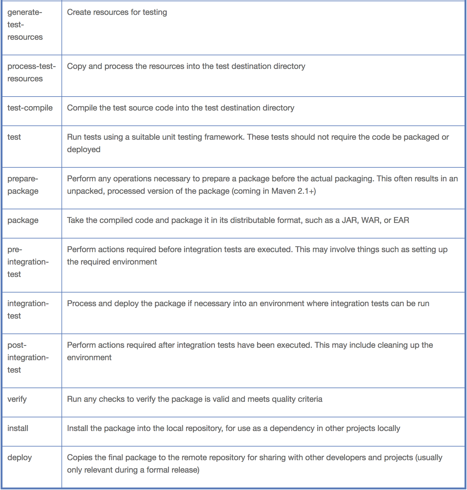

The Build Lifecycle
---

https://books.sonatype.com/mvnref-book/reference/lifecycle-sect-structure.html

A Maven lifecycle consists of a sequence of named phases: prepare-resources, compile, package, and install among other. A Maven lifecycle consists of a sequence of named phases: prepare-resources, compile, package, and install among other. There is phase that captures compilation and a phase that captures packaging. There are pre- and post- phases which can be used to register goals which must run prior to compilation, or tasks which must be run after a particular phase.

A build lifecycle is an organized sequence of phases that exist to give order to a set of goals. Those goals are chosen and bound by the packaging type of the project being acted upon. There are three standard lifecycles in Maven: clean, default (sometimes called build) and site.

## Clean Lifecycle (clean)

Running `mvn clean` invokes the clean lifecycle which consists of three lifecycle phases:

- `pre-clean`
- `clean`
- `post-clean`

The Clean plugin’s clean goal (`clean:clean`) is bound to the `clean` phase in the `clean` lifecycle. The `clean:clean` goal deletes the output of a build by deleting the build directory.

When you execute the `clean:clean` goal you do not do so by executing the goal directly with `mvn clean:clean`, you do so by executing the `clean` phase of the clean lifecycle. Executing the `clean` phase gives Maven an opportunity to execute any other goals which may be bound to the `pre-clean` phase.

In addition to configuring Maven to run a goal during the pre-clean phase, you can also customize the Clean plugin to delete files in addition to the build output directory. You can configure the plugin to remove specific files in a fileSet.

[Example](./code/clean-plugin-customized.md)

## Default Lifecycle (default)

It is a general model of a build process for a software application. The first phase is validate and the last phase is deploy.




## Site Lifecycle (site)

Maven can also generate project documentation and reports about the project, or a collection of projects. Project documentation and site generation have a dedicated lifecycle which contains four phases:

1. pre-site
2. site
3. post-site
4. site-deploy

The default goals bound to the site lifecycle is:

- `site - site:site`
- `site-deploy -site:deploy`

The Site plugin kicks off the execution of [Doxia](http://maven.apache.org/doxia/) document generation and other report generation plugins. You can generate a site from a Maven project by running the following command:
```
$ mvn site
```

---

# Package-specific Lifecycles


---
