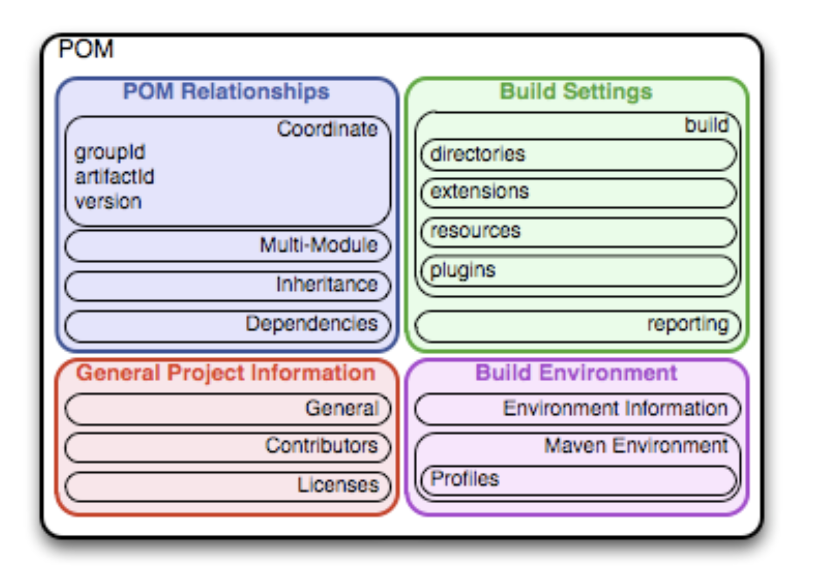
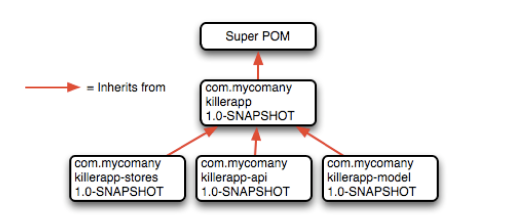
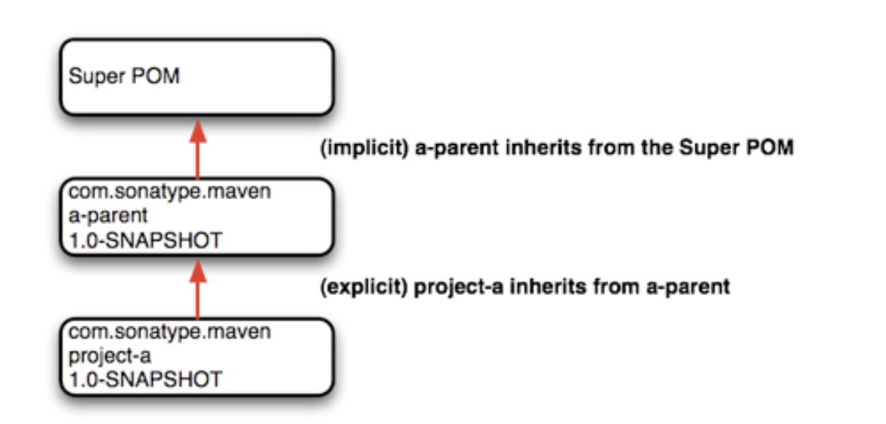

# Project Object Model (POM)
---

The POM is where a project’s identity and structure are declared, builds are configured, and projects are related to one another. The presence of a *pom.xml* file defines a Maven project. Maven projects, dependencies, builds, artifacts: all of these are objects to be modeled and described. These objects are described by an XML file called a Project Object Model. The POM tells Maven what sort of project it is dealing with and how to modify default behavior to generate output from source.



The POM contains four categories of description and configuration:

**General project information** - This includes a project’s name, the URL for a project, the sponsoring organization, and a list of developers and contributors along with the license for a project.

**Build settings** - In this section, we customize the behavior of the default Maven build. We can change the location of source and tests, we can add new plugins, we can attach plugin goals to the lifecycle, and we can customize the site generation parameters.

**Build environment** - The build environment consists of profiles that can be activated for use in different environments. For example, during development you may want to deploy to a development server, whereas in production you want to deploy to a production server. The build environment customizes the build settings for specific environments and is often supplemented by a custom `settings.xml` in `~/.m2`.

**POM relationships** - A project rarely stands alone; it depends on other projects, inherits POM settings from parent projects, defines its own coordinates, and may include submodules.

---

## The Super POM

All Maven project POMs extend the Super POM, which defines a set of defaults shared by all projects. This Super POM is a part of the Maven installation. Depending on the Maven version it can be found in the `maven-x.y.z-uber.jar` or `maven-model-builder-xy.z.jar` file in *${M2_HOME}/lib*.  

[The Super POM](./super-pom.md) for reference.

> An analogy to how the Super POM is the parent for all Maven POM files, would be how `java.lang.Object` is the top of the class hierarchy for all Java classes.

The Super POM defines some standard configuration variables that are inherited by all projects.

- The default Super POM defines a single remote Maven repository with an ID of `central`. This is the Central Repository that all Maven clients are configured to read from by default. This setting can be overridden by a custom *settings.xml* file. Note that the default Super POM has disabled snapshot artifacts on the Central Repository. If you need to use a snapshot repository, you will need to customize repository settings in your *pom.xml* or in your *settings.xml*.

- The Central Repository also contains Maven plugins. The default plugin repository is the central Maven repository. Snapshots are disabled, and the update policy is set to “never”, which means that Maven will never automatically update a plugin if a new version is released.

- The build element sets the default values for directories in the Maven Standard Directory layout.



## The Simplest POM

If you are just writing a simple project that produces a JAR from some source in *src/main/java*, want to run your JUnit tests in *src/test/java*, and want to build a project site using `mvn site`, you don’t have to customize anything. All you would need, in this case, is the simplest possible POM shown in The Simplest POM. This POM defines a `groupId`, `artifactId`, and `version`: the three required coordinates for every project.

```xml
<project>
    <modelVersion>4.0.0</modelVersion>
    <groupId>org.ankitrai.mavenlearn</groupId>
    <artifactId>simplest-project</artifactId>
    <version>1</version>
</project>
```

running `mvn package` would produce a JAR in *target/simple-project-1.jar*.

## The Effective POM

```
$ mvn help:effective-pom
```

Executing the `effective-pom` goal should print out an XML document capturing the merge between the Super POM and the POM from The Simplest POM.

---

# POM Syntax

The POM is always in a file named *pom.xml* in the base directory of a Maven project. This XML document can start with the XML declaration, or you can choose to omit it. All values in a POM are captured as XML elements.

**Project Versions**

A project’s version number is used to group and order releases. Maven versions contain the following parts: major version, minor version, incremental version, and qualifier. In a version, these parts correspond to the following format:

```
<major version>.<minor version>.<incremental version>-<qualifier>
```

**SNAPSHOT Versions**

Maven versions can contain a string literal to signify that a project is currently under active development. If a version contains the string “-SNAPSHOT,” then Maven will expand this token to a date and time value converted to UTC (Coordinated Universal Time) when you install or release this component.

For example, if your project has a version of “1.0-SNAPSHOT” and you deploy this project’s artifacts to a Maven repository, Maven would expand this version to “1.0-20080207-230803-1” if you were to deploy a release at 11:08 PM on February 7th, 2008 UTC. In other words, when you deploy a snapshot, you are not making a release of a software component; you are releasing a snapshot of a component at a specific time.

As a default setting, Maven will not check for SNAPSHOT releases on remote repositories. To depend on SNAPSHOT releases, users must explicitly enable the ability to download snapshots using a repository or pluginRepository element in the POM.

**Variables**

*env*
The env variable exposes environment variables exposed by your operating system or shell. For example, a reference to ${env.PATH} in a Maven POM would be replaced by the ${PATH} environment variable (or %PATH% in Windows).

*project*
The project variable exposes the POM. You can use a dot-notated (.) path to reference the value of a POM element. For example, in this section we used the groupId and artifactId to set the finalName element in the build configuration. The syntax for this property reference was: ${project.groupId}-${project.artifactId}.

*settings*
The settings variable exposes Maven settings information. You can use a dot-notated (.) path to reference the value of an element in a settings.xml file. For example, ${settings.offline} would reference the value of the offline element in ~/.m2/settings.xml.

---

# Project Dependencies

Maven can manage both internal and external dependencies. An external dependency for a Java project might be a library such as Plexus, the Spring Framework, or Log4J. An internal dependency is illustrated by a web application project depending on another project that contains service classes, model objects, or persistence logic. [Example](./project-dependencies-xml.md)

## Dependency Scope

Scope controls which dependencies are available in which classpath, and which dependencies are included with an application.

**compile** - `compile` is the default scope; all dependencies are `compile`-scoped if a scope is not supplied. `compile` dependencies are available in all classpaths, and they are packaged.

**provided** - `provided` dependencies are used when you expect the JDK or a container to provide them. For example, if you were developing a web application, you would need the Servlet API available on the compile classpath to compile a servlet, but you wouldn’t want to include the Servlet API in the packaged WAR; the Servlet API JAR is supplied by your application server or servlet container. `provided` dependencies are available on the compilation classpath (not runtime). They are not transitive, nor are they packaged.

**runtime** - `runtime` dependencies are required to execute and test the system, but they are not required for compilation. For example, you may need a JDBC API JAR at compile time and the JDBC driver implementation only at runtime.

**test** - `test`-scoped dependencies are not required during the normal operation of an application, and they are available only during test compilation and execution phases.

**system** - The `system` scope is similar to `provided` except that you have to provide an explicit path to the JAR on the local file system. This is intended to allow compilation against native objects that may be part of the system libraries. The artifact is assumed to always be available and is not looked up in a repository. If you declare the scope to be `system`, you must also provide the `systemPath` element. Note that this scope is not recommended (you should always try to reference dependencies in a public or custom Maven repository).


## Optional Dependencies

If you set `<optional>true</optional>` in any of the dependencies in your *pom.xml*, the other projects that have your project as dependency will have to add the dependencies for these libraries as well. In simple words, if you have set any dependency as `<optional>true</optional>` it will not be downloaded automatically in the other projects that have your project as dependency, they have to include them explicitly.

**Declaring Optional Dependencies**
```xml
<project>
    <modelVersion>4.0.0</modelVersion>
    <groupId>org.sonatype.mavenbook</groupId>
    <artifactId>my-project</artifactId>
    <version>1.0.0</version>
    <dependencies>
        <dependency>
            <groupId>net.sf.ehcache</groupId>
            <artifactId>ehcache</artifactId>
            <version>1.4.1</version>
            <optional>true</optional>
        </dependency>
        <dependency>
            <groupId>swarmcache</groupId>
            <artifactId>swarmcache</artifactId>
            <version>1.0RC2</version>
            <optional>true</optional>
        </dependency>
        <dependency>
            <groupId>log4j</groupId>
            <artifactId>log4j</artifactId>
            <version>1.2.13</version>
        </dependency>
    </dependencies>
</project>
```

## Transitive Dependencies

`project-a` depends on `project-b`, which in turn depends on `project-c`, then `project-c` is considered a transitive dependency of `project-a`. If `project-c` depended on `project-d`, then `project-d` would also be considered a transitive dependency of `project-a`. Part of Maven’s appeal is that it can manage transitive dependencies and shield the developer from having to keep track of all of the dependencies required to compile and run an application.

Maven accomplishes this by building a graph of dependencies and dealing with any conflicts and overlaps that might occur. For example, if Maven sees that two projects depend on the same `groupId` and `artifactId`, it will sort out which dependency to use automatically, always favoring the more recent version of a dependency.

## Conflict Resolution

There will be times when you need to exclude a transitive dependency, such as when you are depending on a project that depends on another project, but you would like to either exclude the dependency altogether or replace the transitive dependency with another dependency that provides the same functionality.

An example of a dependency element that adds a dependency on `project-a`, but excludes the transitive dependency `project-b`.

```xml
<dependency>
    <groupId>org.sonatype.mavenbook</groupId>
    <artifactId>project-a</artifactId>
    <version>1.0</version>
    <exclusions>
        <exclusion>
            <groupId>org.sonatype.mavenbook</groupId>
            <artifactId>project-b</artifactId>
        </exclusion>
    </exclusions>
</dependency>
```

**Excluding and Replacing a Transitive Dependency**

Often, you will want to replace a transitive dependency with another implementation. Here are some other reasons you might want to exclude or replace transitive dependencies:

1. The groupId or artifactId of the artifact has changed, where the current project requires an alternately named version from a dependency’s version - resulting in 2 copies of the same project in the classpath. Normally Maven would capture this conflict and use a single version of the project, but when groupId or artifactId are different, Maven will consider this to be two different libraries.

2. An artifact is not used in your project and the transitive dependency has not been marked as an optional dependency. In this case, you might want to exclude a dependency because it isn’t something your system needs and you are trying to cut down on the number of libraries distributed with an application.

3. An artifact which is provided by your runtime container thus should not be included with your build. An example of this is if a dependency depends on something like the Servlet API and you want to make sure that the dependency is not included in a web application’s WEB-INF/lib directory.

4. To exclude a dependency which might be an API with multiple implementations.

**`dependencyManagement`**

Maven provides a way to consolidate dependency version numbers in the `dependencyManagement` element. You’ll usually see the `dependencyManagement` element in a top-level parent POM for an organization or project. Using the `dependencyManagement` element in a pom.xml allows you to reference a dependency in a child project without having to explicitly list the version. Maven will walk up the parent-child hierarchy until it finds a project with a `dependencyManagement` element, it will then use the version specified in this `dependencyManagement` element.

e.g. if you have a large set of projects which make use of the MySQL Java connector version 5.1.2, you could define the following `dependencyManagement` element in your multi-module project’s top-level POM

```xml
<project>
    <modelVersion>4.0.0</modelVersion>
    <groupId>org.sonatype.mavenbook</groupId>
    <artifactId>a-parent</artifactId>
    <version>1.0.0</version>
    ...
    <dependencyManagement>
        <dependencies>
            <dependency>
                <groupId>mysql</groupId>
                <artifactId>mysql-connector-java</artifactId>
                <version>5.1.2</version>
                <scope>runtime</scope>
            </dependency>
            ...
            <dependencies>
    </dependencyManagement>
```

Then, in a child project, you can add a dependency to the MySQL Java Connector without specifying the `version` using the following dependency XML:
```xml
<project>
    <modelVersion>4.0.0</modelVersion>
    <parent>
        <groupId>org.sonatype.mavenbook</groupId>
        <artifactId>a-parent</artifactId>
        <version>1.0.0</version>
    </parent>
    <artifactId>project-a</artifactId>
    ...
    <dependencies>
        <dependency>
            <groupId>mysql</groupId>
            <artifactId>mysql-connector-java</artifactId>
        </dependency>
    </dependencies>
</project>
```
If this child project did define a version, it would override the version listed in the top-level POM’s `dependencyManagement` section. That is, the `dependencyManagement` version is only used when the child does not declare a version directly.

---

# Project Relationships

Relationships are not only about dependencies and figuring out what one project needs to be able to build an artifact. Maven can model the relationship of a project to a parent, and the relationship of a project to submodules.

## Coordinates

Coordinates define a unique location for a project. Projects are related to one another using Maven Coordinates. `project-a` doesn’t just depend on `project-b`; a project with a `groupId`, `artifactId`, and `version` depends on another project with a `groupId`, `artifactId`, and `version`.

a Maven Coordinate is made up of three components:

**groupId** - A `groupId` groups a set of related artifacts. Group identifiers generally resemble a Java package name. For example, the `groupId` `org.apache.maven` is the base groupId for all artifacts produced by the Apache Maven project. Group identifiers are translated into paths in the Maven Repository.

**artifactId** - The `artifactId` is the project’s main identifier. When you generate an artifact, this artifact is going to be named with the `artifactId`. When you refer to a project, you are going to refer to it using the `artifactId`. The artifactId, groupId combination must be unique.

> While '.'s are commonly used in `groupId` s, you should try to avoid using them in `artifactId` s. This can cause issues when trying to parse a fully qualified name down into the subcomponents.

**version** - When an artifact is released, it is released with a version number. This version number is a numeric identifier such as "1.0", "1.1.1", or "1.1.2-alpha-01". A snapshot version is a version for a component which is under development, snapshot version numbers always end in SNAPSHOT; for example, "1.0-SNAPSHOT", "1.1.1-SNAPSHOT", and "1-SNAPSHOT".

## Project Inheritance

When a project specifies a parent, it inherits the information in the parent project’s POM. It can then override and add to the values specified in this parent POM.

All Maven POMs inherit values from a parent POM. If a POM does not specify a direct parent using the parent element, that POM will inherit values from the Super POM.

```xml
<project>
    <parent>
        <groupId>com.training.killerapp</groupId>
        <artifactId>a-parent</artifactId>
        <version>1.0-SNAPSHOT</version>
    </parent>
    <artifactId>project-a</artifactId>
    ...
</project>
```



When a project specifies a parent project, Maven uses that parent POM as a starting point before it reads the current project’s POM. It inherits everything, including the `groupId` and `version` number.

When you inherit a POM, you can choose to live with the inherited POM information or to selectively override it. The following is a list of items a Maven POM inherits from its parent POM:

- identifiers (at least one of `groupId` or `artifactId` must be overridden.)
- dependencies
- developers and contributors
- plugin lists
- reports lists
- plugin executions (executions with matching ids are merged)
- plugin configuration

---

# POM Best Practices

## Grouping Dependencies

If you have a set of dependencies which are logically grouped together. You can create a project with pom packaging that groups dependencies together.

If your projects have Dependencies on Hibernate, Spring Framework, MySQL you could create a project for e.g. called persistence-deps (short for Persistence Dependencies), and have every project that needs to do persistence depend on this convenience project:

[Consolidating Dependencies in a Single POM Project](./consolidating-dependencies.md)

You can now add this project as a dependency and all of its dependencies will be added as transitive dependencies to your project.

Declaring a Dependency on a POM.
```xml
<project>
    <description>This is a project requiring JDBC</description>
    ...
    <dependencies>
        ...
        <dependency>
            <groupId>org.sonatype.mavenbook</groupId>
            <artifactId>persistence-deps</artifactId>
            <version>1.0</version>
            <type>pom</type>
        </dependency>
    </dependencies>
</project>
```

Consolidating related dependencies is a good way to cut down on the length of pom.xml files that start having to depend on a large number of dependencies.

If you need to share a large number of dependencies between projects, you could also just establish parent-child relationships between projects and refactor all common dependencies to the parent project, but the disadvantage of the parent-child approach is that a project can have only one parent. Sometimes it makes more sense to group similar dependencies together and reference a pom dependency. This way, your project can reference as many of these consolidated dependency POMs as it needs.

## Multi-module vs. Inheritance

A parent project is one that passes its values to its children.

A multi-module project simply manages a group of other subprojects or modules. The multi-module relationship is defined from the topmost level downwards. The multi-module relationship is defined from the topmost level downwards. When setting up a multi-module project, you are simply telling a project that its build should include the specified modules. multi-module builds are to be used to group modules together in a single build.

The parent-child relationship is defined from the leaf node upwards. The parent-child relationship deals more with the definition of a particular project. When you associate a child with its parent, you are telling Maven that a project’s POM is derived from another.

**Aggregate POM**

A complete application typically consists of multiple Maven projects. As the number of projects grows larger, however, it becomes a nuisance to build each project separately. Moreover, it is usually necessary to build the projects in a certain order and the developer must remember to observe the correct build order.

To simplify building multiple projects, you can optionally create an aggregate Maven project. This consists of a single POM file (the aggregate POM), usually in the parent directory of the individual projects. The POM file specifies which sub-projects (or modules) to build and builds them in the specified order.

The sub-projects are not compulsory required to mention the aggregator pom as the parent project.

**Parent POM**

Maven also supports the notion of a parent POM. A parent POM enables you to define an inheritance style relationship between POMs. POM files at the bottom of the hierarchy declare that they inherit from a specific parent POM. The parent POM can then be used to share certain properties and details of configuration.


### Creating a multi-module project

To create a multi-module project in eclipse, create a quickstart maven project and change the packaging from `jar` to `pom`.

```xml

  <groupId>com.ank</groupId>
  <artifactId>spring-shots</artifactId>
  <version>0.0.1-SNAPSHOT</version>
  <packaging>pom</packaging>

```

 ---
