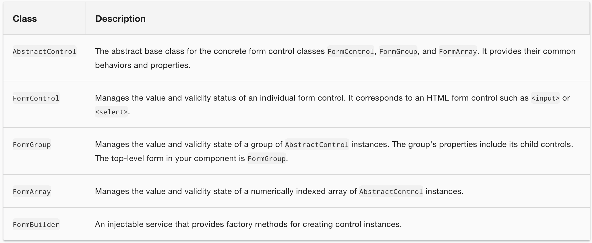
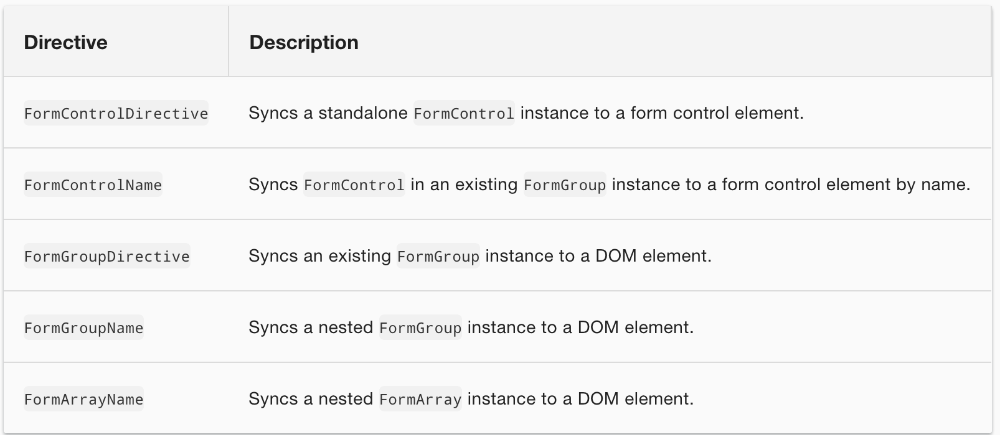

# Reactive Forms

Reactive forms use an explicit and immutable approach to managing the state of a form at a given point in time. Each change to the form state returns a new state, which maintains the integrity of the model between changes. Reactive forms are built around observable streams, where form inputs and values are provided as streams of input values, which can be accessed synchronously.

## Getting started

### Step 1: Registering the reactive forms module

To use reactive forms, import `ReactiveFormsModule` from the `@angular/forms` package and add it to your NgModule's `imports` array.

> `src/app/app.module.ts` (excerpt)

```ts
import { ReactiveFormsModule } from '@angular/forms';

@NgModule({
  imports: [
    // other imports ...
    ReactiveFormsModule
  ],
})
export class AppModule { }
```

### Step 2: Generating and importing a new form control

The FormControl class is the basic building block when using reactive forms. To register a single form control, import the FormControl class into your component and create a new instance of the form control to save as a class property.

```ts
name = new FormControl('');
```
Use the constructor of FormControl to set its initial value, which in this case is an empty string. By creating these controls in your component class, you get immediate access to listen for, update, and validate the state of the form input.

### Step 3: Registering the control in the template

After you create the control in the component class, you must associate it with a form control element in the template. Update the template with the form control using the formControl binding provided by `FormControlDirective` included in `ReactiveFormsModule`.

```html
<label>
  Name:
  <input type="text" [formControl]="name">
</label>
```
Using the template binding syntax, the form control is now registered to the `name` input element in the template. The form control and DOM element communicate with each other: the view reflects changes in the model, and the model reflects changes in the view.

**Displaying a form control value**

- Through the valueChanges observable where you can listen for changes in the form's value in the template using AsyncPipe or in the component class using the subscribe() method.

- With the value property. which gives you a snapshot of the current value.

*display the current value using interpolation in the template.*

```html
<p>
  Value: {{ name.value }}
</p>
```

to change a control's value programmatically, form control instance provides a `setValue()` method that updates the value of the form control and validates the structure of the value provided against the control's structure.

**`FormGroup` - Grouping form controls**

Just as a form control instance gives you control over a single input field, a form group instance tracks the form state of a group of form control instances.

```ts
profileForm = new FormGroup({
  firstName: new FormControl(''),
  lastName: new FormControl(''),
});
```

- A `FormGroup` instance provides its model value as an object reduced from the values of each control in the group.

- A form group instance has the same properties (such as `value` and `untouched`) and methods (such as `setValue()`) as a form control instance.

- A form group tracks the status and changes for each of its controls, so if one of the controls changes, the parent control also emits a new status or value change. The model for the group is maintained from its members

```html
<form [formGroup]="profileForm">

  <label>
    First Name:
    <input type="text" formControlName="firstName">
  </label>

  <label>
    Last Name:
    <input type="text" formControlName="lastName">
  </label>

</form>
```

- a form group contains a group of controls, the profile form `FormGroup` is bound to the `form` element with the `FormGroup` directive, creating a communication layer between the model and the form containing the inputs. The `formControlName` input provided by the FormControlName directive binds each individual input to the form control defined in `FormGroup`. The form controls communicate with their respective elements. They also communicate changes to the form group instance, which provides the source of truth for the model value.

**Saving Form Data**

- The `FormGroup` directive listens for the `submit` event emitted by the `form` element and emits an `ngSubmit` event that you can bind to a callback function.

Add an `ngSubmit` event listener to the `form` tag with the `onSubmit()` callback method.

```html
<form [formGroup]="profileForm" (ngSubmit)="onSubmit()">
  ```

The `submit` event is emitted by the `form` tag using the native DOM event. You trigger the event by clicking a button with `submit` type. This allows the user to press the **Enter** key to submit the completed form.


Use a button element to add a button to the bottom of the form to trigger the form submission.

```html
<button type="submit" [disabled]="!profileForm.valid">Submit</button>
```

> The button in the snippet above also has a `disabled` binding attached to it to disable the button when `profileForm` is invalid

---

### Partial model updates

Patching the model value

There are two ways to update the model value:

- Use the `setValue()` method to set a new value for an individual control. The `setValue()` method strictly adheres to the structure of the form group and replaces the entire value for the control.

- Use the `patchValue()` method to replace any properties defined in the object that have changed in the form model.

The strict checks of the `setValue()` method help catch nesting errors in complex forms, while `patchValue()` fails silently on those errors.

example

```ts
updateProfile() {
  this.profileForm.patchValue({
    firstName: 'Nancy',
    address: {
      street: '123 Drew Street'
    }
  });
}
```

---

## Generating form controls with FormBuilder

**Importing the FormBuilder class**

```ts
import { FormBuilder } from '@angular/forms';
```

**Injecting the FormBuilder service**
```ts
constructor(private fb: FormBuilder) { }
```

**Generating form controls**

```ts
import { Component } from '@angular/core';
import { FormBuilder } from '@angular/forms';

@Component({
  selector: 'app-profile-editor',
  templateUrl: './profile-editor.component.html',
  styleUrls: ['./profile-editor.component.css']
})
export class ProfileEditorComponent {
  profileForm = this.fb.group({
    firstName: [''],
    lastName: [''],
    address: this.fb.group({
      street: [''],
      city: [''],
      state: [''],
      zip: ['']
    }),
  });

  constructor(private fb: FormBuilder) { }
}
```

## Dynamic controls using form arrays

`FormArray` is an alternative to `FormGroup` for managing any number of unnamed controls.

**Importing the FormArray class**

```ts
import { FormArray } from '@angular/forms';
```


**Defining a FormArray control**

You can initialize a form array with any number of controls, from zero to many, by defining them in an array.

Use the `FormBuilder.array()` method to define the array, and the `FormBuilder.control()` method to populate the array with an initial control.

```ts
profileForm = this.fb.group({
  firstName: ['', Validators.required],
  lastName: [''],
  address: this.fb.group({
    street: [''],
    city: [''],
    state: [''],
    zip: ['']
  }),
  aliases: this.fb.array([
    this.fb.control('')
  ])
});
```

The aliases control in the form group instance is now populated with a single control until more controls are added dynamically.

**Accessing the FormArray control**

A getter provides easy access to the aliases in the form array instance compared to repeating the profileForm.get() method to get each instance. The form array instance represents an undefined number of controls in an array. It's convenient to access a control through a getter, and this approach is easy to repeat for additional controls.

```ts
get aliases() {
  return this.profileForm.get('aliases') as FormArray;
}
```

> Because the returned control is of the type `AbstractControl`, you need to provide an explicit type to access the method syntax for the form array instance.

Define a method to dynamically insert an alias control into the alias's form array. The `FormArray.push()` method inserts the control as a new item in the array.


```ts
addAlias() {
  this.aliases.push(this.fb.control(''));
}
```
**Displaying the form array in the template**


```html
<div formArrayName="aliases">
  <h3>Aliases</h3> <button (click)="addAlias()">Add Alias</button>

  <div *ngFor="let address of aliases.controls; let i=index">
    <!-- The repeated alias template -->
    <label>
      Alias:
      <input type="text" [formControlName]="i">
    </label>
  </div>
</div>
```

The `*ngFor` directive iterates over each form control instance provided by the aliases form array instance. Because form array elements are unnamed, you assign the index to the `i` variable and pass it to each control to bind it to the `formControlName` input.

---

## Reactive forms API

**Classes**



**Directives**




---
