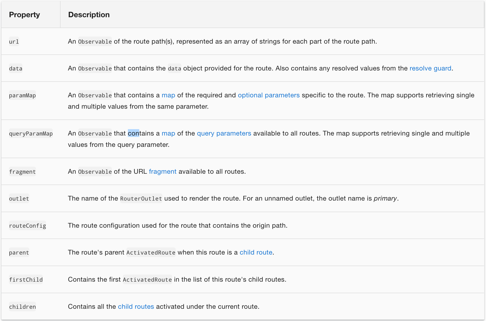
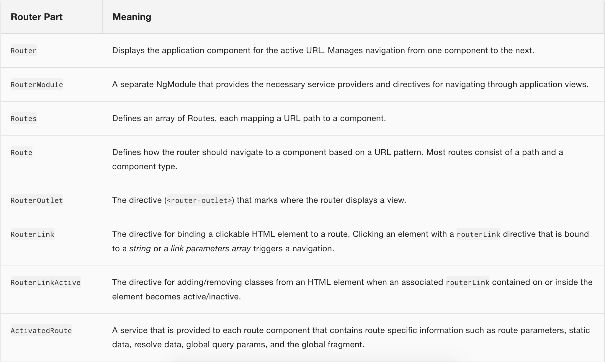
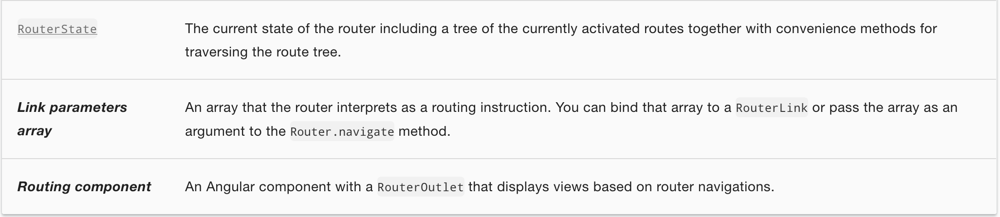

# Routing & Navigation
---

The browser is a familiar model of application navigation:

- Enter a URL in the address bar and the browser navigates to a corresponding page.
- Click links on the page and the browser navigates to a new page.
- Click the browser's back and forward buttons and the browser navigates backward and forward through the history of pages you've seen.

*<base href>*

Most routing applications should add a `<base>` element to the `index.html` as the first child in the `<head>` tag to tell the router how to compose navigation URLs.

index.html (base-href)

```html
<base href="/">
```


**Router imports**

```ts
import { RouterModule, Routes } from '@angular/router';
```

**Configuration**


A routed Angular application has one singleton instance of the `Router` service. When the browser's URL changes, that router looks for a corresponding `Route` from which it can determine the component to display.

```ts
const appRoutes: Routes = [
  { path: 'crisis-center', component: CrisisListComponent },
  { path: 'hero/:id',      component: HeroDetailComponent },
  {
    path: 'heroes',
    component: HeroListComponent,
    data: { title: 'Heroes List' }
  },
  { path: '',
    redirectTo: '/heroes',
    pathMatch: 'full'
  },
  { path: '**', component: PageNotFoundComponent }
];

@NgModule({
  imports: [
    RouterModule.forRoot(
      appRoutes,
      { enableTracing: true } // <-- debugging purposes only
    )
    // other imports here
  ],
  ...
})
export class AppModule { }
```

- The appRoutes array of routes describes how to navigate. Pass it to the `RouterModule.forRoot` method in the module `imports` to configure the router.

- Each Route maps a URL path to a component. There are no leading slashes in the path.

- The data property in the third route is a place to store arbitrary data associated with this specific route. The data property is accessible within each activated route. Use it to store items such as page titles, breadcrumb text, and other read-only, static data.

- The empty path in the fourth route represents the default path for the application, the place to go when the path in the URL is empty, as it typically is at the start. This default route redirects to the route for the /heroes URL and, therefore, will display the HeroesListComponent.

- The `**` path in the last route is a wildcard. The router will select this route if the requested URL doesn't match any paths for routes defined earlier in the configuration. This is useful for displaying a "404 - Not Found" page or redirecting to another route.

- **The order of the routes in the configuration matters** and this is by design. The router uses a **first-match wins** strategy when matching routes, so more specific routes should be placed above less specific routes.

- `enableTracing` option - This outputs each router event that took place during each navigation lifecycle to the browser console. This should only be used for debugging purposes. You set the enableTracing: true option in the object passed as the second argument to the `RouterModule.forRoot()` method.

## Router outlet

The `RouterOutlet` is a directive from the router library that is used like a component. It acts as a placeholder that marks the spot in the template where the router should display the components for that outlet.

```html
<router-outlet></router-outlet>
<!-- Routed components go here -->
```


## Router links

```html
<h1>Angular Router</h1>
<nav>
  <a routerLink="/crisis-center" routerLinkActive="active">Crisis Center</a>
  <a routerLink="/heroes" routerLinkActive="active">Heroes</a>
</nav>
<router-outlet></router-outlet>
```

- The `RouterLink` directives on the anchor tags give the router control over those elements. The navigation paths are fixed, so you can assign a string to the `routerLink` (a "one-time" binding).

- The `RouterLinkActive` directive toggles css classes for active `RouterLink` bindings based on the current `RouterState`.

- On each anchor tag, you see a property binding to the `RouterLinkActive` directive that look like `routerLinkActive="..."`. The template expression to the right of the equals (=) contains a space-delimited string of CSS classes that the Router will add when this link is active (and remove when the link is inactive). You set the `RouterLinkActive` directive to a string of classes such as `[routerLinkActive]="'active fluffy'"` or bind it to a component property that returns such a string.

- Active route links cascade down through each level of the route tree, so parent and child router links can be active at the same time. To override this behavior, you can bind to the `[routerLinkActiveOptions]` input binding with the `{ exact: true }` expression. By using `{ exact: true }`, a given RouterLink will only be active if its URL is an exact match to the current URL.


## Router state

After the end of each successful navigation lifecycle, the router builds a tree of ActivatedRoute objects that make up the current state of the router. Access the current `RouterState` from anywhere in the application using the `Router` service and the `routerState` property.

## Activated route

`ActivatedRoute` interface contains the information about a route associated with a component loaded in an outlet. An `ActivatedRoute` can also be used to traverse the router state tree.




## Router events

During each navigation, the Router emits navigation events through the `Router.events` property. These events range from when the navigation starts and ends to many points in between.


## Router Summary




---

## Define a Wildcard route

Add a wildcard route to intercept invalid URLs and handle them gracefully. A wildcard route has a path consisting of two asterisks. It matches every URL. The router will select this route if it can't match a route earlier in the configuration. A wildcard route can navigate to a custom "404 Not Found" component or redirect to an existing route.

## redirects

A redirect route requires a pathMatch property to tell the router how to match a URL to the path of a route. The router throws an error if you don't.

---

- Separate routing for each module in a Separate file and include them in the main app

> Only call `RouterModule.forRoot` in the root `AppRoutingModule` (or the `AppModule` if that's where you register top level application routes). In any other module, you must call the `RouterModule.forChild` method to register additional routes.

- Module import order matters

- [Route Parameters](https://angular.io/guide/router#route-parameters)

- [Adding routable animations](https://angular.io/guide/router#adding-routable-animations)

---

**child routing**

Organization approach

- Each feature area resides in its own folder.
- Each feature has its own Angular feature module.
- Each area has its own area root component.
- Each area root component has its own router outlet and child routes.
- Feature area routes rarely (if ever) cross with routes of other features.


- provide `--routing` while creating module to automatically create routing file.
```
ng g m user --routing
```

- implement the login functionality just like the crisis component in angular app

[here](https://stackblitz.com/angular/gdxblnqvpby?file=src%2Fapp%2Fcrisis-center%2Fcrisis-center-home%2Fcrisis-center-home.component.html)

---

- [Relative navigation](https://angular.io/guide/router#relative-navigation)

- [Displaying multiple routes in named outlets](https://angular.io/guide/router#displaying-multiple-routes-in-named-outlets)

- [Add a secondary route](https://angular.io/guide/router#add-a-secondary-route)

---

## Route guards

add Guards to the route configuration to handle following scenarios.

- Perhaps the user is not authorized to navigate to the target component.
- Maybe the user must login (authenticate) first.
- Maybe you should fetch some data before you display the target component.
- You might want to save pending changes before leaving a component.
- You might ask the user if it's OK to discard pending changes rather than save them.

A guard's return value controls the router's behavior:

- If it returns true, the navigation process continues.
- If it returns false, the navigation process stops and the user stays put.


The router supports multiple guard interfaces:

- CanActivate to mediate navigation to a route.

- CanActivateChild to mediate navigation to a child route.

- CanDeactivate to mediate navigation away from the current route.

- Resolve to perform route data retrieval before route activation.

- CanLoad to mediate navigation to a feature module loaded asynchronously.


---
