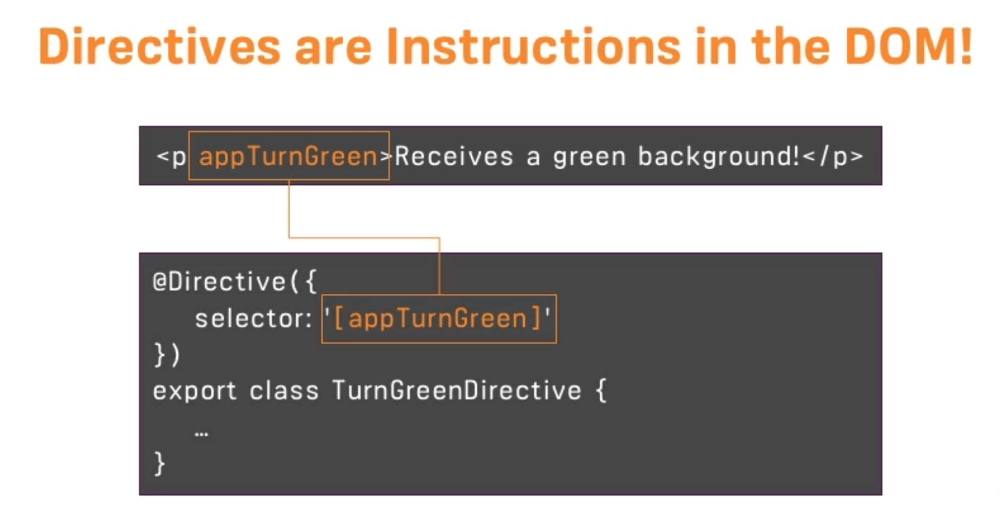

# Basics
---

## App startup in angular

The main file that gets run is `main.ts` which bootstrap the `AppModule` class present in `app.module.ts` having the `app.component`. The `app.component.html` contains the template.

---

## Component

Angular app is composed of components. You will have header component, main-content component, side-bar component etc. `AppComponent` is the root component of the angular. All other components are nested inside it.

Create a component in a separate folder and include it in the app-component.

**Generating component through CLI**

```
ng generate component <<component_name>>
```

or

```
ng g c <<component_name>>
```

Add attribute `--spec false` to prevent the creation of testing file.

Creating a component through command line is helpful as it will auto create entries for it in other places.

**Component with inline template**

check `app-inline-template-component`

---

## Selectors

`Selector` property is used to describe the way a component is used inside another component.

Apart from the regular `element` type, selectors can also be used as attribute as well as class property.

```
selector: 'app-servers',     // element
selector: '[app-servers]',  // attribute
selector: '.app-servers',  // class
```

Selector by id does not work in Angular.

---

## DataBinding


**String interpolation**

Any expression that can be evaluated/ resolved to a String is the only condition for string interpolation to work.

```
{{ expression }}
```

Multi-line or block expression can not be used in String interpolation.

**Property Binding**

`[]` square brackets indicate to angular that we are binding some property.

```
<p [innerText]="allowNewServer"></p>

```

> Don't mix and match String interpolation and property binding.

---

## Event Binding

`()` are used to trigger event binding.

`$event` is a reserved keyword which gives us access to the event data; used in data binding.

---

## Two Way DataBinding

Binding the data both ways through user input as well as from the backend.

`[()]` is used to achieve the same.

```
<input type="text" class="form-control" [(ngModel)]="serverName">
```


---

## Directives



**Structural Directives**

`*` in front of a directive indicates this is a structural directive really changing the dom. like (`ng-if`).

- `ngIf` adds or remove the element from the DOM based on the condition.

- `ngIf-else`

**Attribute Directives**

Unlike structural directives, attribute directives don't add or remove elements. They only change the element they were placed on.

**ngStyle**

`[]` square brackets indicate that we want to bind some property to a directive.(Used in ngStyle).

```
<p [ngStyle]="{'background-color': getColor()}">The {{'server'}} with id {{serverId}} is {{getServerStatus()}}</p>
```

**ngClass**

```
<p [ngClass]="{online: serverStatus === 'Online'}">
  The {{'server'}} with id {{serverId}} is {{getServerStatus()}}</p>
```

**ngFor**

---

## Debugging

- Augury tool extension for chrome


---
