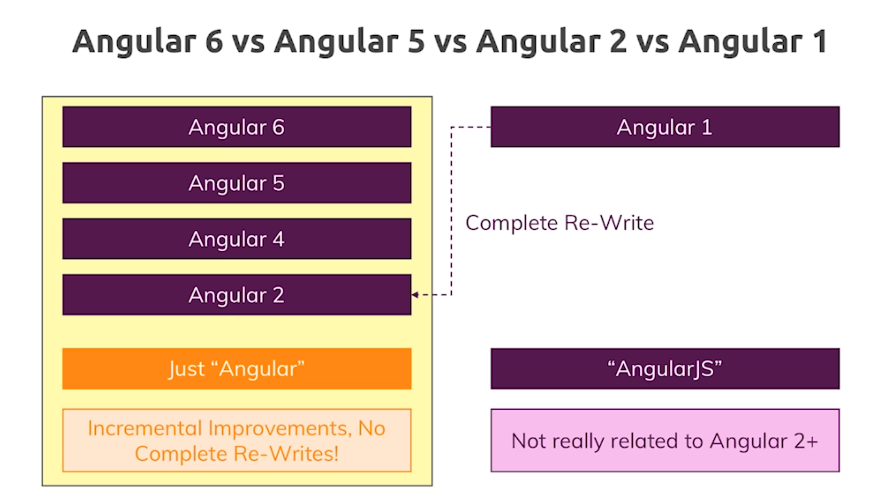
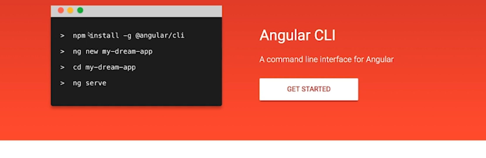
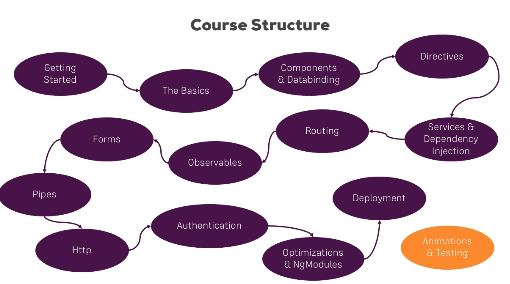

# Angular 6
---

Angular is a javascript frame work which allows you to create reactive Single-Page-Applications(SPAs).

## Angular version comparison



## Starting with angular



- Install node js and npm

- Install angular

```
sudo npm install -g @angular/cli@latest
```

- Create a new app

```
ng new my-first-app
```

- Start the server

```
ng serve
```

This will start the server at port `4200`. To start at a different port give `--port` attribute.

```
ng serve --port 4401    
```


---

## Angular theory

Angular is split into multiple modules (sub-packages).

Importing a module

```
import { AppComponent } from './app.component';
```

include the same in `NgModule` Config

```
@NgModule({
  declarations: [
    AppComponent
  ],
  imports: [
    BrowserModule,
    FormsModule
  ],
  providers: [],
  bootstrap: [AppComponent]
})
```

---

## Course Structure



---

## TypeScript

Strongly type javascript. More features than vanilla javascript - Types, Classes, Interfaces. Angular uses TypeScript features. TypeScript can not be run directly into the browser, hence it is compiled to javascript.

## Installing bootstrap

```
npm install --save bootstrap@latest
```
- Install additionally the required dependencies (jquery and popper).

- add the css file entry in `angular.json` under styles `"node_modules/bootstrap/dist/css/bootstrap.min.css", `

- Restart the app  - quit by `CTRL + C` and `ng serve`.


---
