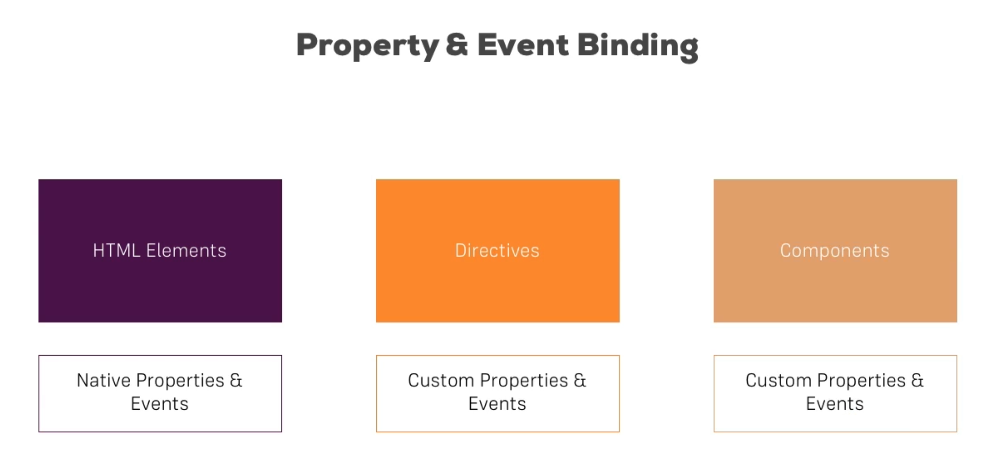
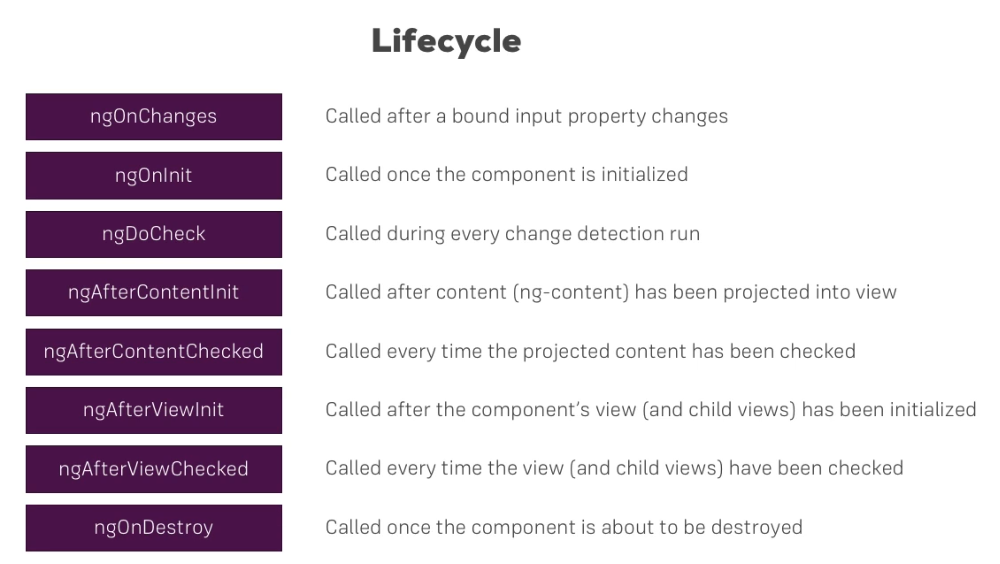

# Components and DataBinding



---

## Exposing the elements in a Components

By default the variables defined in the component are hidden from the other components, so these cannot be accessed by the outer components.

```html
<div >
  <app-server-element *ngFor="let serverElement of serverElements" [element]="serverElement"></app-server-element>
</div>
```

The `element` in the above snippet is not accessible to the outer world. To make it accessible it needs to be annotated with `@Input()` decorator which comes from `@angular/core`. This is used to make the outer component access this variable.


```ts
@Input() element: { type: string, name: string, content: string };
```

**Input property Aliases**

If you want to bind the variable inside the component with a different name to the outside world you can use the alias name in `@Input` annotation.

```ts
@Input('srvElement') element: { type: string, name: string, content: string };
```

here `srvElement` is the alias.

---

**Emitting event to the outer component**

As `@Input` is used to receive the elements from the outer component, `@Output` is used send the data to the outer components.

```ts

  @Output() serverCreated = new EventEmitter<{ serverName: string, serverContent: string }>();
  @Output() blueprintCreated = new EventEmitter<{ serverName: string, serverContent: string }>();
  newServerName = '';
  newServerContent = '';

  onAddServer() {
    this.serverCreated.emit({
      serverName: this.newServerName,
      serverContent: this.newServerContent
    });
  }

  onAddBlueprint() {
    this.blueprintCreated.emit({
      serverName: this.newServerName,
      serverContent: this.newServerContent
    });
  }
```

```html
<app-cockpit
     (serverCreated)="onServerAdded($event)"
     (blueprintCreated)="onBlueprintAdded($event)"></app-cockpit>
```

## View Encapsulation

Any styles applied in a component restricts itself to that particular component only. This is in-fact not a default behavior but enforced by angular. This can be modified by defining `encapsulation` property in `@Component` decorator.

An encapsulation policy for the template and CSS styles. It can be one of following:

- `ViewEncapsulation.Native`: Use shadow roots. This works only if natively available on the platform.

- `ViewEncapsulation.Emulated`: Use shimmed CSS that emulates the native behavior.

- `ViewEncapsulation.None`: Use global CSS without any encapsulation.

If not supplied, the value is taken from CompilerOptions. The default compiler option is `ViewEncapsulation.Emulated`.

If the policy is set to `ViewEncapsulation.Emulated` and the component has no styles or styleUrls specified, the policy is automatically switched to `ViewEncapsulation.None`.

---

## Local References

Another alternative of two way binding is local refernces

```html
 <input type="text" class="form-control" #serverNameInput>
 ```

 It gives access to html element with this reference.

## ViewChild

Property decorator that configures a view query. The change detector looks for the first element or the directive matching the selector in the view DOM. If the view DOM changes, and a new child matches the selector, the property is updated.

```ts
  @ViewChild('serverContentInput') serverContentInput: ElementRef;

  onAddServer(serverNameInput: HTMLInputElement) {
  this.serverCreated.emit({
    serverName: serverNameInput.value,
    serverContent: this.serverContentInput.nativeElement.value
  });
}

```

---

**ng-Content**

This directive can be used if the content inside the component will be provided by other components calling this component. This can be used if the content is complex such as having HTML tags. etc.

## Component Lifecycle

Angular supports a couple of Lifecycle hooks. When a new component is instantiated; Angular goes for a couple of different phases and we can implement some functionalities in this phases by calling certain methods.




---
