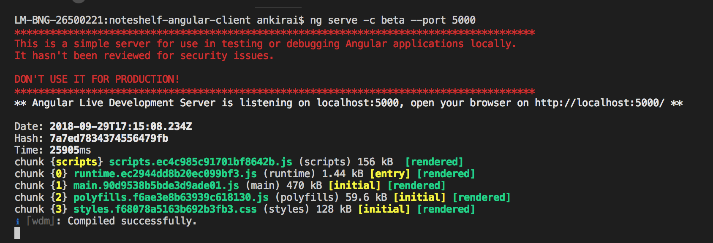

# Multiple environments in Angular application

It’s common for developers to have multiple application versions that target different environments i.e. development and production. It’s common that each environment will have some unique environment variables i.e. API Endpoint, app version etc. Angular provides environment configurations to declare variables unique for each environment.

## Dealing with only 2 Environments
By default angular supports two environments – production and environment. The environment files for the two environments can be located under the environment directory, inside the src directory at the root of your workspace or project folder. Inside, there are two files – `environment.ts` and ` environment.prod.ts`.

Angular CLI compiler, will automatically replace the first file with the second file each time you build with the `–prod` flag.


```
ng build --prod
```

All variables which vary based on the environment, should be placed inside these two files appropriately. Check the examples given below for the API Endpoint.

```
// environment.ts environment variables
export const environment = {
  production: false,
  APIEndpoint: "https://dev.endpoint.com"
};

// environment.prod.ts environment variables
export const environment = {
  production: true,
  APIEndpoint: "https://prod.endpoint.com"
};
```

To access the variables, import the environment constant, and then use it as follows:
```
import { environment } from './../environments/environment';
```
Usage
```
const APIEndpoint = environment.APIEndpoint;
```

After that, every time you build your application without the `–prod` flag, then it will use the dev(default) API endpoint while when you use the –prod flag, it will use the production API Endpoint.

## Dealing with 3 or More Environment

You can add new environments by adding the same in the `environments` folder and adding the configurations for the same in `angular.json`.

Let's add and environment `beta`.

```
// environment.beta.ts environment variables
export const environment = {
  production: true,
  APIEndpoint: "https://beta.endpoint.com"
};

```

First, open `angular.json` and navigate to the `configurations` key (Key map: `projects` -> `yourappname` -> `architect` -> `build` -> `configurations`).

```
"configurations": {
   "production": {
       "fileReplacements": [
           {
              "replace": "src/environments/environment.ts",
               "with": "src/environments/environment.prod.ts"
           }
        ],
        "optimization": true,
        "outputHashing": "all",
        "sourceMap": false,
        "extractCss": true,
        "namedChunks": false,
        "aot": true,
        "extractLicenses": true,
        "vendorChunk": false,
        "buildOptimizer": true,
        "serviceWorker": true
   }
}

```

Duplicate the production key and its content, and replace the mentions with the new environment.

```
"beta": {
   "fileReplacements": [
    {
       "replace": "src/environments/environment.ts",
       "with": "src/environments/environment.beta.ts"
    }],
    "optimization": true,
    "outputHashing": "all",
    "sourceMap": false,
    "extractCss": true,
    "namedChunks": false,
    "aot": true,
    "extractLicenses": true,
    "vendorChunk": false,
    "buildOptimizer": true,
    "serviceWorker": true
}

```

## Building your App

Finally, to build your application with the new custom environment, use the `–configurations=environment-name` flag,

```
//for beta environment
ng build --configuration=beta

```

And for the Angular default environment, there isn’t any changes at all to their build commands.

```
// for production environment
ng build --prod

// for dev environment
ng build
```

The configuration attribute works for `serve` as well. Modify your serve section to add a new configuration as well, pointing to the `beta` build configuration you just declared

```
"serve":
      "configurations": {
        "beta": {
          "browserTarget": "projectName:build:beta"
        }
```
Then you can use `ng serve -c beta`.


```
ng serve --configuration=beta
```
or
```
ng serve -c beta

```




---
