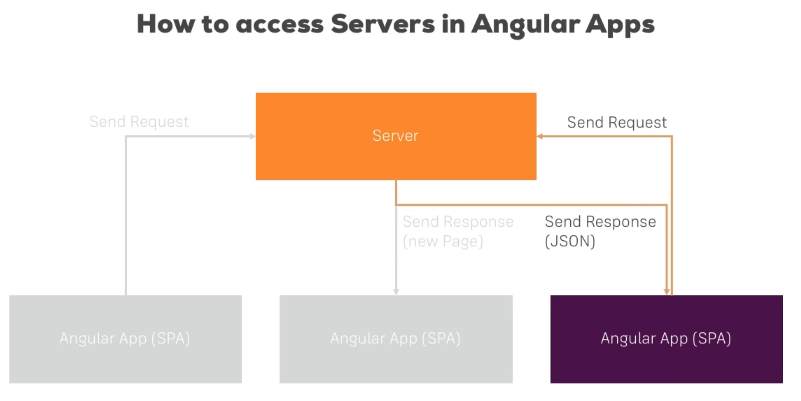

# Directives
---


you cannot combine two structural directives in a same tag.

Directive has `onInit` lifecycle and it does not have a view.

---

# Services and Dependency Injection


It's not recommended to instantiate the Services in angular rather use injectors

---

Type script property access

Using the access modifier (private, public) in constructor of a typescript class makes that property accessible with `this.<<property_name>>`.

---

# Routing

`+` is used to typecast string into a number.

```ts
this.id = +params['id'];
```

---

# Observables


Custom Observables should be unsubscribed by implementing the `unsubscribe` method in `ngOnDestroy`.


**Subject** is like an observable but it allows you to emit a new data conveniently to the code.


---

# Angular Forms


In Angular because of the SPA, forms does not get submitted to the server.

**Forms of Binding in Angular forms**

- *No Binding* - The input is just a control.

- *One way binding* - To give that control a default value.

- *Two Way binding* - To instantly output or perform some more functions on that.


# Reactive Forms

Include `ReactiveFormsModule` in app module.

`[formGroup]` directive is added to the `<form>` tag via property binding to tell Angular to take my formGroup; don't infer or create a one for me.

---

# Pipes

Pipes are a feature built into Angular 2 which allows you to transform output in your template.


---

# Http




Angular behind the scenes uses observables for making http request so all the method of http service have to be subscribed to make HTTP calls.


---
