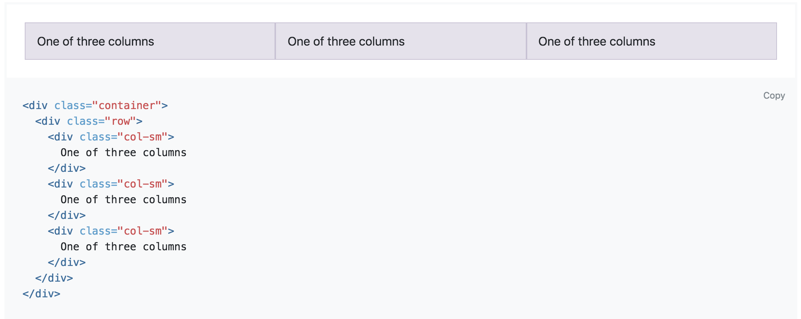
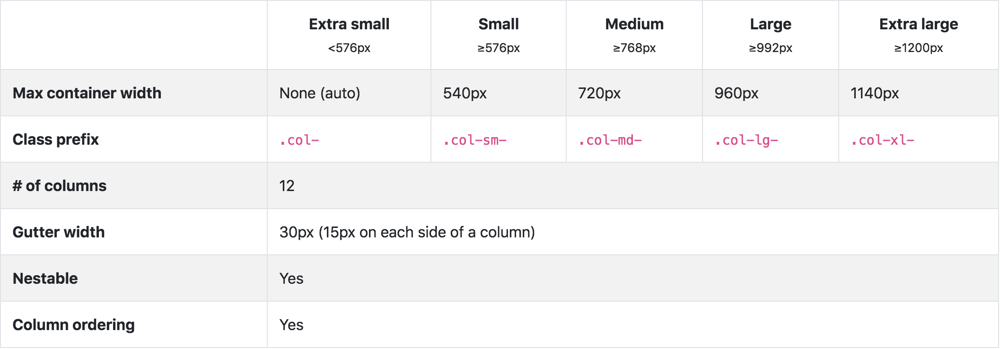
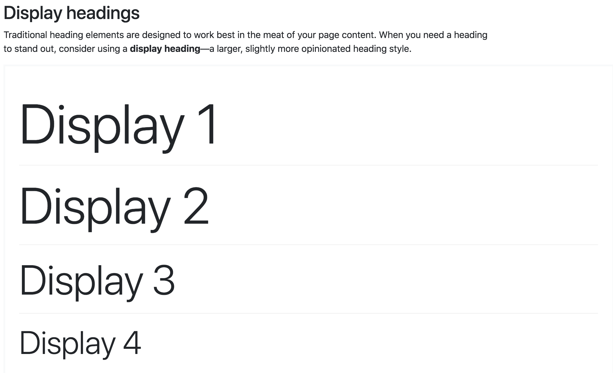
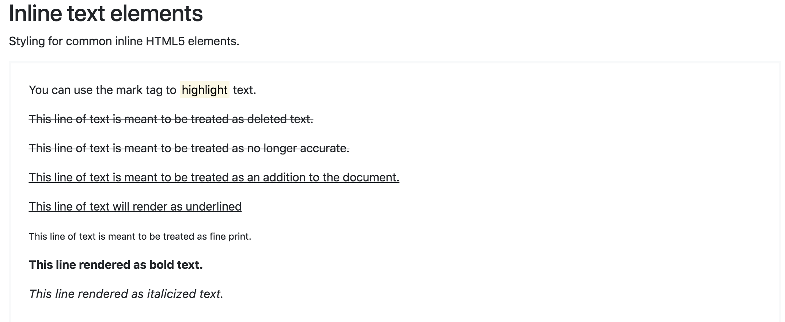
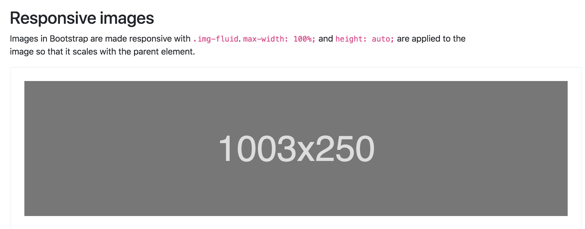
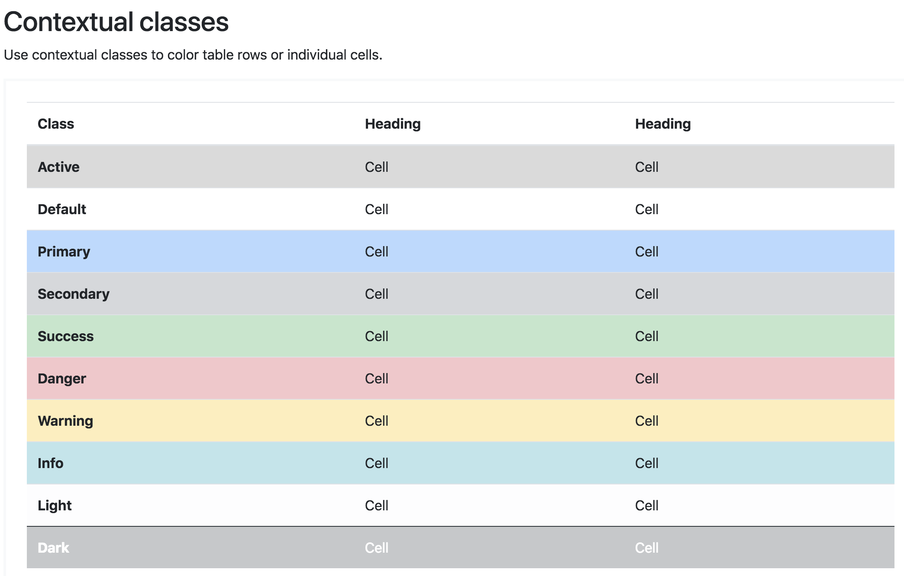
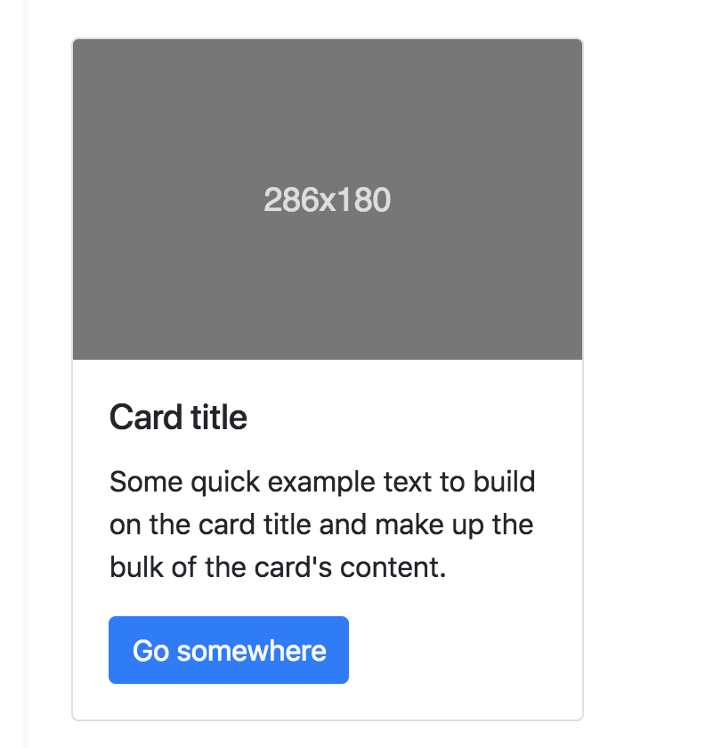
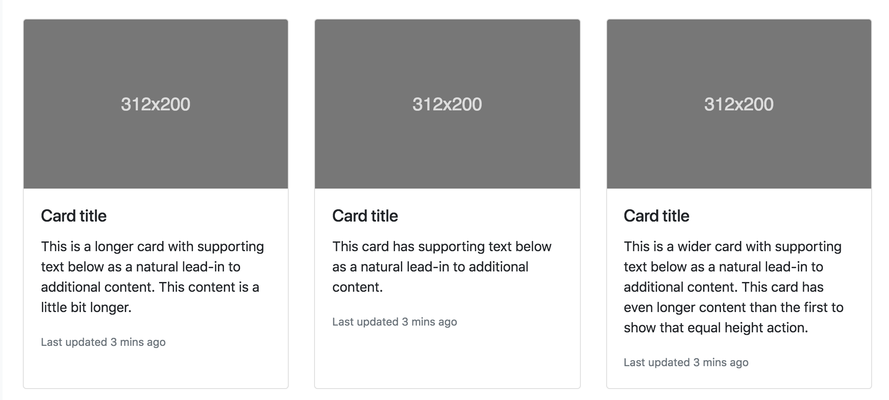
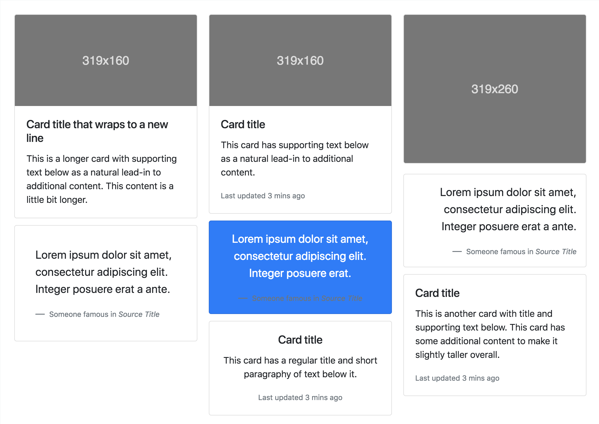

Bootstrap styles
---

most basic layout element in Bootstrap: **Container**

```html
<div class="container">
  <!-- Content here -->
</div>
```

Use .container-fluid for a full width container, spanning the entire width of the viewport.

```html
<div class="container-fluid">
  ...
</div>
```


---

## Z-index

Several Bootstrap components utilize z-index, the CSS property that helps control layout by providing a third axis to arrange content.

```
$zindex-dropdown:          1000 !default;
$zindex-sticky:            1020 !default;
$zindex-fixed:             1030 !default;
$zindex-modal-backdrop:    1040 !default;
$zindex-modal:             1050 !default;
$zindex-popover:           1060 !default;
$zindex-tooltip:           1070 !default;
```

To handle overlapping borders within components (e.g., buttons and inputs in input groups), we use low single digit z-index values of 1, 2, and 3 for default, hover, and active states. On hover/focus/active, we bring a particular element to the forefront with a higher z-index value to show their border over the sibling elements.

---

# Grid



## Grid options




## Variable width content

Use `col-{breakpoint}-auto` classes to size columns based on the natural width of their content.

```html
<div class="col-md-auto">
      Variable width content
</div>
```

[More Options]( https://getbootstrap.com/docs/4.1/layout/grid/)

---

## Media object

The media object helps build complex and repetitive components where some media is positioned alongside content that doesn’t wrap around said media. Only two classes are required—the wrapping `.media` and the `.media-body` around your content.


```html
<div class="media">
  
  <div class="media-body">
    <h5 class="mt-0">Media heading</h5>
    Cras sit amet nibh libero, in gravida nulla. Nulla vel metus scelerisque ante sollicitudin. Cras purus odio, vestibulum in vulputate at, tempus viverra turpis. Fusce condimentum nunc ac nisi vulputate fringilla. Donec lacinia congue felis in faucibus.
  </div>
</div>
```

[More options](https://getbootstrap.com/docs/4.1/layout/media-object/)


---

## Typography




```html
<h1 class="display-1">Display 1</h1>
<h1 class="display-2">Display 2</h1>
<h1 class="display-3">Display 3</h1>
<h1 class="display-4">Display 4</h1>
```



```html
<p>You can use the mark tag to <mark>highlight</mark> text.</p>
<p><del>This line of text is meant to be treated as deleted text.</del></p>
<p><s>This line of text is meant to be treated as no longer accurate.</s></p>
<p><ins>This line of text is meant to be treated as an addition to the document.</ins></p>
<p><u>This line of text will render as underlined</u></p>
<p><small>This line of text is meant to be treated as fine print.</small></p>
<p><strong>This line rendered as bold text.</strong></p>
<p><em>This line rendered as italicized text.</em></p>
```

---

## Images



```html

```

## Table

- add the base class `.table` to any `<table>`

- invert the colors—with light text on dark backgrounds—with `.table-dark`.

**Table head options**

- use the modifier classes `.thead-light` or `.thead-dark` to make `<thead>`s appear light or dark gray

- Use `.table-striped` to add zebra-striping to any table row within the `<tbody>`.

**Hoverable rows**

- Add `.table-hover` to enable a hover state on table rows within a `<tbody>`.



```html
<!-- On rows -->
<tr class="table-active">...</tr>

<tr class="table-primary">...</tr>
<tr class="table-secondary">...</tr>
<tr class="table-success">...</tr>
<tr class="table-danger">...</tr>
<tr class="table-warning">...</tr>
<tr class="table-info">...</tr>
<tr class="table-light">...</tr>
<tr class="table-dark">...</tr>

<!-- On cells (`td` or `th`) -->
<tr>
  <td class="table-active">...</td>

  <td class="table-primary">...</td>
  <td class="table-secondary">...</td>
  <td class="table-success">...</td>
  <td class="table-danger">...</td>
  <td class="table-warning">...</td>
  <td class="table-info">...</td>
  <td class="table-light">...</td>
  <td class="table-dark">...</td>
</tr>

```

---

# Components

## Cards

**Card columns**



**Image overlays**


```html
<div class="card bg-dark text-white">
  
  <div class="card-img-overlay">
    <h5 class="card-title">Card title</h5>
    <p class="card-text">This is a wider card with supporting text below as a natural lead-in to additional content. This content is a little bit longer.</p>
    <p class="card-text">Last updated 3 mins ago</p>
  </div>
</div>
```

**Card decks**



```html
<div class="card-deck">
  <div class="card">
    
    <div class="card-body">
      <h5 class="card-title">Card title</h5>
      <p class="card-text">This is a longer card with supporting text below as a natural lead-in to additional content. This content is a little bit longer.</p>
      <p class="card-text"><small class="text-muted">Last updated 3 mins ago</small></p>
    </div>
  </div>
  <div class="card">
    
    <div class="card-body">
      <h5 class="card-title">Card title</h5>
      <p class="card-text">This card has supporting text below as a natural lead-in to additional content.</p>
      <p class="card-text"><small class="text-muted">Last updated 3 mins ago</small></p>
    </div>
  </div>
  <div class="card">
    
    <div class="card-body">
      <h5 class="card-title">Card title</h5>
      <p class="card-text">This is a wider card with supporting text below as a natural lead-in to additional content. This card has even longer content than the first to show that equal height action.</p>
      <p class="card-text"><small class="text-muted">Last updated 3 mins ago</small></p>
    </div>
  </div>
</div>
```

**Card columns**



Cards can be organized into Masonry-like columns with just CSS by wrapping them in `.card-columns`.


----
