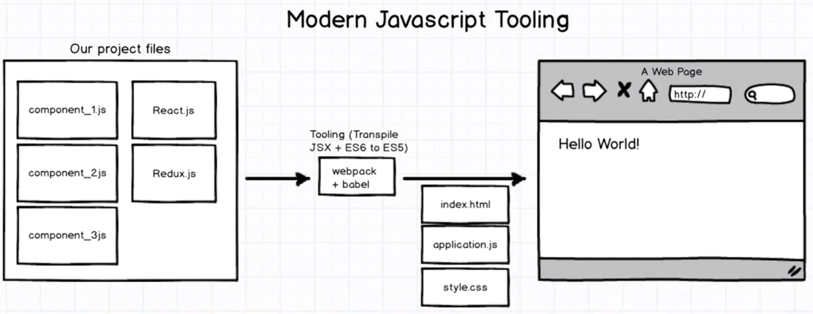
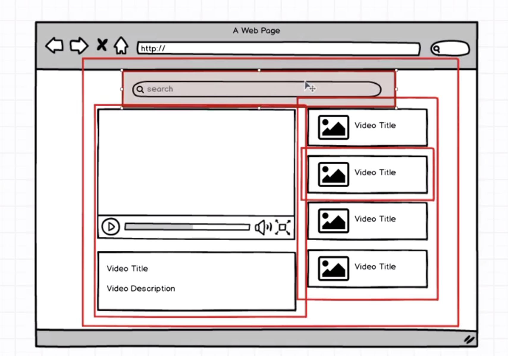

# React Basics
---

## Modern JavaScript Tooling

Get the react starting template from [here](https://github.com/StephenGrider/ReduxSimpleStarter).

In React, we write javascript files inside of the package then babble in web pack bundle all those put all those files together convert them to ES5, something that can be ran inside the browser and then makes a local server available from which we can view all those files.

---

**JSX** - JSX is a subset or dialect of javascript that allows us to write what looks like HTML inside of our javascript but is really behind the scenes just javascript.

---

**Video player application**

---

## Components in React

There are two types of components

- Class based.

- Function based.

## React State

State as a plain javascript object that is used to record and react to user events. Each class based component that we define has its own state object.

Whenever a component state is changed the component immediately renders and also forces all of its children to be rendered as well.
