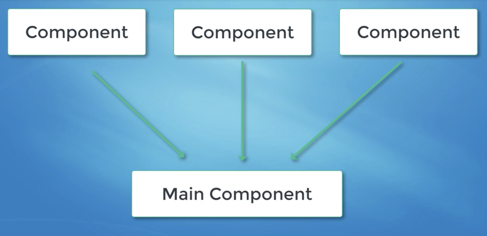

React JS
---

A javascript library for building User Interfaces.

Everything is done using components. Each component is a building block for your website. Once you combine them together it make a complex component that builds up all of the UI of your website.



React's virtual DOM takes care of converting your elements/components to actual DOM nodes in HTML.

---

# React Intro

## React Element creation

```javascript

import React, {Component} from 'react';

import ReactDOM from 'react-dom';

const taskList = ['Learn React Details','Create a simple working WebApp','Implement Oauth2 ', 'Implement NoteShelf client'];

// Way 1 : Creating element programatically

const element = React.createElement('ol',null,
      taskList.map((task,index) => React.createElement('li',{key: index},task))
    );

ReactDOM.render(element, document.getElementById('root'));

// Way 2 :through jsx

const elements2 = <ol>
          <li> {taskList[0]}</li>
          <li> {taskList[1]}</li>
          <li> {taskList[2]}</li>
    </ol>

 ReactDOM.render(elements2, document.getElementById('root'));

// Way 3 : Combining multiple elements and wrapping them up

const elements3 =
              <div>
                <h1>To Do List</h1>
                <ol>
                    { taskList.map((task,key) => <li key={key}>{task}</li>)}
                </ol>
              </div>
ReactDOM.render(elements3, document.getElementById('root'));


```

## Using Components 

```javascript

import React, {Component} from 'react';
import ReactDOM from 'react-dom';

const taskList = ['Learn React Details', 'Create a simple working WebApp', 'Implement Oauth2 '];

//Creating classes that extends Component and reusing them

class List extends Component {
  render() {
    return (<ol>
      {taskList.map((task, key) => <li key={key}>{task}</li>)}
    </ol>);
  }
}

class CustomList extends Component {
  render() {
    return (<ol>
      {this.props.tasks.map((task, key) => <li key={key}>{task}</li>)}
    </ol>);
  }
}

class Title extends Component {
  render() {
    return (<h1>{this.props.name}</h1>);
  }
}

class Main extends Component {
  render() {
    return (
    	<div >
     		<Title name="My To-Do List"/>
      		<List/>
      		<CustomList tasks={["Todo", "Todo", "Tododododo", "Tododododoooooo"]}/>
    	</div>);
  }
}

ReactDOM.render(<Main/>, document.getElementById('root'));

```


## Separating Components into different files and then importing them in main file (index.js)


**Main.js**

```javascript

import React,{Component} from 'react';
import List from './List';
import Title from './Title';
import CustomList from './CustomList';

class Main extends Component {
    render() {
      return (
        <div >
          <Title name="My To-Do List"/>

          <List/>

          <CustomList tasks={["Todo","Todo","Tododododo","Tododododoooooo"]}/>

        </div>
      );
    }
}

export default Main

```

**index.js**

```javascript

import React, {Component} from 'react';
import ReactDOM from 'react-dom';
import Main from './components/Main';

ReactDOM.render(<Main/>, document.getElementById('root'));
```

---

# React - State Management


