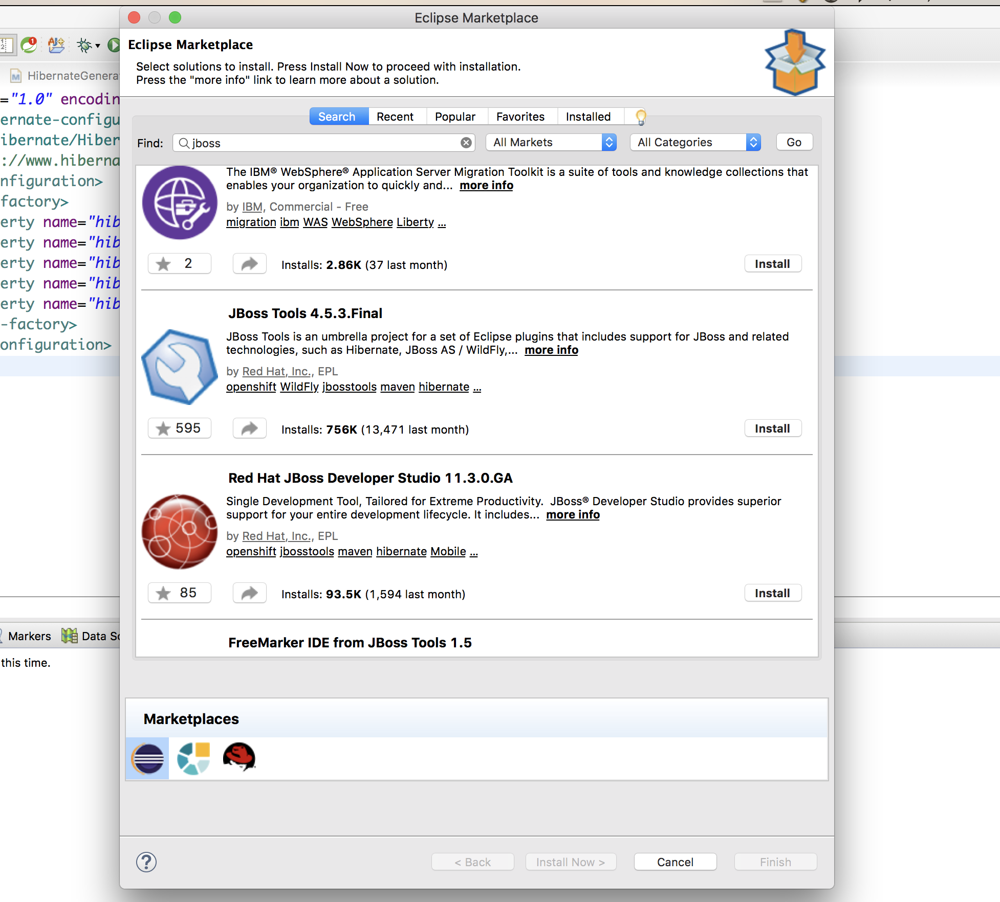
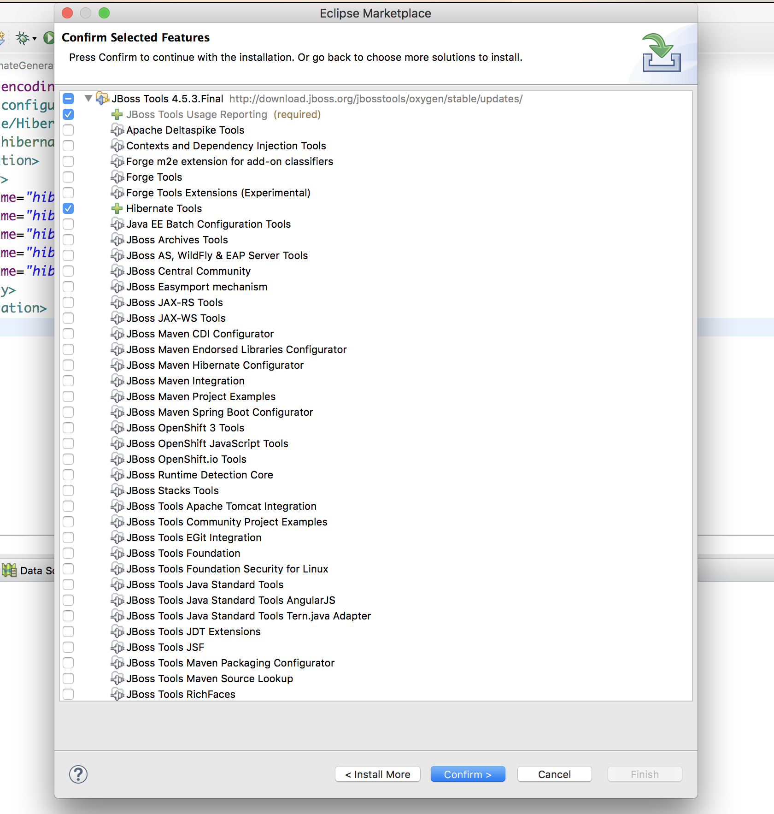
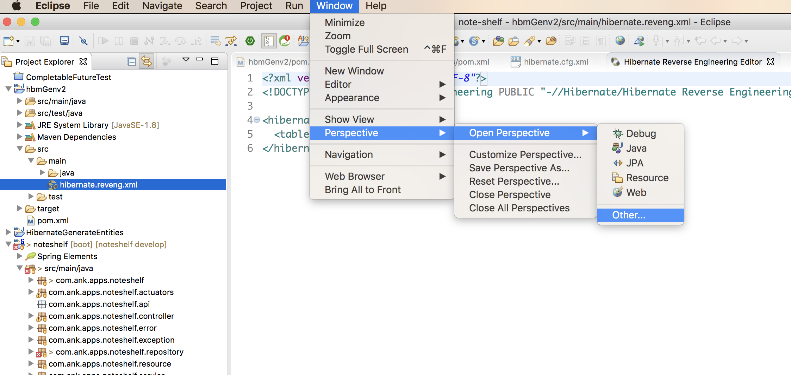
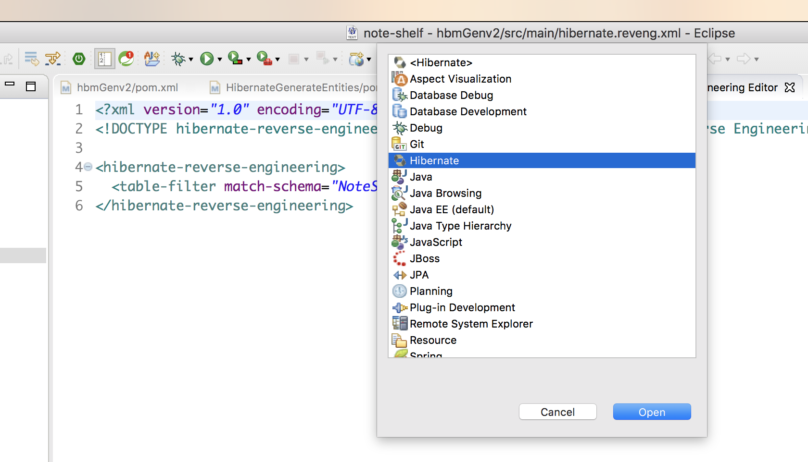
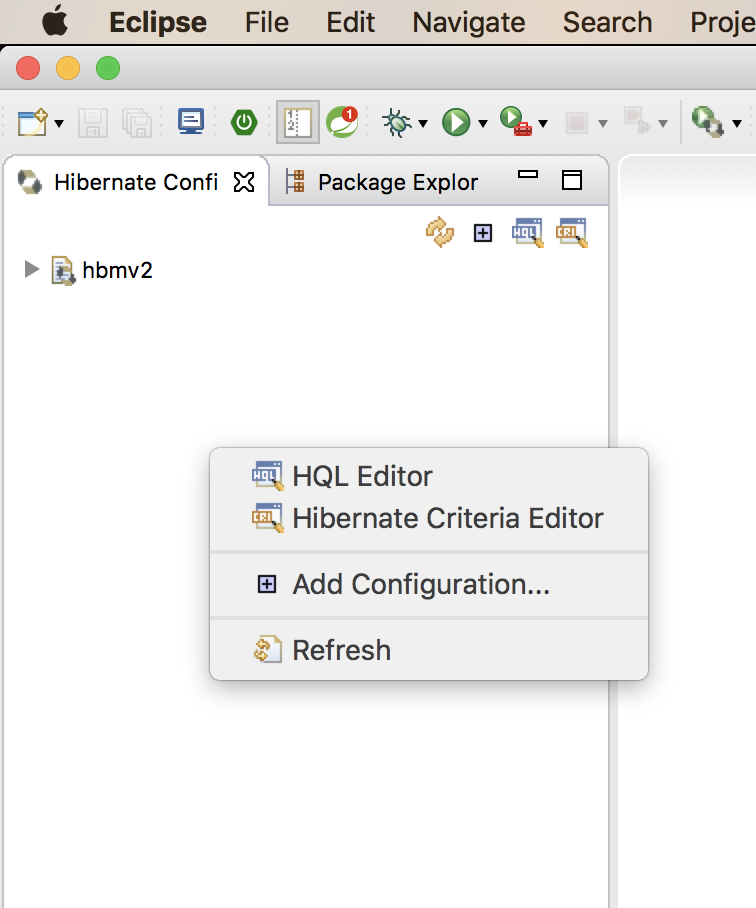
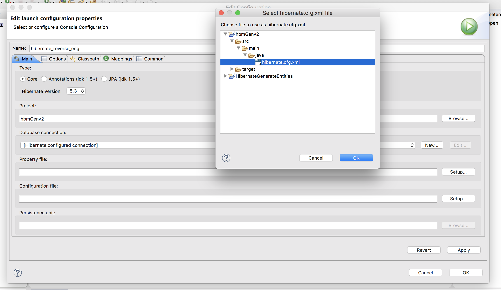
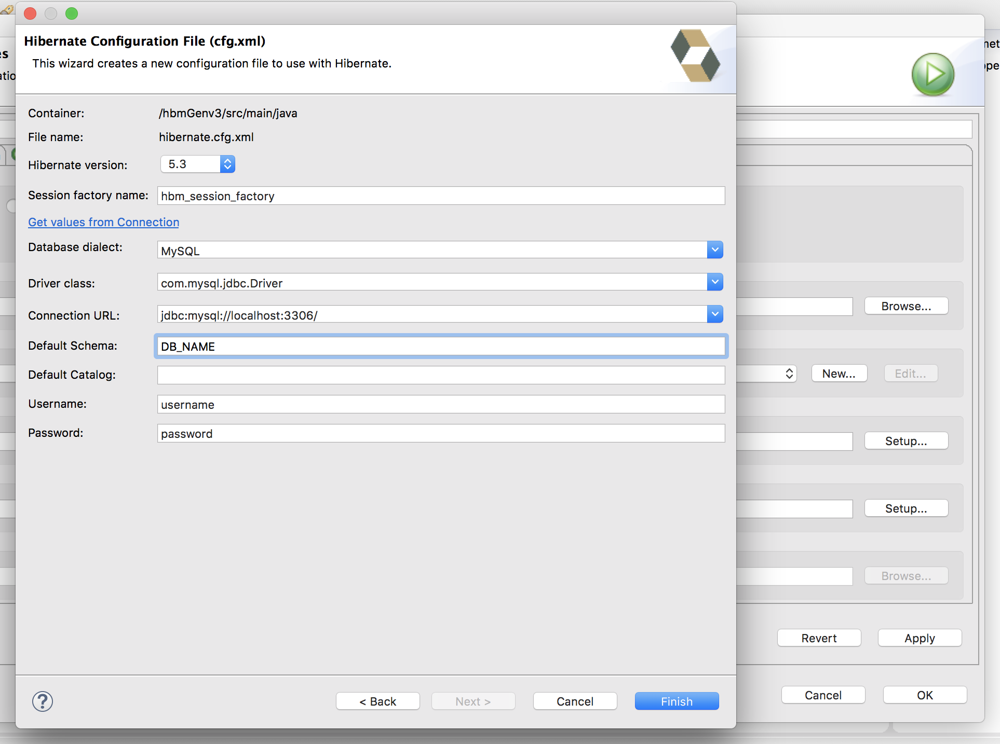
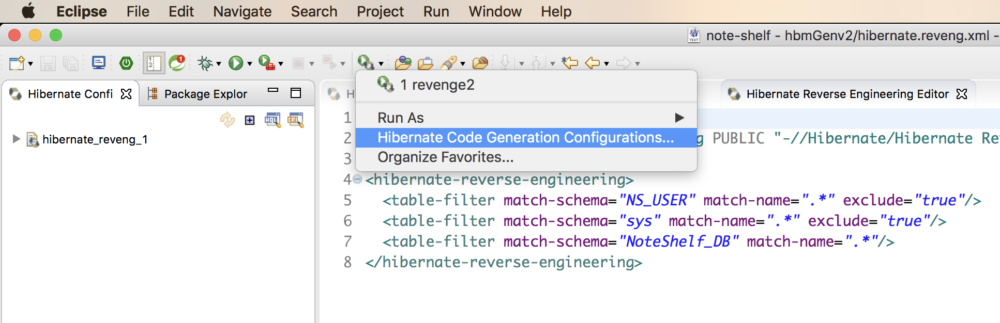
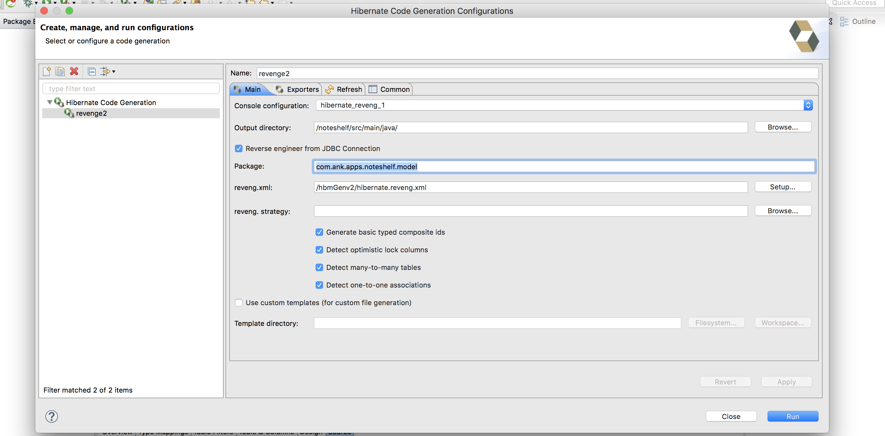
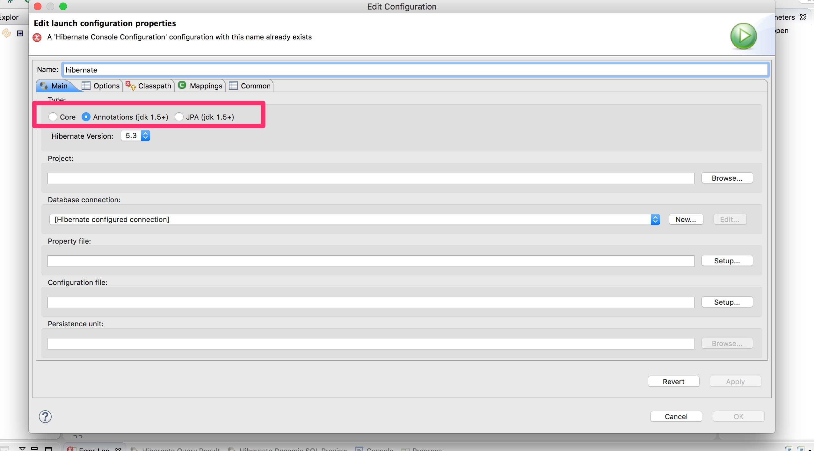

Hibernate Code Generation
---

JBoss Tools can be used to generate java classes from database tables.

# Tools Required

- Eclipse  
- JBoss / Hibernate Tools  
- JDK  


---

# Installing JBoss Tools

- Go to Eclipse Marketplace and search for JBOSS tools.

<br>



<br>

- Select Hibernate Tools from the list.

<br>



<br>

- Click on accept and install.

---

# Hibernate Perspective

Open Hibernate Perspective from Windows tab

<br>



<br><br>



---

# Adding console Configuration

Create a separate project containing the hibernate configuration file (`hibernate.cfg.xml`).

Sample config file

```xml
<?xml version="1.0" encoding="UTF-8"?>
<!DOCTYPE hibernate-configuration PUBLIC
		"-//Hibernate/Hibernate Configuration DTD 3.0//EN"
		"http://www.hibernate.org/dtd/hibernate-configuration-3.0.dtd">
<hibernate-configuration>
    <session-factory>
        <property name="hibernate.connection.driver_class">com.mysql.jdbc.Driver</property>
        <property name="hibernate.connection.password">{{password}}</property>
        <property name="hibernate.connection.url">jdbc:mysql://localhost:3306/DB_NAME</property>
        <property name="hibernate.connection.username">username</property>
        <property name="hibernate.dialect">org.hibernate.dialect.MySQLDialect</property>
    </session-factory>
</hibernate-configuration>

```


In Hibernate Perspective, right click and select “**Add Configuration…**”
<br>



<br>

Select the configuration file created earlier.
<br>



<br>

Another way is to manually create the configuration in which you have to specify all the connection related settings.



---

# Creating Hibernate Code Generation Configuration

Create a Code generation Configuration

<br>



<br>



In the `hibernate.reveng.xml` file specify the table names. The case of table name is important otherwise Hibernate does not generate the tables without specifying any underlying errors.

Click on Run and you will have freshly baked POJOs. :)

---


# Issues

## **Annotations not getting generated with the Domain code.**

-	While creating the Hibernate Console Configuration, ensure that you select the type as `Annotations (jdk 1.5+)`.

 	

- Hibernate version should be set to `5.2` in Hibernate Configuration. Annotations does not get generated when the version is `5.3`

- The mysql-jdbc connector needs to be of version `5.x.x`. The latest `8.x.x` also causes issues.

- Hibernate Tools version in maven is set to `5.2.11.Final`.

## **Avoiding Foreign Key association Sets generation**

- Use Revenge Strategy for the same.

```java
import java.util.List;

import org.hibernate.cfg.reveng.DelegatingReverseEngineeringStrategy;
import org.hibernate.cfg.reveng.ReverseEngineeringStrategy;
import org.hibernate.cfg.reveng.TableIdentifier;

public class RevengStrategy extends DelegatingReverseEngineeringStrategy {

	public RevengStrategy(ReverseEngineeringStrategy delegate) {
		super(delegate);
	}

	@Override
	public boolean excludeForeignKeyAsManytoOne(String keyname, TableIdentifier fromTable, List fromColumns,
			TableIdentifier referencedTable, List referencedColumns) {
		return true;
	}

	@Override
	public boolean excludeForeignKeyAsCollection(String keyname, TableIdentifier fromTable, List fromColumns,
			TableIdentifier referencedTable, List referencedColumns) {
		return true;
	}
}
```

---

## References

- [How to generate Hibernate mapping files & annotation with Hibernate Tools](https://www.mkyong.com/hibernate/how-to-generate-code-with-hibernate-tools/)
