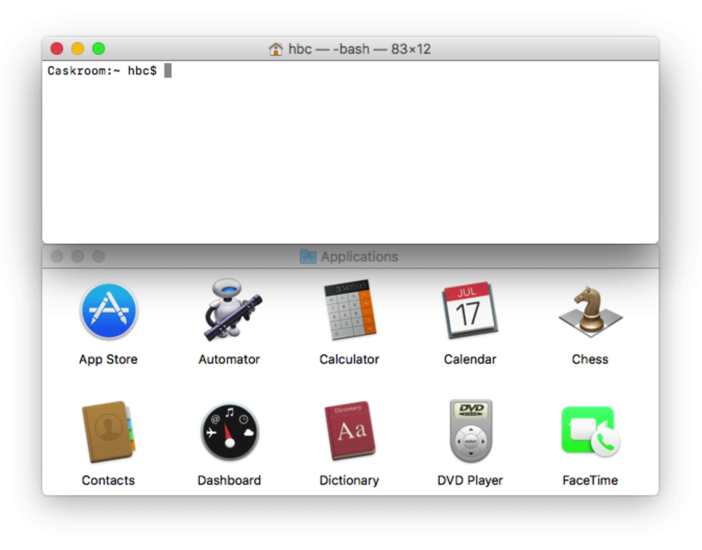

HomeBrew
---

## `brew tap`

The tap command allows Homebrew to tap into another repository of formulae. Once you've done this you've expanded your options of installable software.

These additional Git repos (inside usr/local/Library/Taps) describe sets of package formulae that are available for installation.

E.g.

```
brew tap                     # list tapped repositories
brew tap <tapname>           # add tap
brew untap <tapname>         # remove a tap
```

[HomeBrew CookBook](https://github.com/Homebrew/brew/blob/master/docs/Formula-Cookbook.md)

- Formula

A formula is a package definition written in Ruby. It can be created with `brew create <URL>` where `<URL>` is a zip or tarball, installed with `brew install <formula>`, and debugged with `brew install --debug --verbose <formula>`. 


---

## Homebrew-Cask

Homebrew-Cask extends Homebrew and brings its elegance, simplicity, and speed to the installation and management of GUI macOS applications such as Atom and Google Chrome.




**Un-installing java**

```
brew cask uninstall java

```