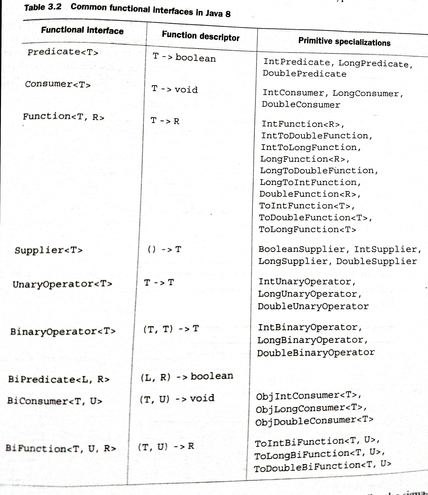

Java 8
---

# Overview - Java 8 major features:

## Behaviour Parameterization

Java 8 adds the ability to pass methods (code) as arguments to other methods. This is referred conceptually as *behaviour parameterization*.


## Functional style programming

The whole point of a programming language is to manipulate values (Objects), which are called as first-class citizens (values) of the program as they are passed from one place to another during execution. Other structures in our programming languages, which perhaps helps us express the structure of values but which can't be passed around during program execution, are second-class citizens. Values are first-class Java citizens, but various other Java concepts, such as methods and classes, exemplify second-class citizens..
Being able to pass methods aroung at run-time, and hence making them first-class citizens, is very useful in programming. Java 8 decided to allow methods to be used as values by introducing *method reference* `::` syntax (meaning "use this method as a value").

Another way Java 8 allows methods (specifically block of code) to be used as values is *lambdas*(or anonymous functions).

Programming using above concepts are said to be written in functional-programming style - this phrase means **writing programs that pass functions around as first-class values**.


## Streams

Java 8 provides a new API (Streams) that supports many parallel operations to process data. It avoids the need to write code that uses `synchronized`, which is not only highly error prone but is also more expensive on multicore CPUs.

A *stream* is a sequence of data items that are conceptually produced one at a time - a program might read items from an input stream one by one and similarly write items to an output stream. The output stream of one program could well be the input stream of another.

Java 8 adds a Streams API in `java.util.stream` package base on this idea; `Stream<T>` is a sequence of items of type `T`. The Streams API has many methods that can be chained to form a complex pipeline.

## Default methods

An interface can now contain method signatures for which an implementing class doesn't provide an implementation! The missing method bodies are given as part of the interface (hence default implementations) rather than in the implementing class.

---

# Passing code with behavior parameterization

*Behaviour Parameterization* is a software development pattern that lets you handle frequent requirement changes. In a nutshell, it means taking a block of code and making it available without executing it. This block of code can be called later by other parts of your programs, which means that you can defer the executionn of that block of code. You could pass the block of code as an arguement to another method that will execute it later. As a result, the method's behavior is parameterized based on that block of code.

The ability to tell method to take multiple behaviors (or strategies) as parameters and use them internally to accomplish different behaviors.(Strategy Design Pattern)

Predicate - The word predicate is often used in mathematics to mean something function-like that takes a values for an arguement and returns `true` or `false`.


```java
import java.util.ArrayList;
import java.util.List;

import com.ank.java8.behavior_param.approach2.ApplePredicate;
import com.ank.java8.behavior_param.common.Apple;
import com.ank.java8.behavior_param.common.AppleUtil;
import com.ank.java8.behavior_param.common.Color;

public class AppleFilterTestApproach3 {

    public static List<Apple> filterApples(List<Apple> inventory, ApplePredicate predicate) {
	List<Apple> result = new ArrayList<>();

	for (Apple apple : inventory) {
	    if (predicate.test(apple)) {
		result.add(apple);
	    }
	}
	return result;
    }

    public static void main(String[] args) {

	List<Apple> list = AppleUtil.produceApples();

	// Passing behavior in-line. Lambdas in Action!
	List<Apple> greenApples = filterApples(list, (apple) -> apple.getColor() == Color.GREEN);

	List<Apple> heavyApples = filterApples(list, (apple) -> apple.getWeight() > 120);


	System.out.println("Green Apples:" + greenApples);

	System.out.println("Heavy Apples:" + heavyApples);
    }
}
```

---

# Lambda expressions

A lambda expression can be understood as a concise representation of an anonymous function that can be passed around; it doesn't have a name, but it has a list of parameters, a body, a return type, and also possibly a list of exception that can be thrown.

- *Anonymous* -  It doesn't have an explicit name like a method would normally have

- *Function* - Lambda is not associated with a particular class like a method is. But like a method, a lambda das a list of parameters, a body. a return type, and a possible list of exceptions that can be thrown.

- *Passed around*- A lambda expression can be passed as argument to a method or stored in a variable.

- *Concise* - Not much of a boilerplate code is required.

```java
(Apple a1, Apple a2) -> a1.getWeight().compareTo(a2.getWeight());
```

A lambda expression has three parts:

- *A list of parameters* - In this case it mirrors the parameters of the compare method of a `Comparator` - two Apples

- *An arrow* - The arrow `->` separates the list of parameters from the body of the lambda.

- *The body of the lambda* - Compare two Apples using their weights. The expression is considered as lambda's return value.

**Examples of lambdas**

- A boolean expression -

  ```java
    (List<String> list) -> list.isEmpty()
  ```

- Creating objects -

  ```
    () -> new Apple(10)
  ```

- Consuming from an object -

  ```java
  (Apple a) -> {
    System.out.println(a.getWeight());
  }
  ```

- Select/extract from an object -

  ```java
    (String s) -> s.length()
  ```

---

# Functional Interface

A Functional Interface is an interface that specifies exactly one abstract method. An interface is still a functional interface if it has many default methods as long as it specifies only one abstract method.

`Predicate` is a functional interface because it specifies only one abstract method:

```java
public interface Predicate<T>{
  boolean test (T t);
}
```

# Function descriptor

The signature of the abstract method of the functional interface essentially describes the signature of the lambda expression. This abstract method is called as a function descriptor.

For e.g. `Runnable` interface signature accepts nothing and returns nothing(void). Hence it's signature `() -> void`.

A lambda expression can be assigned to a variable or passed to a method expecting a functional interface as argument, provided the lambda expression has the same signature as the abstract method of the functional interface.

A lambda expression let you provide the implementation of the abstract method of a functional interface directly inline, and they treat the whole expression as an instance of a functional interface.

`@FunctionalInterface` annotation is used to indicate that the interface is intended to be a functional interface. The compiler will return a meaningful error if you define an interface using the `@FunctionalInterface` annotation and it isn't functional interface. `@FunctionalInterface` annotation isn't mandatory, but it's good practice to use it when an interface is designed for that purpose like the `@Override` notation is used to indicate that a method is overridden.

**Putting lambdas in practice**

```java
public class ExecuteAroundTest {

    public static void printVariation(String s, OntheFlyPrint p) {
	     System.out.println(p.printThis(s));
    }

    public static void main(String[] args) {

    	String s = "Original_String";

    	printVariation(s, (p) -> p); // normal print

    	printVariation(s, (p) -> p.toUpperCase()); // UpperCase Print

    	printVariation(s, (p) -> p.toLowerCase()); // UpperCase Print

    }
}

@FunctionalInterface
interface OntheFlyPrint {

    String printThis(String s);
}
```

Output:

```
Original_String
ORIGINAL_STRING
original_string
```
---

# Existing Functional Interfaces

Java 8 introduces several new functional interfaces inside the `java.util.function` package.

## Predicate

The `java.util.function.Predicate<T>` interface defines an abstract method named `test` that accepts an object of generic type `T` and returns a boolean.

```java
@FunctionalInterface
public interface Predicate<T>{
  boolean test (T t);
}
```
[Example](https://github.com/a2ankitrai/Java8-Shots/blob/master/src/main/java/com/ank/java8/lambda_exp/PredicateTest.java)

## Consumer

The `java.util.function.Consumer<T>` interface defines an abstract method name `accept` that takes an object of generic type `T` and returns no result(void). Use this interface when you need to access an object of type `T` and perform some operations on it.

```java
@FunctionalInterface
public interface Consumer<T>{
  void accept (T t);
}
```

[Example](https://github.com/a2ankitrai/Java8-Shots/blob/master/src/main/java/com/ank/java8/lambda_exp/ConsumerTest.java)

## Function

The `java.util.function.Function<T,R>` interface defines an abstract method named `apply` that takes an object of generic type `T` as input and returns an object of generic type `R`. Use this interface when you need to define a lambda that maps information from an input object to an output.

```java
@FunctionalInterface
public interface Function<T,R>{
  R apply (T t);
}
```

[Example](https://github.com/a2ankitrai/Java8-Shots/blob/master/src/main/java/com/ank/java8/lambda_exp/FunctionTest.java)

## Primitive Specializations

Java 9 also brings specialized version of the above functional interfaces in order to avoid auto-boxing operations when the inputs or outputs are primitives.
For e.g. `IntPredicate`

```java
public interface IntPredicate{
  boolean test(int t);
}
```

**Common Functional Interfaces in Java 8**



> Note that none of the functional interfaces allow for a checked exception to be thrown. You have two options if you need a lambda expression to throw an exception: define your own functional interface that declares the checked exception, or wrap the lambda with a `try/catch` block.

---

# Type checking, type inference, and restrictions


----
