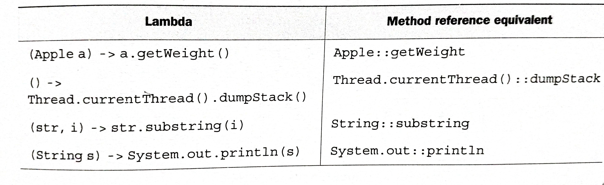

# Method references

Method reference lets you create a lambda expression from an existing method implementation. In method reference, the target reference is placed before the delimiter `::` and the name of the method is provided after it. No brackets are needed because you are not actually calling the method. It is a syntactic sugar for lambdas.




## Recipe for constructing method references

- A method reference to a *static method*. (method `parseInt` of `Integer`, written  `Intger :: parseInt`)

- A method reference to an instance method of an arbitrary type ( method `length` of a `String`, written `String::length`). You're referring to a method to an object that will be supplied as one of the parameters of the lambda.

- A method reference to an instance method of an existing object. You're calling a method in a lambda to an external object that already exists. (For eg. the lambda expression `() -> expensiveTransaction.getValue()` can be rewritten as `expensiveTransaction::getValue`).

## Constructor references

You can create a reference to an existing constructor using its name and the keyword `new ` as follows: `ClassName::new`. It works similarly to a reference to a static method.

```java
Supplier<Apple> c1 = Apple::new;
Apple a1 = c1.get();
```

which is equivalent to

```java
Supplier<Apple> c1 = () -> new Apple();
Apple a1 = c1.get();
```

[Examples](https://github.com/a2ankitrai/Java8-Shots/blob/master/src/main/java/com/ank/java8/method_reference/MethodReferenceTest.java)

---

# Composing Lambda Expressions

Lambda expressions provide methods that allow composition through which we can combine several simple lambda expression to build more complicated ones.

## Composing Comparator

[Example](https://github.com/a2ankitrai/Java8-Shots/blob/master/src/main/java/com/ank/java8/composing_lambda/ComparatorComposeTest.java)

## Composing Predicate

The  `Predicate` interface includes three methods that let you reuse an existing `Predicate` to create more complicated ones: `negate`, `and`, and `or`.

[Example](https://github.com/a2ankitrai/Java8-Shots/blob/master/src/main/java/com/ank/java8/composing_lambda/PredicateComposeTest.java)

## Composing Functions

The `Function` interface comes with two default methods for this, `andThen` and `compose`, which both return and instance of `Function`.
