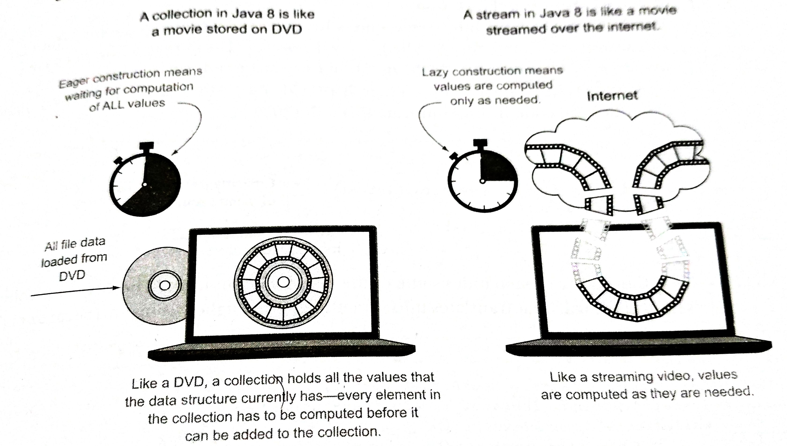
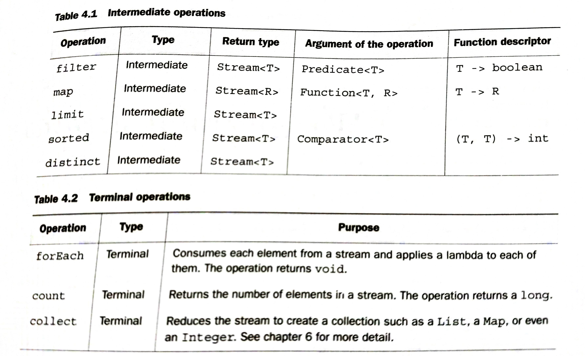

Streams
---

Streams are an update to the Java API that lets you manipulate collections of data in a declarative way; you specify what you want to achieve as opposed to specifying how to implement an operation.

A *stream* is a sequence of elements from a source that supports data processing operations.

- *Sequence of elements* - Like a collection, a stream provides an interface to a sequenced set of values of a specific  element type. Collections are mostly about storing and accessing elements with specific time/space complexities. But streams are about expressing computations such as `filter`, `sorted`, and `map`. Collections are about data; streams are about computations.

- *Source* - Streams consume from a data-providing source such as collections, arrays, or I/O resources. Generating a stream from an ordered collection preserves the ordering.

- *Data processing operations* - Streams support database-like operations and common operations from functional programming languages to manipulate data, such as `filter`, `map`, `reduce`, `find`, `match`, `sort`, and so on. Stream operations can be executed either sequentially or in parallel.

Stream operations have two important characteristics:

- *Pipelining* - Many stream operations return a stream themselves, allowing operations to be chained and form a larger pipeline. A pipeline of operations can be viewed as a database like query on the data source.

- *Internal iteration* - In contrast to collections, which are iterated explicitly using an iterator, stream operations do the iteration behind the scenes for you.

The JDK's standard implementation of `Stream` interface is the internal class `java.util.stream.ReferencePipeline`, you cannot instantiate it directly.

---

# Streams vs Collections

A collection is an in-memory data structure that holds all the values the data data structure currently has -  every element in the collection had to be computed before it can be added to the collection. (You can add or remove elements from the collection, but a each moment in time, every element in the collection is stored in memory, elements have to be computed before becoming part of collection)

By contrast, a stream is a conceptually fixed data structure whose elements are *computed on demand*. The idea is that a user will extract only the values they required from a stream, and these elements are produced - invisibly to the user - only as and when required.



- **Traversable only once** - Similarly to iterators, a stream can be traversed only once. After that a stream is said to be consumed.

```java

List<String> title  = Arrays.asList("Java","is","sucking","my","soul");
Stream<String> s = title.stream();
s.forEach(System.out::println);
//s.forEach(System.out::println); //Exception in thread "main" java.lang.IllegalStateException: stream has already been operated upon or closed

```

> Streams and collections philosophically - Stream is a set of values spread out in time. In contrast, a collection is a set of values spread out in space(here computer memory), which all exist at a single point in time.

- **External vs. Internal iteration** - Collection interface requires iteration to be done by the user; this is called external iteration. The streams library by contrast uses internal iteration - it does the iteration for you and takes care of storing the resulting stream value somewhere.

```java
List<String> names  = menu.stream()
                .map(Dish::getName)
                .collect(Collectors.toList());
```

---

# Stream operations

The Stream interface in java.util.stream.Stream defines many operations which can be classified into two categories.

## Intermediate operations

Intermediate operations such as `filter` or `sorted` return another stream as the return type. This allows the operations to be connected to form a query. The intermediate operations don't perform any processing until a terminal operation is invoked on the stream pipeline - they are lazy. This is because intermediate operations can usually be merged and processed into a single pass by the terminal operation.

## Terminal operations

Terminal operations produce a result from a stream pipeline. A result is any non stream values such as a `List`, an `Integer`, or even `void`.

```java
long count = Dish.menu.stream()
                        .filter(d -> d.getCalories() >300)         // intermediate operation
                        .distinct()                              // intermediate operation
                        .limit(4)                              // intermediate operation
                        .count();                           // terminal operation

  System.out.println(count);
```

[Stream operations code](https://github.com/a2ankitrai/Java8-Shots/blob/master/src/main/java/com/ank/java8/stream/StreamOperations.java)

The idea behind a stream pipeline is similar to the builder pattern. In the builder pattern, there's a chain of calls to set up a configuration (for streams this is a chain of intermediate operations), followed by a call to a `build` method (for streams this is a terminal operation).


