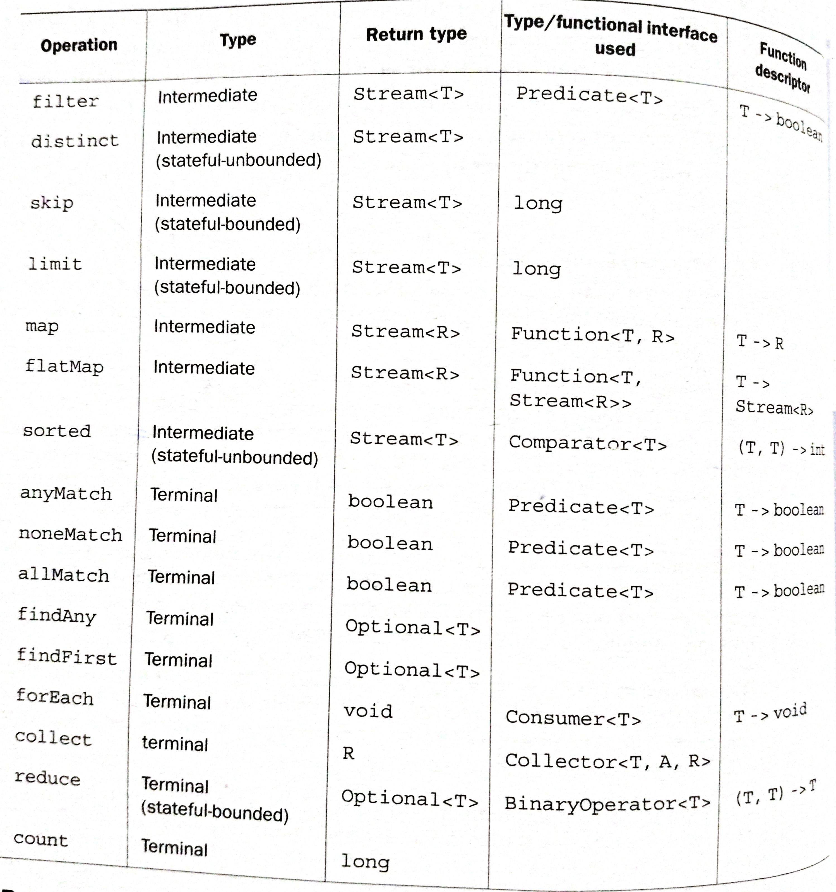

Working with Streams
---

Working with streams in general involves three items:

- A **data source** (such as a collection) to perform a query on

- A chain of **intermediate operations** that form a stream pipeline

- A **terminal operation** that executes the stream pipeline and produces a result

## Filtering and slicing

**Filtering with a predicate**

The Streams interface supports a filter method which takes as argument a *predicate*(a function returning a boolean) and returns a stream including all elements that match the predicate.

**Filtering unique elements**

Streams also support a method called `distinct` that returns a stream with unique elements (according to the implementation of the `hashCode` and `equals` method of the objects produced by the stream).

**Truncating a stream**

Streams support the `limit(n)` method , which returns another stream that's no longer than a given size. The requested size is passed as argument to `limit`. If the stream is ordered, the first elements are returned up to a maximum of `n`.

**Skipping elements**

Streams support the `skip(n)` method to return a stream that discards the first `n` elements. If the stream has fewer elements than `n`, then an empty stream is returned.

Note that `limit(n)` and `skip(n)` are complementary!

[Filtering operations code](https://github.com/a2ankitrai/Java8-Shots/blob/master/src/main/java/com/ank/java8/stream/StreamFilteringOperations.java)


## Mapping

The Streams API provides map and flatMap methods to select information from objects and apply a function to it.

**Applying a function to each element of a stream**

Streams support the method `map`, which takes a function as argument. The function is applied to each element, mapping it into a new element (the word *mapping* is used because it has a meaning similar to transforming but with the nuance of "creating a new version of" rather than "modifying").

**Flattening streams**

The `flatMap` method lets you replace each value of a stream with another stream and then concatenates all the generated streams into a single stream.

```java
//Flattening streams
        String[] arrayOfWords = {"Goodbye", "World"};

        List<String> uniqueCharacters = Arrays.stream(arrayOfWords)
                .map(w -> w.split(""))
                .flatMap(Arrays::stream)
                .distinct()
                .collect(Collectors.toList());

        System.out.println("uniqueCharacters = " + uniqueCharacters);
```

Using the flatMap method has the effect of mapping each array not with a stream but with the contents of that stream. All the separate streams that were generated when using `map(Arrays::stream)` get amalgamated-flattened into a single stream.

[Mapping operations code](https://github.com/a2ankitrai/Java8-Shots/blob/master/src/main/java/com/ank/java8/stream/StreamMappingOperations.java)

## Finding and matching

Another common data processing idiom is finding whether some elements in a set of data match a given property. The Streams API provides such facilities through the `allMatch`, `anyMatch`, `nonMatch`, `findFirst`, and `findAny` methods of a stream.

**Checking if a predicate matches at least one element**

Is there an element in the stream matching the given predicate?

The `anyMatch` method returns a boolean and is therefore a terminal operation.

```java
//anyMatch
        if(Dish.menu.stream().anyMatch(Dish::isVegetarian)){
            System.out.println("This menu contains vegetarian items as well");
        }
```

**Checking to see if a predicate matches all elements**

The `allMatch` method works similarly to `anyMatch` but will check to see if all the elements of the stream match the given predicate.

```java
//allMatch
        boolean isHealthy = Dish.menu.stream()
                .allMatch(d -> d.getCalories() < 1000);

        System.out.println("isHealthy = " + isHealthy);
```        

The opposite of `allMatch` is `noneMatch`. It ensures that no elements in the stream match the given predicate.

```java
//noneMatch
        boolean isHealthy2 = Dish.menu.stream()
                .noneMatch(d -> d.getCalories() >= 1000);

        System.out.println("isHealthy2 = " + isHealthy2);
```        

**Finding an element**

The findAny method returns an arbitrary element of the current stream. It can be used in conjunction with other stream operations.

```java
//Finding an element : findAny
        Optional<Dish> dish = Dish.menu.stream()
                .filter(Dish::isVegetarian)
                .findAny();

        dish.ifPresent(d -> System.out.println(d.getName()));
```

[Finding & matching operations code](https://github.com/a2ankitrai/Java8-Shots/blob/master/src/main/java/com/ank/java8/stream/StreamFindingMatchingOperations.java)

**Optional class in java 8**

The Optional<T> class (java.util.Optional) is a container class to represent the existence or absence of a value. Following are some important methods of the same.

- `ifPresent()` returns `true` if `Optional` contains a value, `false` otherwise.

- `ifPresent(Consumer<T> block)` executes the given block if a value is present.

- `T get()` returns the value if present; otherwise it throws a `NoSuchElementException`.

- `T orElse(T other)` returns the value if present; otherwise it returns a default value.


## Reducing

Reducing operations are used to reduce a stream to a value. These are similar to for e.g. finding the maximum, calculating the sum in DB queries.

In functional programming language jargon, this is referred to as a fold because you can view this operation as repeatedly folding a long piece of paper(your stream) until it forms a small square, which is the result of the fold operation.

**Summing the elements**

```java
        List<Integer> numbers = Arrays.asList(1,2,3,4,5);

        // Summing the elements
        int sum = numbers.stream().reduce(0, (a,b) -> a+b);
        System.out.println("sum = " + sum);

        int product = numbers.stream().reduce(1,(a,b) -> a*b);
        System.out.println("product = " + product);

        int sum2 = numbers.stream().reduce(0,Integer::sum);
        System.out.println("sum2 = " + sum2);

        Optional<Integer> optionalNumbersSum = numbers.stream().reduce((a,b) -> a + b);
        System.out.println("optionalNumbersSum = " + optionalNumbersSum);

        List<Integer> emptyList = new ArrayList<>();
        Optional<Integer> optionalEmptyListSum = emptyList.stream().reduce((a,b) -> a + b);
        System.out.println("optionalEmptyListSum = " + optionalEmptyListSum);
```

**Maximum and Minimum**

```java
        // Maximum and Minimum

        Optional<Integer> max = numbers.stream().reduce(Integer::max);
        System.out.println("max = " + max);

        Optional<Integer> min = numbers.stream().reduce(Integer::min);
        System.out.println("min = " + min);
```        

[Reducing operations code](https://github.com/a2ankitrai/Java8-Shots/blob/master/src/main/java/com/ank/java8/stream/StreamReducingOperations.java)

> The chain of `map` and `reduce` is commonly known as the map-reduce pattern, made famous by Google's use of it for web searching because it can be easily parallelized.

> The lambda passed to reduce can't change state(for example, instance variables), and the operation needs to be associative so it can be executed in any order.



---

# Numeric streams

## Primitive stream specializations

Java 8 introduces three primitive specialized stream interfaces to work with streams of numbers.

`IntStream`, `DoubleStream`, and `LongStream` respectively specialize the elements of  a stream to be `int`, `long` and `double` - and thereby avoid hidden boxing costs. Each of these interfaces brings new methods to perform common numeric reductions such as `sum` to calculate the sum of a numeric stream and `max` to find the maximum element.

The common methods used to convert a stream to a specialized version are `mapToInt`, `mapToDouble`, and `mapToLong`. These methods work exactly like the method `map` but return a specialized stream instead of a `Stream<T>`.

```java

int calories = menu.stream()
                   .mapToInt(Dish::getCalories)
                   .sum();

```

IntStream also supports other convenience methods such as `max`, `min`, and `average`.

To convert from a primitive stream to a general stream(each int will be boxed to an Integer) use the method boxed as follows:

```java
IntStream intStream = menu.stream().mapToInt(Dish::getCalories);
Stream<Integer> stream = intStream.boxed();
```

There's a primitive specialized version of Optional as well for the three primitive stream specializations: `OptionalInt`, `OptionalDouble`, and `OptionalLong`.

## Numeric ranges

Java 8 introduces two static methods available on `IntStream` and `LongStream` to help generate range of numeric values: `range` and `rangeClosed`. Both methods take the starting value of the range as the first parameter and the end value of the range as the second parameter. Bit `range` is exclusive, whereas `rangeClosed` is inclusive.

---

# Building Streams

Streams can be created from a sequence of values, from an array, from a file, and evene from a generative function to create infinite streams.

## Streams from values

You can create a stream with explicit values by using the static method `Stream.of`, which can take any number of parameters.
```java
// stream from values
Stream<String> streamOfStrings = Stream.of("Stream","of","Strings","in","Java 8");
streamOfStrings.map(String::toUpperCase).forEach(System.out::println);
```

You can get an empty stream using the `empty` method.

```java
// empty stream
Stream<String> emptyStream = Stream.empty();
```

You can convert an array of primitive ints into an IntStream.

```java
// streams from arrays
int[] numbers = {2,4,1,6,8,13};
int sum = Arrays.stream(numbers).sum();
```

## Stream from function: creating infinite streams

The Streams API provides two static methods to generate a stream from a function: `Stream.iterate` and `Stream.generate`. These operations can create an *infinite stream*: a stream that doesn't have a fixed size. Streams produced by iterate and generate create values on demand given a function and can therefore calculate values forever.

**Iterate**
```java
System.out.println("Streams from Iteration : ");
Stream.iterate(0, n -> n + 2).limit(5).forEach(System.out::println);
```        

**Generate**
```java
System.out.println("Streams from Generation");
Stream.generate(Math::random).limit(5).forEach(System.out::println);
```

[Numeric operations code](https://github.com/a2ankitrai/Java8-Shots/blob/master/src/main/java/com/ank/java8/stream/StreamNumericOperations.java)
