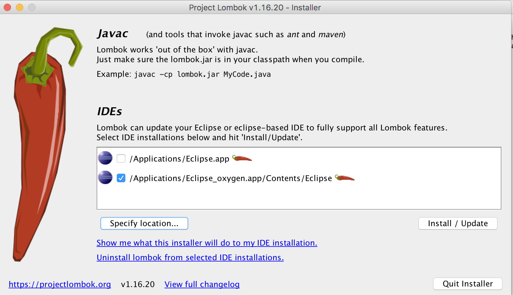

Project Lombok
---

Project Lombok is a java library that automatically plugs into your editor and build tools, spicing up your java.
Never write another getter or equals method again. Early access to future java features such as val, and much more.

# Installation in eclipse

1. Downloaded jar from https://projectlombok.org/download

2. execute command: `java -jar lombok.jar`

3. This command will open window as shown here https://projectlombok.org/setup/eclipse, install and quit the installer.

4. Add jar to build path/add it to pom.xml.

5. restart eclipse.

6. Go to Eclipse --> About Eclipse --> check 'Lombok v1.16.18 "Dancing Elephant" is installed.

https://projectlombok.org/

---

# Annotations

- **@NoArgsConstructor, @RequiredArgsConstructor, @AllArgsConstructor**

	`@NoArgsConstructor` will generate a constructor with no parameters. If this is not possible (because of final fields), a compiler error will result instead, unless `@NoArgsConstructor(force = true)` is used, then all final fields are initialized with `0` / `false` / `null`. For fields with constraints, such as `@NonNull` fields, no check is generated,so be aware that these constraints will generally not be fulfilled until those fields are properly initialized later. Certain java constructs, such as hibernate and the Service Provider Interface require a no-args constructor. This annotation is useful primarily in combination with either `@Data` or one of the other constructor generating annotations.

	`@RequiredArgsConstructor` generates a constructor with 1 parameter for each field that requires special handling. All non-initialized final `fields` get a parameter, as well as any fields that are marked as `@NonNul`l that aren't initialized where they are declared. For those fields marked with `@NonNull`, an explicit null check is also generated. The constructor will throw a `NullPointerException` if any of the parameters intended for the fields marked with `@NonNull` contain `null`. The order of the parameters match the order in which the fields appear in your class.

	`@AllArgsConstructor` generates a constructor with 1 parameter for each field in your class. Fields marked with `@NonNull` result in null checks on those parameters.

	Each of these annotations allows an alternate form, where the generated constructor is always private, and an additional static factory method that wraps around the private constructor is generated. This mode is enabled by supplying the `staticName` value for the annotation, like so: `@RequiredArgsConstructor(staticName="of")`. Such a static factory method will infer generics, unlike a normal constructor. This means your API users get write `MapEntry.of("foo", 5)` instead of the much longer `new MapEntry<String, Integer>("foo", 5)`.

- **@Data**

	All together now: A shortcut for `@ToString`, `@EqualsAndHashCode`, `@Getter` on all fields, and `@Setter` on all non-final fields, and `@RequiredArgsConstructor`!

