# Advanced Topic Configurations
---

**Why should I care about topic config?**

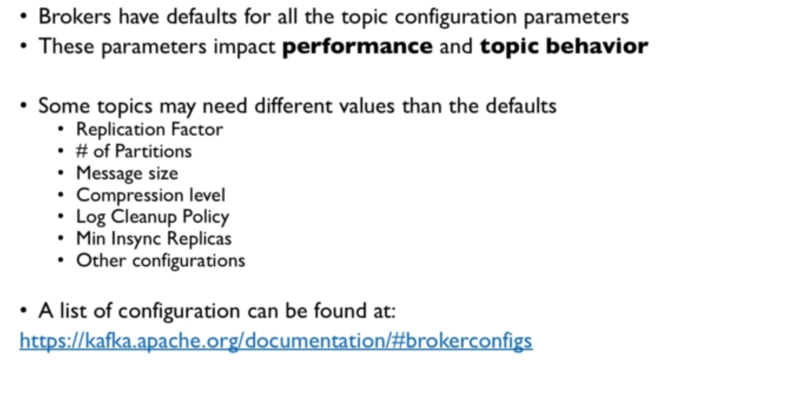

**CLI commands**

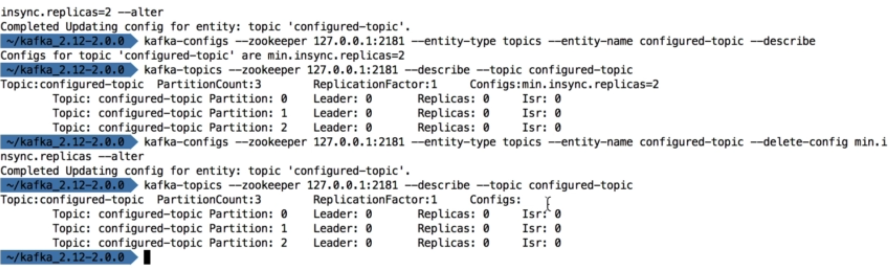

---

# Partitions & Segments

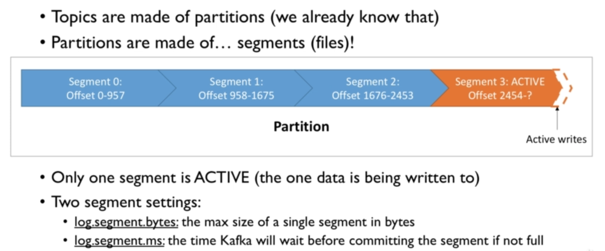

**Segments & Indexes**

**Segments: Why should I care?**

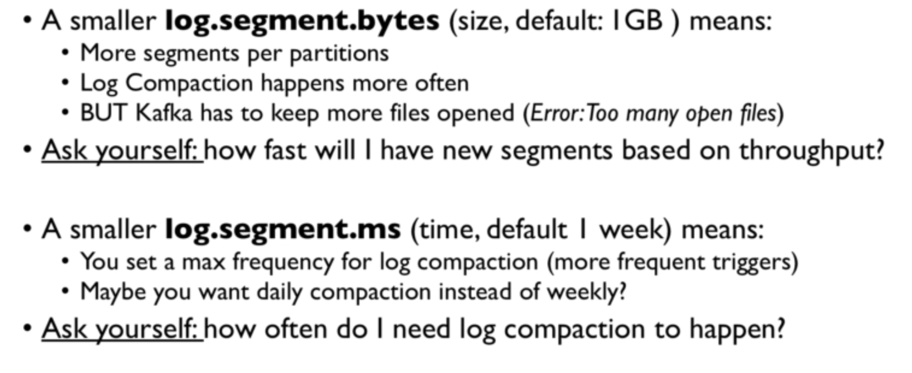

---

# Log Cleanup Policies

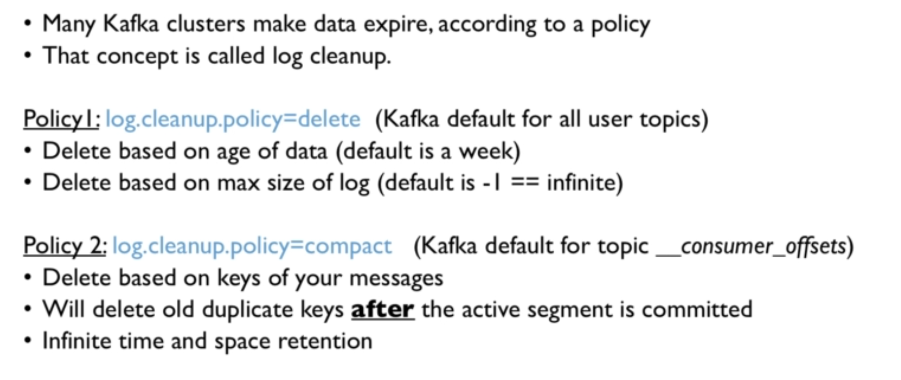

**Why & When?**

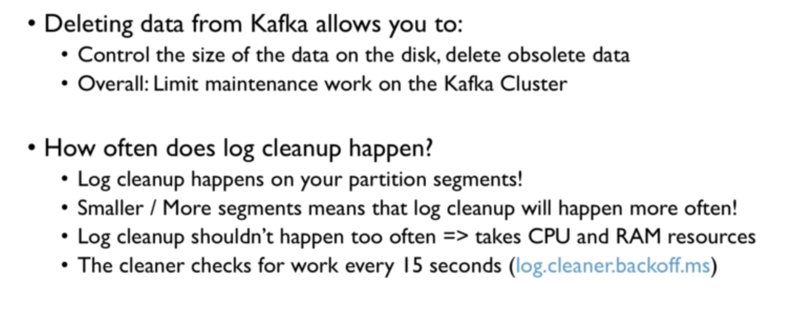

## Log Cleanup Policy: Delete

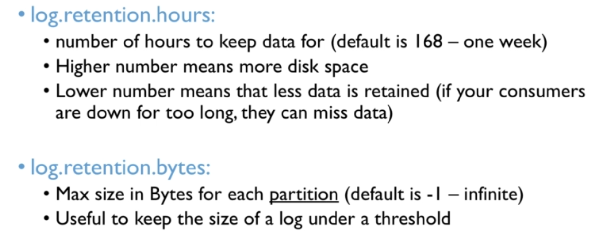

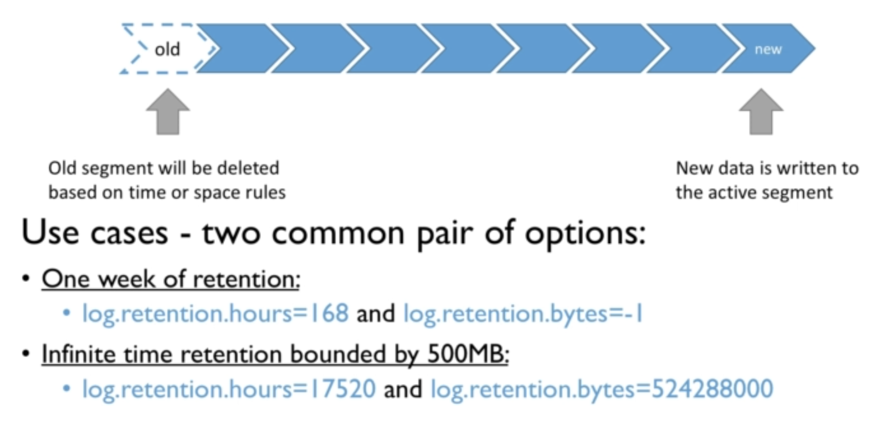

## Log Cleanup Policy: Compact

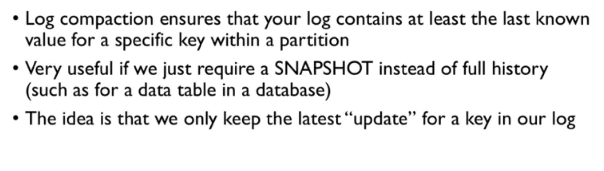

**Example**

**Log Compaction Guarantees**

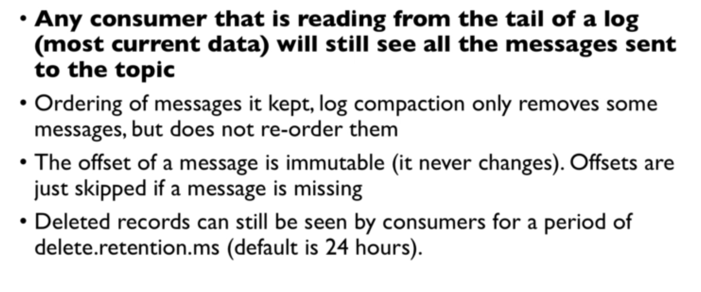

**Log Compaction Myth Busting**

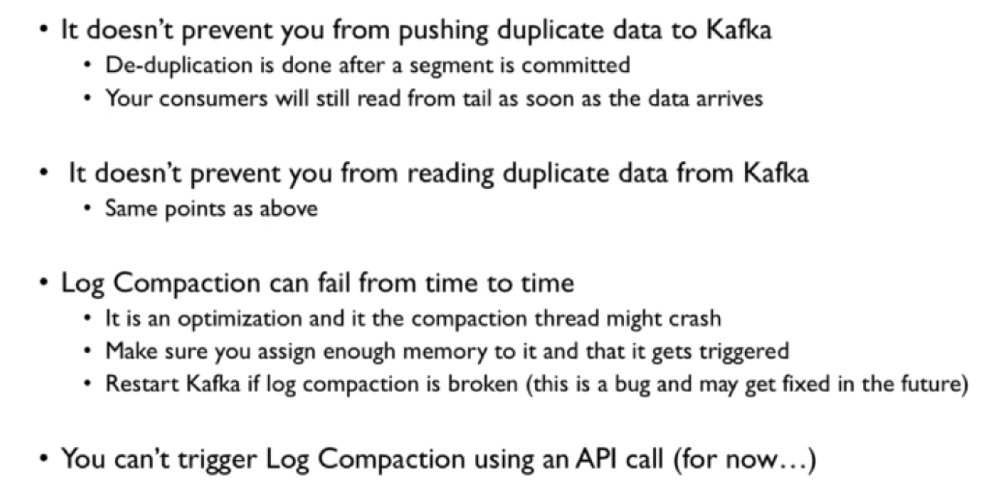

**Log Compaction - working**

----

## unclean.leader.election

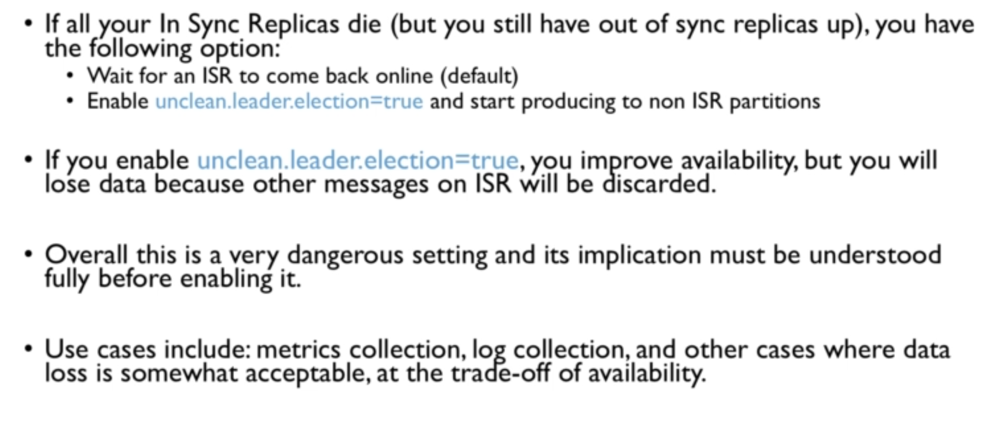

----
