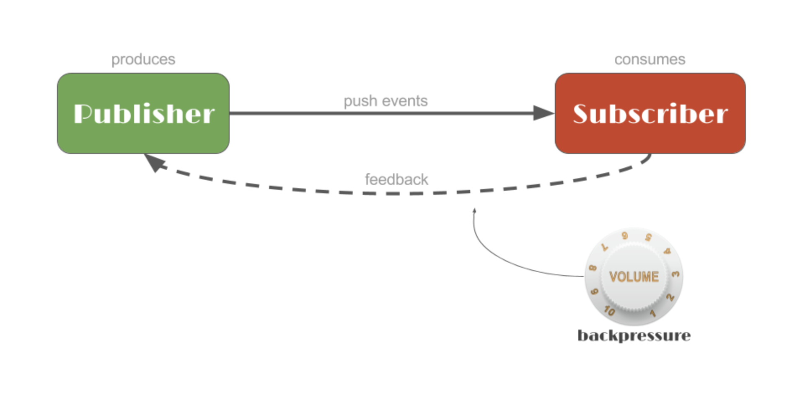
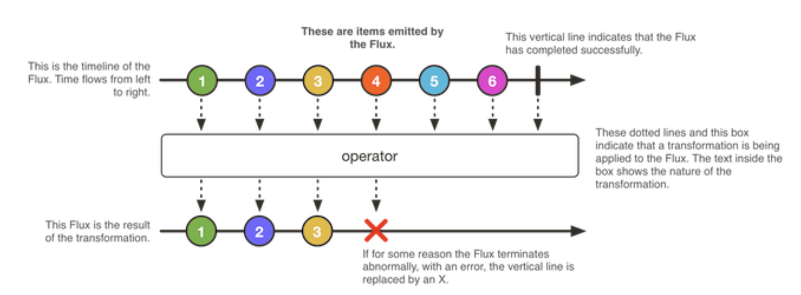
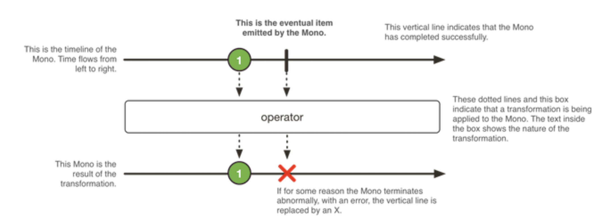
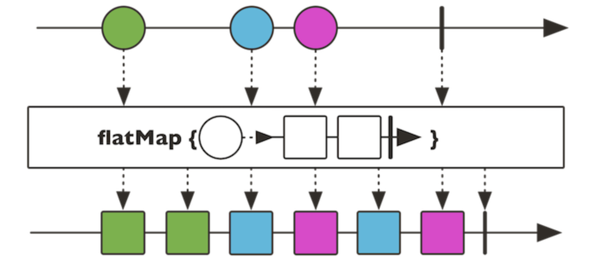

# Project Reactor
---

Reactor is a fourth-generation Reactive library for building non-blocking applications on the JVM based on the Reactive Streams Specification. Reactor is a fully non-blocking foundation with efficient demand management. It directly interacts with Java 8 functional API, Completable Future, Stream and Duration.

Reactor 3 aims at offering an higher level API that can be leverage in a large breadth of situations, building it on top of Reactive Streams Publisher.

The Spring Framework uses Reactor internally for its own reactive support. Reactor is a Reactive Streams implementation that further extends the basic Reactive Streams Publisher contract with the `Flux` and `Mono` composable API types to provide declarative operations on data sequences of `0..N` and `0..1`.

## Interactions

In reactive stream sequences, the source `Publisher` produces data. But by default, it does nothing until a `Subscriber` has registered (subscribed), at which point it will push data to it.



Reactor adds the concept of **operators**, which are chained together to describe what processing to apply at each stage to the data. Applying an operator returns a new intermediate `Publisher` (in fact it can be though of as both a `Subscriber` to the operator upstream and a `Publisher` for downstream). The final form of the data ends up in the final `Subscriber` that defines what to do from a user perspective.

---

## Flux

A `Flux<T>` is a Reactive Streams `Publisher`, augmented with a lot of operators that can be used to generate, transform, orchestrate Flux sequences.

It can emit 0 to *n* `<T>` elements (`onNext` event) then either completes or errors (`onComplete` and `onError` terminal events). If no terminal event is triggered, the `Flux` is infinite.

- Static factories on Flux allow to create sources, or generate them from several callbacks types.

- Instance methods, the operators, let you build an asynchronous processing pipeline that will produce an asynchronous sequence.

- Each `Flux#subscribe()` or multicasting operation such as `Flux#publish` and `Flux#publishNext` will materialize a dedicated instance of the pipeline and trigger the data flow inside it.



`Flux` in action:

```java

Flux.fromIterable(getSomeLongList())
    .delayElements(Duration.ofMillis(100))
    .doOnNext(serviceA::someObserver)
    .map(d -> d * 2)
    .take(3)
    .onErrorResumeWith(errorHandler::fallback)
    .doAfterTerminate(serviceM::incrementTerminate)
    .subscribe(System.out::println);

```

---

## Mono

A `Mono<T>` is a Reactive Streams `Publisher`, also augmented with a lot of operators that can be used to generate, transform, orchestrate Mono sequences.

It is a specialization of `Flux` that can emit at **most 1 `<T>` element**: a Mono is either valued (complete with element), empty (complete without element) or failed (error).

A `Mono<Void>` can be used in cases where only the completion signal is interesting (the Reactive Streams equivalent of a Runnable task completing).

Like for `Flux`, the operators can be used to define an asynchronous pipeline which will be materialized anew for each `Subscription`.

Note that some API that change the sequence's cardinality will return a `Flux` (and vice-versa, APIs that reduce the cardinality to 1 in a `Flux` return a `Mono`).



`Mono` in action:

```java

Mono.just(1)
    .map(integer -> "foo" + integer)
    .or(Mono.delay(Duration.ofMillis(100)))
    .subscribe(System.out::println);
```

---

## StepVerifier

This class from the `reactor-test` artifact is capable of subscribing to any `Publisher` (eg. a `Flux` or an Akka Stream...) and then assert a set of user-defined expectations with regard to the sequence.

If any event is triggered that doesn't match the current expectation, the `StepVerifier` will produce an `AssertionError`.

You can obtain an instance of `StepVerifier` from the static factory `create`. It offers a DSL to set up expectations on the data part and finish with a single terminal expectation (completion, error, cancellation...).

Note that **you must always call the `verify()` method** or one of the shortcuts that combine the terminal expectation and verify, like `.verifyErrorMessage(String)`. Otherwise the `StepVerifier` won't subscribe to your sequence and nothing will be asserted.

```java

StepVerifier.create(T<Publisher>).{expectations...}.verify()

```

> Remember the `verify()` step, which triggers the verification. In order to help, the API includes a few shortcut methods that combine the terminal expectations with a call to `verify()`: `verifyComplete()`, `verifyError()`, `verifyErrorMessage(String)`, and others.

> By default, the `verify()` method and derived shortcut methods (`verifyThenAssertThat`, `verifyComplete()`, etc.) has no timeout. It can block indefinitely. You can use `StepVerifier.setDefaultTimeout(Duration)` to globally set a timeout for these methods, or specify one on a per-call basis with `verify(Duration)`.
 
---

## Transforming the data

Reactor ships with several operators that can be used to transform data.

**map** method is used to transform the items emitted by `Mono` or `Flux` by applying a synchronous function to each item.

```java

// Capitalize the user username, firstname and lastname
    Mono<User> capitalizeOne(Mono<User> mono) {
	return mono.map(u -> new User(u.getUsername().toUpperCase(), u.getFirstname().toUpperCase(),
		u.getLastname().toUpperCase()));
    }

    // TODO Capitalize the users username, firstName and lastName
    Flux<User> capitalizeMany(Flux<User> flux) {
	return flux.map(u ->
		new User(u.getUsername().toUpperCase(), 
			 u.getFirstname().toUpperCase(),
			 u.getLastname().toUpperCase()));
    }
```  

**`flatMap`** takes a transformation `Function` that returns a `Publisher<U>` instead of a `U`. This publisher represents the asynchronous transformation to apply to each element. If we were using it with `map`, we'd obtain a stream of `Flux<Publisher<U>>`. Not very useful.

But `flatMap` on the other hand knows how to deal with these inner publishers: it will subscribe to them then merge all of them into a single global output, a much more useful `Flux<U>`. Note that if values from inner publishers arrive at different times, they can interleave in the resulting `Flux`.



---

## Merge

Merging sequences is the operation consisting of listening for values from several `Publisher`s and emitting them in a single `Flux`.

```java
 	// Merge flux1 and flux2 values with interleave
    Flux<User> mergeFluxWithInterleave(Flux<User> flux1, Flux<User> flux2) {
	return flux1.mergeWith(flux2);
    }

    // Merge flux1 and flux2 values with no interleave (flux1 values and then flux2 values)
    Flux<User> mergeFluxWithNoInterleave(Flux<User> flux1, Flux<User> flux2) {
	return flux1.concatWith(flux2);
    }

    // Create a Flux containing the value of mono1 then the value of mono2
    Flux<User> createFluxFromMultipleMono(Mono<User> mono1, Mono<User> mono2) {
	return Flux.concat(mono1, mono2);
    }
```    

## Request & Backpressure

Backpressure is a feedback mechanism that allows a `Subscriber` to signal to its `Publisher` how much data it is prepared to process, limiting the rate at which the `Publisher` produces data.

This control of the demand is done at the `Subscription` level: a `Subscription` is created for each `subscribe()` call and it can be manipulated to either `cancel()` the flow of data or tune demand with `request(long)`.

Making a `request(Long.MAX_VALUE)` means an **unbounded demand**, so the Publisher will emit data at its fastest pace.
 
---

## Error Handling

Reactor ships with several operators that can be used to deal with errors: propagate errors but also recover from it (eg. by falling back to a different sequence or by retrying a new `Subscription`).

```java
	// Return a Mono<User> containing User.SAUL when an error occurs in the
    // input Mono, else do not change the input Mono.
    Mono<User> betterCallSaulForBogusMono(Mono<User> mono) {

	return mono.onErrorReturn(User.SAUL);
	// return mono.onErrorResume(e -> Mono.just(User.SAUL)); //another option
    }

    // Return a Flux<User> containing User.SAUL and User.JESSE when an error
    // occurs in the input Flux, else do not change the input Flux.
    Flux<User> betterCallSaulAndJesseForBogusFlux(Flux<User> flux) {
	return flux.onErrorResume(e -> Flux.just(User.SAUL, User.JESSE));
    }

```    

Dealing with checked exceptions is a bit more complicated. Whenever some code that throws checked exceptions is used in an operator (eg. the transformation function of a `map`), you will need to deal with it. The most straightforward way is to make a more complex lambda with a `try-catch` block that will transform the checked exception into a `RuntimeException` that can be signalled downstream.

There is a `Exceptions#propagate` utility that will wrap a checked exception into a special runtime exception that can be automatically unwrapped by Reactor subscribers and `StepVerifier`: this avoid seeing an irrelevant `RuntimeException` in the stacktrace.

```java

	// Implement a method that capitalizes each user of the incoming flux using
    // the #capitalizeUser method and emits an error containing a
    // GetOutOfHereException error
    Flux<User> capitalizeMany(Flux<User> flux) {
	return flux.map(u -> {
	    try {
		return capitalizeUser(u);
	    } catch (GetOutOfHereException e) {
		throw Exceptions.propagate(e);
	    }
	});
    }

    User capitalizeUser(User user) throws GetOutOfHereException {
	if (user.equals(User.SAUL)) {
	    throw new GetOutOfHereException();
	}
	return new User(user.getUsername(), user.getFirstname(), user.getLastname());
    }

    protected final class GetOutOfHereException extends Exception {
    }

```    

## Adapt : Mixing Reactor and RxJava

We can make RxJava2 and Reactor 3 types interact without a single external library.

We will adapt from `Flux` to `Flowable`, which implements `Publisher`, and vice-versa.

This is straightforward as both libraries provide a factory method to do that conversion from any `Publisher`.

```java
	// Adapt Flux to RxJava Flowable
    Flowable<User> fromFluxToFlowable(Flux<User> flux) {
	return Flowable.fromPublisher(flux);
    }

    // Adapt RxJava Flowable to Flux
    Flux<User> fromFlowableToFlux(Flowable<User> flowable) {
	return Flux.from(flowable);
    }
```    

The next one is a little trickier: we need to adapt between `Flux` and `Observable`, but the later doesn't implement `Publisher`.

In the first case, you can transform any publisher to `Observable`. In the second case, you have to first transform the `Observable` into a `Flowable`, which forces you to define a strategy to deal with backpressure (RxJava 2 `Observable` doesn't support backpressure)

```java
 	// Adapt Flux to RxJava Observable
    Observable<User> fromFluxToObservable(Flux<User> flux) {
	return Observable.fromPublisher(flux);
    }

    // Adapt RxJava Observable to Flux
    Flux<User> fromObservableToFlux(Observable<User> observable) {
	return Flux.from(observable.toFlowable(BackpressureStrategy.BUFFER));
    }
```    

### Transform a `Mono` to a `RxJava` Single & vice-versa

```java
	// Adapt Mono to RxJava Single
    Single<User> fromMonoToSingle(Mono<User> mono) {
	return Single.fromPublisher(mono);
	
    }

    // Adapt RxJava Single to Mono
    Mono<User> fromSingleToMono(Single<User> single) {
	return Mono.from(single.toFlowable());
    }
```

### Transform a Mono to a Java 8 CompletableFuture & vice-versa

Notice how these conversion methods all begin with `from` (when converting an external type to a Reactor one) and `to` (when converting a Reactor type to an external one).

```java
	// Adapt Mono to Java 8+ CompletableFuture
    CompletableFuture<User> fromMonoToCompletableFuture(Mono<User> mono) {
	return mono.toFuture();
    }

    // Adapt Java 8+ CompletableFuture to Mono
    Mono<User> fromCompletableFutureToMono(CompletableFuture<User> future) {
	return Mono.fromFuture(future);
    }
```

---

## Other Operations

A few more useful operators that don't fall into the broad categories we explored earlier.

### Zip Operator

We'll receive 3 `Flux<String>`. Their elements could arrive with latency, yet each time the three sequences have all emitted an element, we want to combine these 3 elements and create a new `User`. This concatenate-and-transform operation is called `zip`:


```java
	// Create a Flux of user from Flux of username, firstname and lastname.
    Flux<User> userFluxFromStringFlux(Flux<String> usernameFlux, Flux<String> firstnameFlux,
	    Flux<String> lastnameFlux) {
	return Flux

		.zip(usernameFlux, firstnameFlux, lastnameFlux)
		.map(tuple -> new User(tuple.getT1(), tuple.getT2(), tuple.getT3()));
    }
```    

### Fastest Mono / Flux

If you have multiple possible Mono /Flux sources and you only want to keep the fastest one, you can use the `first` static method:

```java
 	// Return the mono which returns its value faster
    Mono<User> useFastestMono(Mono<User> mono1, Mono<User> mono2) {
	return Mono.first(mono1, mono2);
    }

    // Return the flux which returns the first value faster
    Flux<User> useFastestFlux(Flux<User> flux1, Flux<User> flux2) {
	return Flux.first(flux1, flux2);
    }
```

---

## Reactive to Blocking

Sometimes you can only migrate part of your code to be reactive, and you need to reuse reactive sequences in more imperative code.

Thus if you need to block until the value from a `Mono` is available, use `Mono#block()` method. It will throw an `Exception` if the `onError` event is triggered.

Note that you should avoid this by favoring having reactive code end-to-end, as much as possible. You MUST avoid this at all cost in the middle of other reactive code, as this has the potential to lock your whole reactive pipeline.

### Return a blocking `Mono`

```java
	// Return the user contained in that Mono
    User monoToValue(Mono<User> mono) {
	return mono.block();
    }
```

### Return a blocking `Flux`

Similarly, you can block for the first or last value in a `Flux` with `blockFirst()`/`blockLast()`. You can also transform a `Flux` to an `Iterable` with `toIterable`.

---

## Blocking to Reactive

The big question is "How to deal with legacy, non reactive code?".

Say you have blocking code (eg. a JDBC connection to a database), and you want to integrate that into your reactive pipelines while avoiding too much of an impact on performance.

The best course of action is to isolate such intrinsically blocking parts of your code into their own execution context via a `Scheduler`, keeping the efficiency of the rest of the pipeline high and only creating extra threads when absolutely needed.

In the JDBC example you could use the `fromIterable` factory method. But how do you prevent the call to block the rest of the pipeline?

The `subscribeOn` method allow to isolate a sequence from the start on a provided `Scheduler`. For example, the `Schedulers.elastic()` will create a pool of threads that grows on demand, releasing threads that haven't been used in a while automatically.

Use that trick to slowly read all users from the blocking `repository` . Note that you will need to wrap the call to the repository inside a `Flux.defer` lambda.

```java

	// Create a Flux for reading all users from the blocking repository
    // deferred until the flux is subscribed, and run it with an elastic scheduler
    Flux<User> blockingRepositoryToFlux(BlockingRepository<User> repository) {
	return Flux.defer(() -> Flux.fromIterable(repository.findAll())).subscribeOn(Schedulers.elastic());
    }

```    

For slow subscribers (eg. saving to a database), you can isolate a smaller section of the sequence with the `publishOn` operator. Unlike `subscribeOn`, it only affects the part of the chain below it, switching it to a new `Scheduler`.

As an example, you can use `doOnNext` to perform a `save` on the `repository`, but first use the trick above to isolate that save into its own execution context. You can make it more explicit that you're only interested in knowing if the save succeeded or failed by chaining the `then()` operator at the end, which returns a `Mono<Void>`.

```java

	// Insert users contained in the Flux parameter in the blocking repository
    // using an elastic scheduler and return a Mono<Void> that signal the end of the
    // operation
    Mono<Void> fluxToBlockingRepository(Flux<User> flux, BlockingRepository<User> repository) {
	return flux.publishOn(Schedulers.elastic()).doOnNext(repository::save).then(); 
    }
```     

---


