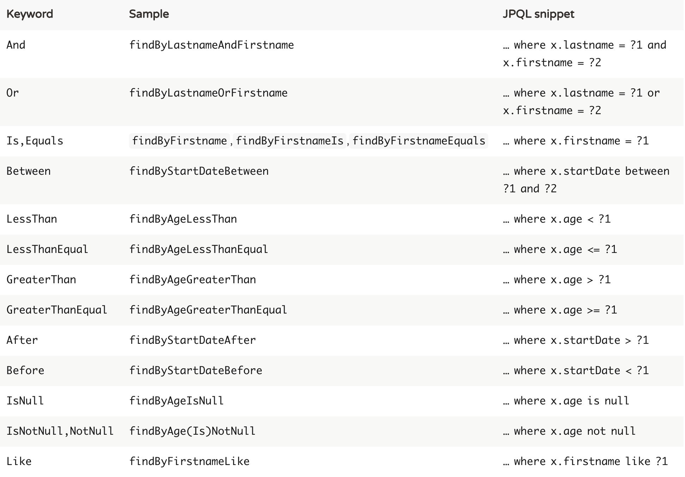
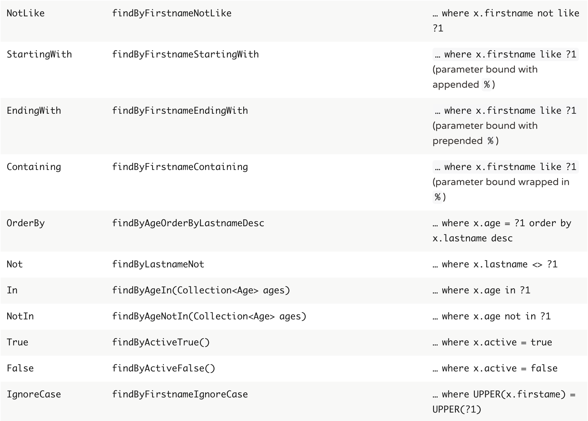

Spring Data
---

**Spring Repositories**

`JpaRepository` extends `PagingAndSortingRepository` which in turn extends `CrudRepository`.

- `CrudRepository` mainly provides CRUD functions.

- `PagingAndSortingRepository` provide methods to do pagination and sorting records.

- `JpaRepository` provides some JPA related method such as flushing the persistence context and delete record in a batch.

Because of the inheritance mentioned above,  `JpaRepository` will have all the functions of `CrudRepository` and `PagingAndSortingRepository`. So if you don't need the repository to have the functions provided by `JpaRepository` and `PagingAndSortingRepository` , use `CrudRepository`.

---

## Spring Data JPA Query Creation

```java
public interface UserRepository extends Repository<User, Long> {

  List<User> findByEmailAddressAndLastname(String emailAddress, String lastname);
}
```

The following table describes the keywords supported for JPA and what a method containing that keyword translates to:




## Using JPA Named Queries

**XML Named Query Definition**

```xml
<named-query name="User.findByLastname">
  <query>select u from User u where u.lastname = ?1</query>
</named-query>
```

**Annotation-based Configuration**

```java
@Entity
@NamedQuery(name = "User.findByEmailAddress",
  query = "select u from User u where u.emailAddress = ?1")
public class User {

}
```
