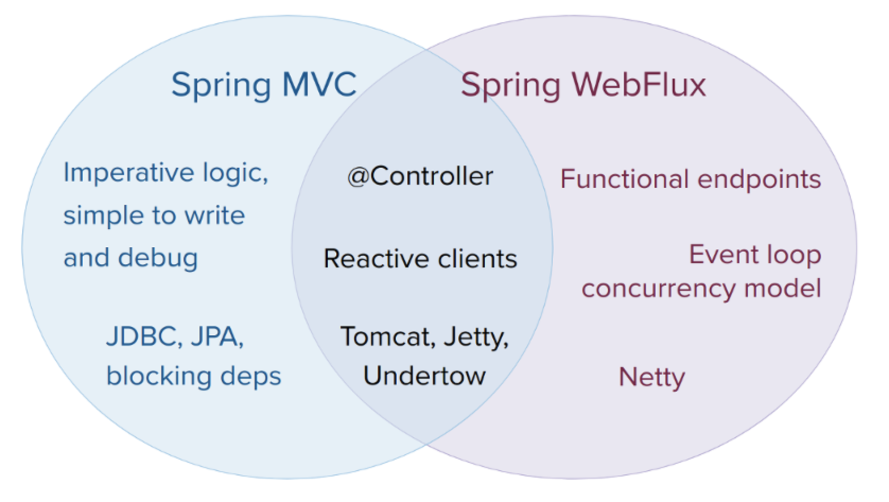

Spring WebFlux
---
 
Spring WebFlux is fully non-blocking framework, supports Reactive Streams back pressure, and runs on servers such as Netty, Undertow, and Servlet 3.1+ containers.

Spring WebFlux supports two types of programming models :

1. Traditional annotation-based model with `@Controller`, `@RequestMapping`, and other annotations that you have been using in Spring MVC.

2. A brand new Functional style model based on Java 8 lambdas for routing and handling requests.

---

# Introduction

The original web framework included in the Spring Framework, Spring Web MVC, was purpose built for the Servlet API and Servlet containers. The reactive stack, web framework, Spring WebFlux, was added later in version 5.0. It is fully non-blocking, supports [Reactive Streams](http://www.reactive-streams.org/) back pressure, and runs on servers such as Netty, Undertow, and Servlet 3.1+ containers.

## Motivation

Why was Spring WebFlux created?

Part of the answer is the need for a non-blocking web stack to handle concurrency with a small number of threads and scale with less hardware resources. Servlet 3.1 did provide an API for non-blocking I/O. However, using it leads away from the rest of the Servlet API where contracts are synchronous (`Filter`, `Servlet`) or blocking (`getParameter`, `getPart`). This was the motivation for a new common API to serve as a foundation across any non-blocking runtime. That is important because of servers such as Netty that are well established in the async, non-blocking space.

## Define "reactive"

The term **reactive** refers to programming models that are built around reacting to change — network component reacting to I/O events, UI controller reacting to mouse events, etc. In that sense **non-blocking is reactive** because instead of being blocked we are now in the mode of reacting to notifications as operations complete or data becomes available.

**Non-blocking back pressure.**  In synchronous, imperative code, blocking calls serve as a natural form of back pressure that forces the caller to wait. In non-blocking code it becomes important to control the rate of events so that a fast producer does not overwhelm its destination.

Reactive Streams is a small spec, also adopted in Java 9, that defines the interaction between asynchronous components with back pressure. For example a data repository — acting as Publisher, can produce data that an HTTP server — acting as Subscriber, can then write to the response. The main purpose of Reactive Streams is to allow the subscriber to control how fast or how slow the publisher will produce data.

>what if a publisher can’t slow down?
The purpose of Reactive Streams is only to establish the mechanism and a boundary. If a publisher can’t slow down then it has to decide whether to buffer, drop, or fail.

## Reactive API

Reactor is the reactive library of choice for Spring WebFlux. It provides the Mono and Flux API types to work on data sequences of `0..1` and `0..N` through a rich set of operators aligned with the ReactiveX vocabulary of operators. Reactor is a Reactive Streams library and therefore all of its operators support non-blocking back pressure. Reactor has a strong focus on server-side Java. It is developed in close collaboration with Spring.

WebFlux requires Reactor as a core dependency but it is interoperable with other reactive libraries via Reactive Streams. As a general rule WebFlux APIs accept a plain Publisher as input, adapt it to Reactor types internally, use those, and then return either Flux or Mono as output. So you can pass any Publisher as input and you can apply operations on the output, but you’ll need to adapt the output for use with another reactive library. Whenever feasible — e.g. annotated controllers, WebFlux adapts transparently to the use of RxJava or other reactive library.

## Programming models

Spring WebFlux provides a choice of two programming models:

- **Annotated Controllers** — consistent with Spring MVC, and based on the same annotations from the spring-web module. Both Spring MVC and WebFlux controllers support reactive (Reactor, RxJava) return types and as a result it is not easy to tell them apart. One notable difference is that WebFlux also supports reactive @RequestBody arguments.

- **Functional Endpoints** — lambda-based, lightweight, functional programming model. Think of this as a small library or a set of utilities that an application can use to route and handle requests. The big difference with annotated controllers is that the application is in charge of request handling from start to finish vs declaring intent through annotations and being called back.

## Applicability - Spring MVC or WebFlux?

The two are designed for continuity and consistency with each other, they are available side by side, and feedback from each side benefits both sides. The diagram below shows how the two relate, what they have in common, and what each supports uniquely:

- If you have a Spring MVC application that works fine, there is no need to change. Imperative programming is the easiest way to write, understand, and debug code. You have maximum choice of libraries since historically most are blocking.

- If you are already shopping for a non-blocking web stack, Spring WebFlux offers the same execution model benefits as others in this space and also provides a choice of servers — Netty, Tomcat, Jetty, Undertow, Servlet 3.1+ containers, a choice of programming models — annotated controllers and functional web endpoints, and a choice of reactive libraries — Reactor, RxJava, or other.

- If you are interested in a lightweight, functional web framework for use with Java 8 lambdas or Kotlin then use the Spring WebFlux functional web endpoints. That can also be a good choice for smaller applications or microservices with less complex requirements that can benefit from greater transparency and control.

- In a microservice architecture you can have a mix of applications with either Spring MVC or Spring WebFlux controllers, or with Spring WebFlux functional endpoints. Having support for the same annotation-based programming model in both frameworks makes it easier to re-use knowledge while also selecting the right tool for the right job.

- **A simple way to evaluate an application is to check its dependencies**. If you have blocking persistence APIs (JPA, JDBC), or networking APIs to use, then Spring MVC is the best choice for common architectures at least. It is technically feasible with both Reactor and RxJava to perform blocking calls on a separate thread but you wouldn’t be making the most of a non-blocking web stack.

- **If you have a Spring MVC application with calls to remote services, try the reactive `WebClient`**. You can return reactive types (Reactor, RxJava, or other) directly from Spring MVC controller methods. The greater the latency per call, or the interdependency among calls, the more dramatic the benefits. Spring MVC controllers can call other reactive components too.

## Servers

Spring WebFlux is supported on Tomcat, Jetty, Servlet 3.1+ containers, as well as on non-Servlet runtimes such as Netty and Undertow. All servers are adapted to a low-level, common API so that higher level programming models can be supported across servers.

Spring WebFlux does not have built-in support to start or stop a server. However it is easy to assemble an application from Spring configuration, and WebFlux infrastructure. Spring Boot has a WebFlux starter that automates these steps. By default the starter uses Netty but it is easy to switch to Tomcat, Jetty, or Undertow simply by changing your Maven or Gradle dependencies.

Spring Boot defaults to Netty. Tomcat and Jetty can be used with both Spring MVC and WebFlux. Keep in mind however that the way they’re used is very different. Spring MVC relies on Servlet blocking I/O and allows applications to use the Servlet API directly if they need to. Spring WebFlux relies on Servlet 3.1 non-blocking I/O and uses the Servlet API behind a low-level adapter and not exposed for direct use.

For Undertow, Spring WebFlux uses Undertow APIs directly without the Servlet API.

## Performance vs scale

Reactive and non-blocking generally do not make applications run faster. They can, in some cases, for example if using the `WebClient` to execute remote calls in parallel. On the whole it requires more work to do things the non-blocking way and that can increase slightly the required processing time.

The key expected benefit of reactive and non-blocking is the ability to scale with a small, fixed number of threads and less memory. That makes applications more resilient under load because they scale in a more predictable way. In order to observe those benefits however you need to have some latency including a mix of slow and unpredictable network I/O. That’s where the reactive stack begins to show its strengths and the differences can be dramatic.

## Concurrency Model

In Spring MVC, and servlet applications in general, it is assumed that applications may block the current thread, e.g. for remote calls, and for this reason servlet containers use a large thread pool, to absorb potential blocking during request handling.

In Spring WebFlux, and non-blocking servers in general, it is assumed that applications will not block, and therefore non-blocking servers use a small, fixed-size thread pool (event loop workers) to handle requests.

> To "scale" and "small number of threads" may sound contradictory but to never block the current thread, and rely on callbacks instead, means you don’t need extra threads as there are no blocking calls to absorb.

https://docs.spring.io/spring/docs/current/spring-framework-reference/web-reactive.html#webflux-concurrency-model

https://spring.io/blog/2016/09/22/new-in-spring-5-functional-web-framework
https://dzone.com/articles/spring-webflux-getting-started
https://docs.spring.io/spring/docs/current/spring-framework-reference/web-reactive.html#spring-webflux
https://stackoverflow.com/questions/41476795/a-real-world-controller-example-with-spring-5-web-reactive

---

# Videos

- [Servlet or Reactive Stack: you have choices..](https://www.infoq.com/presentations/spring-servlet-reactive-streams)

